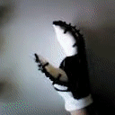
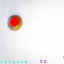

# EMG-CV fusion Exoglove Control

Sony Spresense Competition

In 2022 Summer, I had an amazing internship experience with Zhenyu and Jimmy for deploying the Tensorflow Lite model in a Sony Spresense Microcontroller.  First, the tensorflow model was trained based on Ninapro Database 5 and was fine-tuned based on Jimmy's EMG signal (he had the most muscle). With index motion of 0, 1, 2, and 3 which are for thumbs up, releasing, grabbing, and O.K sign, we were able to deploy a quantized model in the Sony Spresense board.&#x20;

However, we had to use ESP32 just for the sole purpose of wireless communication. ESP32 only receives the Bluetooth information and sends UART information to the Sony Spresense board.

<figure><figcaption></figcaption></figure>

<figure><figcaption></figcaption></figure>

<figure><figcaption></figcaption></figure>

<figure><figcaption></figcaption></figure>

That is how we got the free PS5 by winning the Sony Spresense competition. However, the goal was to design a portable exoglove that could be fused with growing computer vision system.&#x20;

## Computer Vision&#x20;

Thanks to the Professor Zhuwei Qin who bought different microcontrollers, I was able to test commonly used microcontrollers other than Raspberry Pi&#x20;

<figure><figcaption></figcaption></figure>

I wanted to use Sony Spresense for Computer Vision and calculating the distance, but I was only able to use Sony Spresense with EdgeImpulse which yielded really low fps. For Nvidia Jetson 4GB version, the Jetpack was outdated and was stuck at ubuntu 18.04. Although some Pytorch projects from 2019 did not caused the dependency issue, I wanted to test multiple different models.&#x20;

Eventually I ended up using OpenMV H7 for small, compact size setup and Google Coral Dev board for running tensorflow model in high FPS.&#x20;


The goal of those microcontrollers is to calculate the distance between the hand model (which is the prototype of the wearable exoglove) and the grabbable object and send this filtered distance information (likely to be uint8) to the ESP32 which will receive distance information while processing EMG signals.

The dataset was made by Microsoft VoTT which I wrote in [https://app.gitbook.com/o/sNvhSOVZyDyTTrC5zdxK/s/cv8SWQoAK05Ec2tRdE9v/\~/changes/116/readme/how-to-make-ml-dataset-using-microsoft-vott](machine-learning/how-to-make-ml-dataset-using-microsoft-vott.md)

<figure><figcaption></figcaption></figure>

### OpenMV H7: MQTT communication

I set up the MQTT communication by setting my macbook as broker. Just in case if I have to come back here and remeber what MQTT commnads are:

* Turn on local MQTT server:&#x20;

```
/usr/local/opt/mosquitto/sbin/mosquitto -c /usr/local/etc/mosquitto/mosquitto.conf
```

* Turn on another termial and start:&#x20;

```
mosquitto_sub -h test.mosquitto.org -t "openmv/test" -v
```

* To turn off,&#x20;

```
/opt/homebrew/opt/mosquitto/sbin/mosquitto -c /opt/homebrew/etc/mosquitto/mosquitto.conf
```

Initially, the goal was to save the average distance in an array of lengths of 5, remove outliers, and send the average distance value to MQTT communication.&#x20;

<figure><figcaption></figcaption></figure>

<figure><figcaption></figcaption></figure>

However, in some parts of university, the MQTT communication did not worked. To make the system as concise as possible, I was going to make a simple OpenMV H7 extension board with nRF52860, but it took too long to figure out the configuration. Instead, I made a simple shield with ESP8266 using ESP-one. ESP-one is for short-distance communication between two ESP8266 microcontrollers.&#x20;

<figure><figcaption></figcaption></figure>

<figure><figcaption></figcaption></figure>

<figure><figcaption></figcaption></figure>

<figure><figcaption></figcaption></figure>

Due to its STM32 H7 limitation with 2mb memory, it does not get higher than 10FPS. However, I am still surprised that 2MB memory can handle 96X96 RGB Images with convolution and bounding box. \
\
This computer vision setup with OpenMV H7 is easy and can be run by tiny LiPO battery, yet it causes significant delay in exoglove reaction.&#x20;


### Google Coral Dev Board with EfficientNet.&#x20;

Google Coral Dev board is priced at around $120. It has a dedicated TPU that accelerates convolution operation. Initially, I was going to use the SSDMobileNetV2 TFLite model which I already trained, but there was a sample Google Colab code from the Coral team, so I just used the EfficientNet. (Also SSDMobileNetV2 caused endless StrideSlice errors) The following link is how I trained EfficientNet:

[https://app.gitbook.com/o/sNvhSOVZyDyTTrC5zdxK/s/cv8SWQoAK05Ec2tRdE9v/readme/google-coral-tpu/coral-tpu-train-efficientdet](readme/coral-tpu-train-efficientdet.md)

<figure><figcaption><p>SSDMobileNetV2 TFLite model trained on RTX3080</p></figcaption></figure>

One of the models that classify COCO datset worked as below. Unfortunatley, it did not classify Apple and Pen.&#x20;

<figure><figcaption></figcaption></figure>

The EfficientNet that was trained on glove and apple is shown below:&#x20;

<figure><figcaption></figcaption></figure>

The python script adds distance in array of length of 8, removes outlier and sends the average value so that every 500ms one distance information is being sent to ESP32. This value is being sent to UART so that the Shield board that is connected to ESP8266 can send distance by ESP-one. Thinking back, I should've used BLE or just MQTT communication to minimize GPIO use.

<figure><figcaption></figcaption></figure>

## Electromyography with OYMotion&#x20;

The goal of electromyography is to read the muscle signal and infer the user's intention. Thalamic Armband - which had been extensively used in EMG-related conference papers - is discontinued. My goal was to use some cheaper alternative - Myoware EMG sensor, AK8232, and some other commonly used sensors in arduino projects.&#x20;


However, the Professor gave me the OYMotion EMG sensor - it was a growing company in China. Its configuration was better than the Myoware armband because the EMG pads and Amplifier circuits were separated with an audio jack&#x20;
