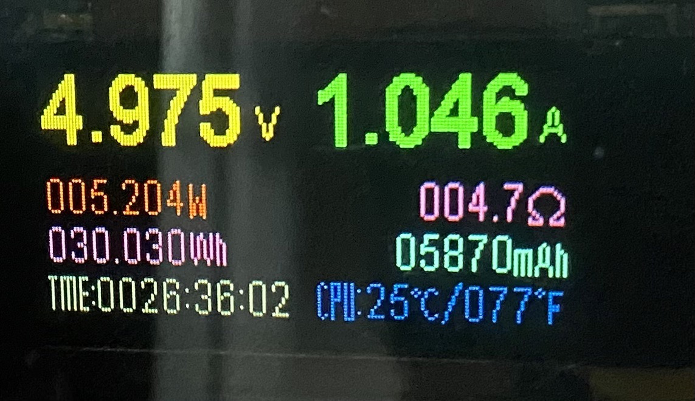
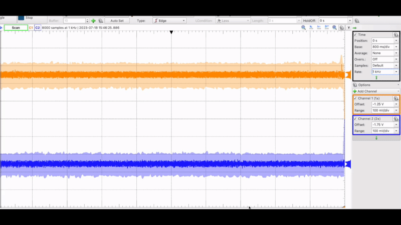
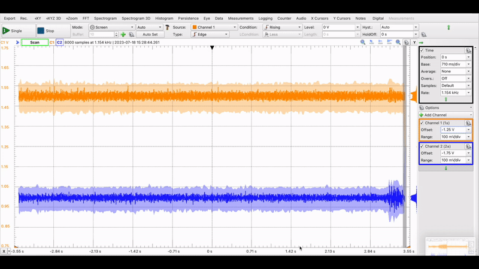
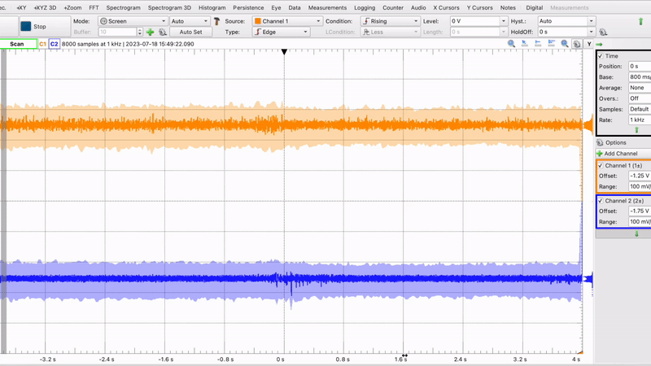
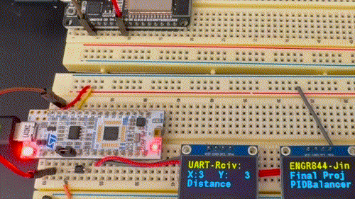

# EMG-CV fusion Exoglove Control & PID Ball-Balancer

Sony Spresense Competition

In 2022 Summer, I had an amazing internship experience with Zhenyu and Jimmy for deploying the Tensorflow Lite model in a Sony Spresense Microcontroller.  First, the tensorflow model was trained based on Ninapro Database 5 and was fine-tuned based on Jimmy's EMG signal (he had the most muscle). With index motion of 0, 1, 2, and 3 which are for thumbs up, releasing, grabbing, and O.K sign, we were able to deploy a quantized model in the Sony Spresense board.&#x20;

However, we had to use ESP32 just for the sole purpose of wireless communication. ESP32 only receives the Bluetooth information and sends UART information to the Sony Spresense board.

<figure><figcaption></figcaption></figure>

<figure><figcaption></figcaption></figure>

<figure><figcaption></figcaption></figure>

<figure><figcaption></figcaption></figure>

That is how we got the free PS5 by winning the Sony Spresense competition. However, the goal was to design a portable exoglove that could be fused with growing computer vision system.&#x20;

## Computer Vision&#x20;

Thanks to the Professor Zhuwei Qin who bought different microcontrollers, I was able to test commonly used microcontrollers other than Raspberry Pi&#x20;

<figure><figcaption></figcaption></figure>

I wanted to use Sony Spresense for Computer Vision and calculating the distance, but I was only able to use Sony Spresense with EdgeImpulse which yielded really low fps. For Nvidia Jetson 4GB version, the Jetpack was outdated and was stuck at ubuntu 18.04. Although some Pytorch projects from 2019 did not caused the dependency issue, I wanted to test multiple different models.&#x20;

Eventually I ended up using OpenMV H7 for small, compact size setup and Google Coral Dev board for running tensorflow model in high FPS.&#x20;


The goal of those microcontrollers is to calculate the distance between the hand model (which is the prototype of the wearable exoglove) and the grabbable object and send this filtered distance information (likely to be uint8) to the ESP32 which will receive distance information while processing EMG signals.

The dataset was made by Microsoft VoTT which I wrote in [https://app.gitbook.com/o/sNvhSOVZyDyTTrC5zdxK/s/cv8SWQoAK05Ec2tRdE9v/\~/changes/116/readme/how-to-make-ml-dataset-using-microsoft-vott](how-to-make-ml-dataset-using-microsoft-vott.md)


## Design #1 - Using OpenMV H7&#x20;

<figure><figcaption></figcaption></figure>


### OpenMV H7: MQTT communication

I set up the MQTT communication by setting my macbook as broker. Just in case if I have to come back here and remeber what MQTT commnads are:

* Turn on local MQTT server:&#x20;

```
/usr/local/opt/mosquitto/sbin/mosquitto -c /usr/local/etc/mosquitto/mosquitto.conf
```

* Turn on another termial and start:&#x20;

```
mosquitto_sub -h test.mosquitto.org -t "openmv/test" -v
```

* To turn off,&#x20;

```
/opt/homebrew/opt/mosquitto/sbin/mosquitto -c /opt/homebrew/etc/mosquitto/mosquitto.conf
```

Initially, the goal was to save the average distance in an array of lengths of 5, remove outliers, and send the average distance value to MQTT communication.&#x20;

<figure><figcaption></figcaption></figure>

<figure><figcaption></figcaption></figure>

However, in some parts of university, the MQTT communication did not worked. To make the system as concise as possible, I was going to make a simple OpenMV H7 extension board with nRF52860, but it took too long to figure out the configuration. Instead, I made a simple shield with ESP8266 using ESP-one. ESP-one is for short-distance communication between two ESP8266 microcontrollers.&#x20;

<figure><figcaption></figcaption></figure>

<figure><figcaption></figcaption></figure>

<figure><figcaption></figcaption></figure>

<figure><figcaption></figcaption></figure>

Due to its STM32 H7 limitation with 2mb memory, it does not get higher than 10FPS. However, I am still surprised that 2MB memory can handle 96X96 RGB Images with convolution and bounding box. \
\
This computer vision setup with OpenMV H7 is easy and can be run by tiny LiPO battery, yet it causes significant delay in exoglove reaction.&#x20;


## Design #2: using Google Coral Dev Board&#x20;

<figure><figcaption></figcaption></figure>

* **Google Coral Dev Board**
  * Measures distance to a target (e.g. hand/object).
  * Sends distance data via UART to ESP8266.
* **ESP8266**
  * Receives distance data from Coral Dev Board over UART.
  * Sends the distance wirelessly to ESP32 (e.g. via ESP-NOW or Wi-Fi).
* **ESP32**
  * Receives and parses distance data from ESP8266.
  * Controls 4 individual 0.96" I2C OLED displays to show gesture and distance info.
  * Reads EMG signals using ADS1115 at \~860 Hz from OYMotion EMG sensor.
  * Performs signal preprocessing (zero-centering and average pooling).
  * Uses logistic regression model to classify gestures (e.g., grab/release).
  * Optionally uses threshold mode for simpler activation logic.
  * Controls 4 servos via `ESP32Servo` based on predicted gestures.
  * Supports slow, smooth servo movements (e.g., slow grab animation).
  * Displays real-time state (gesture and/or distance) using custom bitmaps and text.
* **ADS1115 (I2C)**
  * Captures EMG signals with high precision.
  * Configured for high sample rate and consistent performance (\~860 SPS).

***

#### 🧠 EMG Signal Processing

* **Sampling**
  * EMG signal is sampled using ADS1115 at \~860 samples per second.
  * Each channel (e.g., 2 muscles) is read individually on its own timer.
* **Buffering**
  * Latest N samples (default: `ARRAY_SIZE = 10`) are stored in a circular buffer per channel.
* **Zero-Centering**
  * The average of the 10 samples is calculated.
  * Each sample is subtracted from the average to remove DC bias.
  * The absolute values of these centered samples are averaged to represent signal strength.
*   **Example Output:**

    ```
    Raw samples → [1200, 1230, 1220, ..., 1215]
    Centered → [|1200 - avg|, |1230 - avg|, ..., |1215 - avg|]
    Average centered value → Feature for classification
    ```
* **Gesture Classification**
  * The final averaged values from two EMG channels are fed into a pre-trained logistic regression classifier.
  * Outputs one of 3 gestures (e.g., neutral, grab, release).

### Google Coral Dev Board with EfficientNet.&#x20;

Google Coral Dev board is priced at around $120. It has a dedicated TPU that accelerates convolution operation. Initially, I was going to use the SSDMobileNetV2 TFLite model which I already trained, but there was a sample Google Colab code from the Coral team, so I just used the EfficientNet. (Also SSDMobileNetV2 caused endless StrideSlice errors) The following link is how I trained EfficientNet:

[https://app.gitbook.com/o/sNvhSOVZyDyTTrC5zdxK/s/cv8SWQoAK05Ec2tRdE9v/readme/google-coral-tpu/coral-tpu-train-efficientdet](broken-reference)

<figure><figcaption><p>SSDMobileNetV2 TFLite model trained on RTX3080</p></figcaption></figure>

One of the models that classify COCO datset worked as below. Unfortunatley, it did not classify Apple and Pen.&#x20;

<figure><figcaption></figcaption></figure>

The EfficientNet that was trained on glove and apple is shown below:&#x20;

<figure><figcaption></figcaption></figure>

<figure><figcaption></figcaption></figure>

It uses \~ 5W of power during active inferencing

<figure><figcaption></figcaption></figure>

The python script adds distance in array of length of 8, removes outlier and sends the average value so that every 500ms one distance information is being sent to ESP32. This value is being sent to UART so that the Shield board that is connected to ESP8266 can send distance by ESP-one. Thinking back, I should've used BLE or just MQTT communication to minimize GPIO use.

<figure><figcaption></figcaption></figure>

## Electromyography with OYMotion&#x20;

The goal of electromyography is to read the muscle signal and infer the user's intention. Thalamic Armband - which had been extensively used in EMG-related conference papers - is discontinued. My goal was to use some cheaper alternative - Myoware EMG sensor, AK8232, and some other commonly used sensors in arduino projects.&#x20;


However, the Professor gave me the OYMotion EMG sensor - it was a growing company in China. Its configuration was better than the Myoware armband because the EMG pads and Amplifier circuits were separated with an audio jack&#x20;

<figure><figcaption><p>OYMotion EMG Sensor</p></figcaption></figure>

### Testing with Analog Discovery 2&#x20;

Before connecting it to microcontroller ADC, I used AD2 to see how the EMG signal looks lile.&#x20;

The setup was that I wear EMG sensor on both side of arm and do grabbing/releasing motion to see difference.

<figure><figcaption><p>OYMotion_AD2_Grabbing_and_Releasing. Orange is the sensor facing inside of arm and blue is the sensor facing outside of arm</p></figcaption></figure>

<figure><figcaption></figcaption></figure>

However, as you can see the grabbing and releasing motion of the EMG signal looks similar, and sometimes Linear Classification Model gives faulty results. Also, touching any kind of metallic objects or twisting motion that will lead to slight detachment of electrode will lead to noise.

Below is an example of noise from touching a metallic table. In here, I am actually resting but my elbow is touching the metallic surface of lab test bench

<figure><figcaption><p>OYMotion AD2 noise</p></figcaption></figure>

### External ADC: ADS1115&#x20;

Because ESP32 ADC had a linearity issue and was practically 8bit + extension bits, I used 16-bit ADS1115.


## Final Result

<figure><figcaption></figcaption></figure>

<figure><figcaption></figcaption></figure>

<figure><figcaption></figcaption></figure>

<figure><figcaption></figcaption></figure>

<figure><figcaption></figcaption></figure>


## Side Project for STM32 Class: PID-Controlled Ball Balancer (Ball Centering System)

<figure><figcaption></figcaption></figure>

* **Designed and implemented a real-time embedded system** that tracks and centers a ping pong ball on a 2D tilting plane using STM32 Nucleo and OpenMV H7 camera.
* Utilized **OpenMV H7 with FOMO model** to perform real-time object detection; mapped X-Y coordinates transmitted via **UART (19200 baud)** to STM32.
* Developed **FreeRTOS-based multitasking firmware** to handle:
  * UART data reception and position processing.
  * Real-time servo control via PWM signals (angle range: 60°–120°).
  * I2C SSD1306 OLED display updates for position and system uptime.
* Applied **data smoothing techniques** (moving average of last 4 positions) for jerk prevention
* Built a 2-axis plane system using **dual servo motors** for real-time tilt adjustment based on deviation from center (mapped range: -15° to +15°).


* Microcontroller: Powered by STM32H7 ARM Cortex-M7 processor (480 MHz).
* Camera: High-quality OV7725 image sensor for machine vision tasks.
* UART, I2C, SPI, CAN, and USB for communication.
* MicroSD card slot for data storage (I never used one)
* Power Efficiency: Low-power design suitable for embedded vision applications.


### OpenMV H7 Codes&#x20;

````
uart = UART(3, 19200)
sensor.reset()  # Reset and initialize the sensor.
sensor.set_pixformat(sensor.RGB565)  # Set pixel format to RGB565 (or GRAYSCALE)
sensor.set_framesize(sensor.QQVGA)  # Set frame size to QVGA (320x240)
sensor.set_auto_exposure(0)

sensor.skip_frames(time=2000)  # Let the camera adjust.

min_confidence = 0.4
threshold_list = [(math.ceil(min_confidence * 255), 255)]

last_sent_value = 0

# Load built-in model
model = ml.Model("trained")
```
while True:
   clock.tick()
   img = sensor.snapshot()
   for i, detection_list in enumerate(model.predict([img], callback=fomo_post_process)):
       if i == 0:
           continue  # background class
       if len(detection_list) == 0:
           continue  # no detections for this class?
       for (x, y, w, h), score in detection_list:
           center_x = math.floor(x + (w / 2))
           center_y = math.floor(y + (h / 2))

           # Store the values in the arrays
           x_values.append(center_x)
           y_values.append(center_y)

           # Keep only the last 5 values
           if len(x_values) > 4:
               x_values.pop(0)
           if len(y_values) > 4:
               y_values.pop(0)

           # Calculate and print the average if we have 5 values
           if len(x_values) == 4 and len(y_values) == 4:
               avg_x = sum(x_values) / 4 - 35
               avg_y = 115 - sum(y_values) / 4
               # Map avg_x and avg_y from range 0-200 to 0-9
               mapped_x = int(max(0, min(9, (avg_x - 0) * (9 - 0) / (100 - 0) + 0)))
               mapped_y = int(max(0, min(9, (avg_y - 0) * (9 - 0) / (100 - 0) + 0)))
               print(f"Mapped X: {mapped_x}, Mapped Y: {mapped_y}")
               # Concatenate mapped_x and mapped_y into a single integer
               combined_value = int(f"{mapped_x}{mapped_y}")
               time.sleep_ms(2)

               if combined_value != last_sent_value:
                                   # Send the combined integer via UART
                                   uart.write(f"{combined_value}\n".encode())
                                   last_sent_value = combined_value  # Update the last sent value

           img.draw_circle((center_x, center_y, 10), color=colors[i], thickness=10)

   print(clock.fps(), "fps", end="\n")
````

* The FOMO model processes each frame captured by the camera.
* Detected objects' bounding boxes are post-processed using Non-Maximum Suppression (NMS) to eliminate overlapping detections.
* The x and y coordinates are stored in arrays to maintain a history of the last few positions.
* When enough data points are available (4 in this case), the average position is computed to smooth out the tracking.The mapped x and y values are concatenated into a single integer value.
* This integer is sent via UART to the STM32. If the current value differs from the last sent value, it ensures that redundant data is not sent.


### STM32 Receiving Ball Coordinate throguh UART communication&#x20;

<figure><figcaption></figcaption></figure>

<figure><figcaption><p>Testing STM32 UART Communication with ESP32</p></figcaption></figure>

### Controlling Two Servo by STM32 &#x20;

* You can buy cheap 2-axis ball balancing frames that you can assemble for $10 in Aliexpress
* Also bought 5V Servo for $8 in Aliexpress (with bunch of ESP32 WROOM boards)


<figure><figcaption></figcaption></figure>

* Datasheet → 50Hz \~ 133 Hz PWM Signal Generation&#x20;
* 72MHz/72 Prescaler = 1MHz. 1MHZ/20000 Timer → 50Hz. &#x20;
* PWM Signal Generation: The servo angle is controlled by generating a PWM signal using the TIM1 timer. The Set\_Servo\_Angle function converts the desired angle (0°–180°) into a pulse width (500 µs–2500 µs) and updates the timer compare register.
* Timer Output: The mapped pulse width is applied to the appropriate timer channel (TIM\_CHANNEL\_1 for X-axis, TIM\_CHANNEL\_4 for Y-axis), setting the servo to the calculated position.

```
void Set_Servo_Angle(TIM_HandleTypeDef *htim, uint32_t channel, float angle) {
// Convert angle to pulse width
	uint32_t pulse_width = (500 + ((angle / 180.0) * 2000)); // 0.5ms to 2.5ms pulse
	__HAL_TIM_SET_COMPARE(htim, channel, pulse_width);
}

```

### STM32 UART Setup

Initializes UART1 in interrupt mode to receive data using HAL\_UART\_Receive\_IT.

Upon receiving 3 bytes of UART data, triggers the HAL\_UART\_RxCpltCallback.

* Processes the received data stored in rx\_buffer.
* Sets update\_display flag to signal main loop for further actions.
* Re-enables the UART interrupt for continuous reception using HAL\_UART\_Receive\_IT.

Main loop reacts to the update\_display flag:

* Extracts the X and Y coordinate data from rx\_buffer.
* Converts received ASCII values into numerical deviations.
* Maps deviations to servo angles and constrains them within limits.
* Updates the servo positions using the Set\_Servo\_Angle function.
* Updates the SSD1306 OLED display with the received coordinates and related information.

Utilizes UART2 for terminal communication to print diagnostic and status messages.

<pre><code><strong>// ===========================================================================================
</strong>void HAL_UART_RxCpltCallback(UART_HandleTypeDef *huart) {
	UNUSED(huart);

// Transmit received byte on UART2
	HAL_UART_Transmit(&#x26;huart2, (uint8_t*) rx_buffer, 3, 10); // Transmit all received bytes
//
//	char message[40];
//	snprintf(message, sizeof(message), "\r\nReceived byte via UART1: %c %c %c",
//			rx_buffer[0], rx_buffer[1], rx_buffer[2]);
//	print_terminal(message);
	update_display = 1;

	HAL_UART_Receive_IT(&#x26;huart1, (uint8_t*) rx_buffer, 3);

}
// ===========================================================================================

void Set_Servo_Angle(TIM_HandleTypeDef *htim, uint32_t channel, float angle) {
// Convert angle to pulse width
	uint32_t pulse_width = (500 + ((angle / 180.0) * 2000)); // 0.5ms to 2.5ms pulse
	__HAL_TIM_SET_COMPARE(htim, channel, pulse_width);
}

// ===========================================================================================

// this should print to uart 2 which prints in computer console
void print_terminal(const char *message) {
	HAL_UART_Transmit(&#x26;huart2, (uint8_t*) message, strlen(message), 100);
//HAL_UART_Transmit(&#x26;huart2, (uint8_t*) "\r\n", 2, 100); // Adds a newline for better readability
}
// ===========================================================================================
</code></pre>

### Servo Angle Mapping&#x20;

* Mapping Deviation to Angles:
* Numerical deviations (ranging from 0-9) are mapped to angles between -15° and +15° using the formula:
* (deviation−4.5)×2.5(deviation - 4.5) \times 2.5(deviation−4.5)×2.5
  * 0 deviation corresponds to -15°.
  * 9 deviation corresponds to +15°.
* Servo Angle Calculation:
* Servo angles are derived from mapped deviations:
  * X-axis angle: 90−x\_angle
  * Y-axis angle: 90+y\_angle
* Constrained within a safe range:
  * Minimum: 60°
  * Maximum: 120°

### Temporary Soldering Board && Changing i2C Address 0x3C, 0x3D&#x20;

<figure><figcaption><p>SSD1306 Changing Address 0x3C, 0x3D </p></figcaption></figure>

<figure><figcaption></figcaption></figure>


