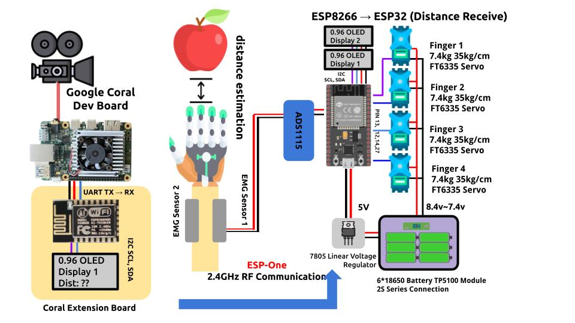

# Making Battery Pack

To make a battery pack to power my senior design project which includes 4 7.5V servos, ESP32, and external battery, I planned to make a battery pack using 18650.

<figure><figcaption>
Abstract Concept for Project 
</figcaption></figure>

The battery pack will be used to supply power to following components (some of them are not included in the picture):&#x20;

1. Four FT6335 Servo @7.5V&#x20;
2. L7805 that will convert 7.5V to 5V&#x20;
3. ESP32 that will be using Wireless communication
4. 4 0.96 inch SSD1306 OLED Display (This is not shown in picture)
5. ADS1115 external 16-bit adc&#x20;
6. Two potentiometer that will determine EMG Threshold and Distance Threshold.

## Ordering 18650&#x20;

Do not order 18650 from Amazon, as most of them are either defective or have incorrect amount of battery capacitance. (I realized this after ordering 10 of them from Amazon) Those batteries will refuse to work after 1 week.

I ordered the official LG INR18650 MJ1 3500mAh Battery from 18650 Battery Store.

<figure><figcaption></figcaption></figure>

According to the Datasheet,&#x20;

* Max Charge Voltage = 4.2V±0.05V&#x20;
* End Voltage = 2.5V&#x20;
* Standard Discharge = 0.2C (3500mAh X 0.2C = 680mA)
* Max Discharge = 10A (INR = High Discharge)

Compared to Samsung 30Q which can discharge maximum of 20A and continuously discharge 15A, LG MJ1 discharge rate might be seen as slower, but way cheaper.&#x20;

<figure><figcaption></figcaption></figure>

 

<figure><figcaption></figcaption></figure>

All of the Batteries at the arrival were charged at 3.6V.

## Ordering BMS Module&#x20;

BMS stands for Battery Management System. For 1s configuration one of the most widely used chip is tp4056 which can both charge and discharge.

However, TP5100 which supports 2s configuration can only charge the 2s battery and does not provide regulated output voltage.&#x20;

Eventually I ended up buying a 2s charge BMS module from Amazon.

<figure><figcaption></figcaption></figure>

<figure><figcaption></figcaption></figure>

I found the [datasheet](https://seegatecell.com/wp-content/uploads/2021/01/2S-7.4V-4A-DATASHEET-2.pdf) for the model that is similar to this one.&#x20;

* Max continuous Charging Current: 4A&#x20;
* Max continuous Discharging Current: 4A&#x20;
* Overcharge detection voltage: 4.28V&#x20;
* Overdischarge release voltage: 3.0V&#x20;

There is no inductor so I guess there is not buck-boost converter involved. The circuit simply charges and discharges the battery.&#x20;

## Making Battery Pack&#x20;

Out of 8 Batteries I will be using 2 batteries for powering Google Coral Dev Board with Extension board and 6 batteries for controlling servos and ESP32.&#x20;

<figure><figcaption>
2s3p battery pack 
</figcaption></figure>

 

<figure><figcaption>
Charging battery pack @9V 
</figcaption></figure>

The batteries are connected in 2s3p configuration. To activate the charging mode the battery output should be connected to 9V.&#x20;

(I wonder whether charging the battery through power supply is the reason why the power supply broke after 1 month - maybe I should've included diode when I was charging )

<figure><figcaption>
Output 
</figcaption></figure>

 

<figure><figcaption>
charging 
</figcaption></figure>

As you can see, output is just the single cell charge value multiplied by two.&#x20;

