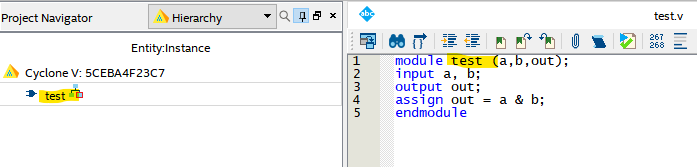
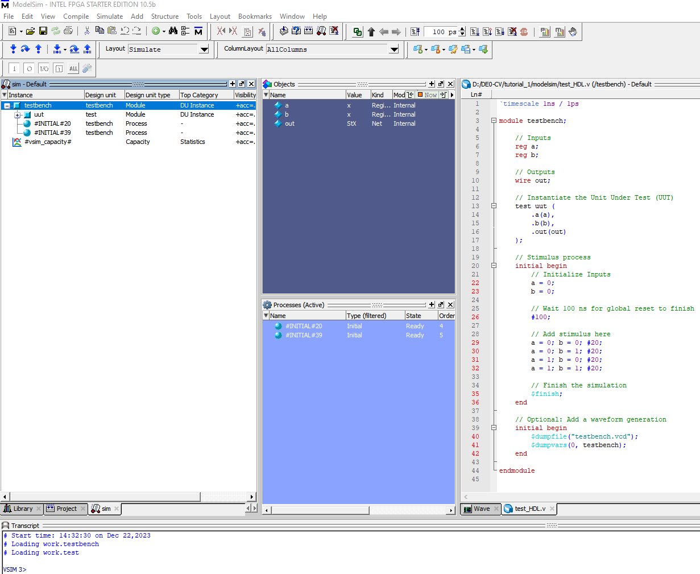
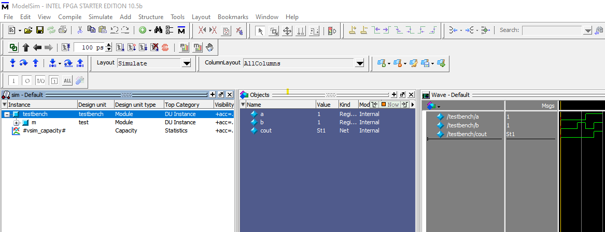

# FPGA: DE10-Standard Board Setup

* DE10-Standard Board [Manuals](https://www.terasic.com.tw/cgi-bin/page/archive.pl?Language=English\&CategoryNo=165\&No=1081\&PartNo=2#contents)
* DE10-Standard Board [Project Builder](https://www.terasic.com.tw/cgi-bin/page/archive.pl?Language=English\&CategoryNo=205\&No=1081\&PartNo=4)

### Quartus Installation Steps in Windows 10&#x20;

Install Quartus Prime Standard[ 18.1.0.625 ](https://www.intel.com/content/www/us/en/software-kit/665987/intel-quartus-prime-standard-edition-design-software-version-18-1-for-windows.html)with ModelSim - upper version does not support Cyclone IV, V family

<figure><figcaption></figcaption></figure>

Go to Individual Files → Install Intel Cyclone V Device Support. Put .qdz file in the same path as installation file.&#x20;

<figure><figcaption></figcaption></figure>

### Setting up Quartus Project&#x20;

1. In the Windows search bar, type "device installer" -> Quartus installer will pop up

<figure><figcaption></figcaption></figure>

<figure><figcaption></figcaption></figure>

<figure><figcaption></figcaption></figure>

2. Select the file directory which you stored .qdz file -> Install Cyclone V Library&#x20;
3. Turn on Quartus&#x20;
4. File -> New Project Wizard -> select directory -> Empty Project -> No need to add files&#x20;
5. In Family Device Board Settings, select Cyclone V with model name 5CSXFC6D6F31C6N

<figure><figcaption></figcaption></figure>

6. Skip EDA Tool Setting. The output should resemble below pic

<figure><figcaption></figcaption></figure>


### Testing Simple Project

1. File -> New -> Verilog HDL File&#x20;
2. Paste following code. (The module name **MUST** match Project name)

```
module test (a,b,out);
input a, b; 
output out;
assign out = a & b; 
endmodule 
```

<figure><figcaption></figcaption></figure>

3. Project -> add/remove files to project -> add current file/remove unncessary file&#x20;
4. Processing -> Start Compilation

<figure><figcaption></figcaption></figure>

5. In project directory, make folder "modelsim". This will be used to store modelsim files&#x20;
6. Turn on Modelsim -> File -> New -> Project

<figure><figcaption></figcaption></figure>

7. Add Existing File -> Add test.v&#x20;


8. Create New File -> Create "test\_HDL".  File Type: Verilog -> Paste Following Code:

```
module testbench;
	reg a;
	reg b;
	wire cout;

initial begin
a = 0;
b = 0;

#20; 

a = 0; b = 0; #20; 
a = 0; b = 1; #20;
a = 1; b = 0; #20;
a = 1; b = 1; #20;

end


test m(
.a( a ),
.b( b ),
.out( cout )
);
endmodule
```

9. Right click the test\_HDL file -> compile -> compile all

<figure><figcaption></figcaption></figure>

```
project open D:/DE0-CV/tutorial_1/modelsim/test_simulation
# Loading project test_simulation
# Compile of test_HDL.v was successful.
# Compile of test.v was successful.
# 2 compiles, 0 failed with no errors.
```

10. Go to Simulate -> Start Simulation -> Select testbench&#x20;

<figure><figcaption></figcaption></figure>

Following screen will pop up.&#x20;

<figure><figcaption></figcaption></figure>

11. View -> Wave
12. Enter following Command to console. (This will add all signals to wave window)&#x20;

```
add wave sim:/testbench/*
```

<figure><figcaption></figcaption></figure>

13. Simulate -> Run 100

<figure><figcaption></figcaption></figure>

After seeing the correct waveform, move to next step&#x20;

### RAM testing by IP-Catalog in Verilog&#x20;

1. Create a new Project&#x20;
2. Go to Tools -> IP Catalog. At right side, following screen will pop up.&#x20;

<figure><figcaption><p>IP Catalog </p></figcaption></figure>

3. Select RAM: 1-PORT and name it **ram32x4.v**

<figure><figcaption></figcaption></figure>

<figure><figcaption></figcaption></figure>

4. Uncheck 'q' output port&#x20;

<figure><figcaption></figcaption></figure>

5. Leave the RAM initialization blank as the testbench will write on it

<figure><figcaption></figcaption></figure>

<figure><figcaption></figcaption></figure>

6. It will generate ram32x4.v and ram32x4\_bb.v \
   **ram32x4.v** -> RTL file which contains actual implementation \
   **ram32x4\_bb.v** -> black box version that needs to be included in top-level design\

7. After creating files, go to Project -> Add/Remove Files.  Following files should be included:&#x20;

* ram32x4.v&#x20;
* ram32x4\_bb.v&#x20;
* ram32x4.qip&#x20;

<figure><figcaption></figcaption></figure>

8. Double click the ram32x4.v file. Change **ram32x4.v** file module name to **project\_3\_ram\_tutorial**. The module name must match the project name. \
   <mark style="color:blue;">module ram32x4 -> module (Your Project Name)</mark>

<figure><figcaption></figcaption></figure>

8. In project directory, create new file with name 'modelsim'. Open Modelsim and create new project in created file. \
   Name the project as **ram32x4\_testbench**&#x20;

<figure><figcaption></figcaption></figure>

9. Add Existing File -> **ram32x4.v**&#x20;
10. Create New File -> **ram32x4\_testbench** with filetype Verilog&#x20;

<figure><figcaption></figcaption></figure>

Following screen will pop up:

<figure><figcaption></figcaption></figure>

11. Go to [Intel FPGAcademy](https://fpgacademy.org/courses.html) and download lab8 file. It contains testbench file for ram32x4
12. Copy and paste file to **ram32x4\_testbench**. Change the module name to ram32x4\_testbench&#x20;
13. Right click ram32x4\_testbench -> Compile -> Compile All&#x20;

<figure><figcaption></figcaption></figure>

14. Simulation -> Start Simulation -> Select **ram32x4\_testbench**&#x20;

<figure><figcaption></figcaption></figure>


## DE-10: Use IP-Catalog to use ROM


### ROM Setup

1. Create new directory for project&#x20;
2. Verilog -> New Project Wizard -> select the created file&#x20;
3. In the created project directory, create the file 'rom\_initialization.mif' (Make sure the extension is .mif, not .txt)

<figure><figcaption></figcaption></figure>

4. Paste the following sample code to .mif file and save. The following code will initialize ROM content with 8-bit width and 32 rows.&#x20;

```
DEPTH=32; 
WIDTH=8;  
ADDRESS_RADIX=HEX; 
DATA_RADIX=HEX;    
CONTENT 
BEGIN
    0: 01;
    1: 02;
    2: 03;
    3: 04;
    4: 05;
    5: 06;
    6: 07;
    7: 08;
    8: 09;
    9: 0A;
    A: 0B;
    B: 0C;
    C: 0D;
    D: 0E;
    E: 0F;
    F: 10;
    10: 11;
    11: 12;
    12: 13;
    13: 14;
    14: 15;
    15: 16;
    16: 17;
    17: 18;
    18: 19;
    19: 1A;
    1A: 1B;
    1B: 1C;
    1C: 1D;
    1D: 1E;
    1E: 1F;
    1F: 20;
END;
```

4. Tools -> IP-Catalog. \
   Following window will show at the right side of screen

<figure><figcaption></figcaption></figure>

5. Library -> Basic Functions -> On Chip Memory -> ROM:1-Port \
   For simplicity of this demo, I will use ROM:1-Port to minimize input and output wiring.&#x20;

<figure><figcaption></figcaption></figure>

6. Name file as **rom32x8.v**
7. In the settin&#x67;**,**&#x20;

* 'q' output: 8-bits (rom will output 8 bits for each address)
* 32 words -> there will be 32 rows of 8-bit data
* Select **M10K** for Cyclone V&#x20;

<figure><figcaption></figcaption></figure>

* Uncheck the 'q' output port&#x20;

<figure><figcaption></figcaption></figure>

* Select the created rom\_initialization.mif file as memory content data&#x20;

<figure><figcaption></figcaption></figure>

* It will generate rom32x8.v and rom32x8\_bb.v

<figure><figcaption></figcaption></figure>

8. Project -> Add/Remove Files in Project -> Add following files:&#x20;

* rom32x8.qip&#x20;
* rom32x8.v&#x20;
* rom32x8\_bb.v&#x20;

<figure><figcaption></figcaption></figure>

9. Change the module name of rom32x8\_bb.v file so that it does not overlap with ram32x8.v

<figure><figcaption></figcaption></figure>

### Creating Top Module&#x20;

1. File -> New -> SystemVerilog HDL File -> Paste following top module.\
   The following code will read ROM content, multiply those content with input wire and output the sum

```
module project7_rom (
    input wire [7:0] pixel,
    input wire clock,
    output reg [15:0] sum_output // Changed to reg since it's assigned in an always block
);

    wire [7:0] rom_output; // Output from the rom_test_bb module
    reg [15:0] sum = 0;
    reg [4:0] rom_pointer = 0; // 5-bit pointer for 32 elements

    // Instantiate the rom_test_bb module
    rom32x8 rom_inst (
        .address(rom_pointer), // Provide rom_pointer as the address
        .clock(clock),
        .q(rom_output)
    );

    always @(posedge clock) begin
	     $display("Time: %t, Pixel: %h, ROM address: %h, ROM Output: %h, Sum: %h, Sum Output: %h", $time, pixel, rom_pointer, rom_output, sum, sum_output);
        if (rom_pointer < 31) begin
            sum <= sum + rom_output * pixel; // Calculate the new sum
            rom_pointer <= rom_pointer + 1; // Increment the pointer
        end else begin
            sum_output <= sum; // Assign the sum to the output
            sum <= 0; // Reset the sum
            rom_pointer <= 0; // Reset the pointer
        end
    end

endmodule
```

The top module must match the project name

<figure><figcaption></figcaption></figure>

2. Compile the project&#x20;

### Modelsim Simulation&#x20;

1. Create 'modelsim' file in project directory&#x20;

<figure><figcaption></figcaption></figure>

2. Open Modelsim -> File -> New Project&#x20;

<figure><figcaption></figcaption></figure>

3 . Add Existing File -> Add&#x20;

* project7\_rom.sv
* rom32x8.v&#x20;
* rom32x8\_bb

4. Create New **SystemVerilog** File -> \[your project name] + "testbench"   &#x20;

<figure><figcaption></figcaption></figure>

5. Paste following code in testbench. For each clock, the testbench will generate random number and feed in to module.

```
`timescale 1ns / 1ns

module project7_testbench;

    // Testbench signals
    reg [7:0] pixel;
    reg clock;
    wire [15:0] sum_output;

    // Instantiate the project4_rom module
    project7_rom uut (
        .pixel(pixel),
        .clock(clock),
        .sum_output(sum_output)
    );

    // Clock generation
    initial begin
        clock = 0;
        forever #10 clock = ~clock; // Generate a clock with a period of 20 ns
    end

    // Stimulus
    initial begin
        // Initialize
        pixel = 0;

        // Apply test vectors
        // Input a new pixel value at each clock cycle
        repeat (100) begin // Repeat for a certain number of cycles
            @(posedge clock) pixel = $random; // Assign a random value at each positive edge of the clock
        end

        #100; // Wait for some time to observe the outputs
        $finish; // End the simulation
    end

    // Optionally, add a waveform dump for debugging
    initial begin
        $dumpfile("testbench.vcd");
        $dumpvars(0, project7_testbench);
    end

endmodule
```

6. Compile Project -> Questionmark should disappear&#x20;

<figure><figcaption></figcaption></figure>

<figure><figcaption></figcaption></figure>

7. Simulate -> Start Simulation -> Library -> Add **altera\_mf\_ver** (required for RAM/ROM)
8. Select work -> project7\_testbench

<figure><figcaption></figcaption></figure>

<figure><figcaption></figcaption></figure>

9. Add all the variables to waveforms by typing

```
add wave sim:/your_testbench_name/*
```

<figure><figcaption></figcaption></figure>

If the timescale is set to ns,&#x20;

```
run 1000
```

If the timescale is set to ps, multiply 1000.&#x20;

```
add wave sim:/project7_testbench/*
run 1000000
# Time:                10000, Pixel: 00, ROM address: 00, ROM Output: 00, Sum: 0000, Sum Output: xxxx
# Time:                30000, Pixel: 24, ROM address: 01, ROM Output: 01, Sum: 0000, Sum Output: xxxx
# Time:                50000, Pixel: 81, ROM address: 02, ROM Output: 02, Sum: 0024, Sum Output: xxxx
# Time:                70000, Pixel: 09, ROM address: 03, ROM Output: 03, Sum: 0126, Sum Output: xxxx
# Time:                90000, Pixel: 63, ROM address: 04, ROM Output: 04, Sum: 0141, Sum Output: xxxx
# Time:               110000, Pixel: 0d, ROM address: 05, ROM Output: 05, Sum: 02cd, Sum Output: xxxx
# Time:               130000, Pixel: 8d, ROM address: 06, ROM Output: 06, Sum: 030e, Sum Output: xxxx
# Time:               150000, Pixel: 65, ROM address: 07, ROM Output: 07, Sum: 065c, Sum Output: xxxx
# Time:               170000, Pixel: 12, ROM address: 08, ROM Output: 08, Sum: 091f, Sum Output: xxxx
# Time:               190000, Pixel: 01, ROM address: 09, ROM Output: 09, Sum: 09af, Sum Output: xxxx
# Time:               210000, Pixel: 0d, ROM address: 0a, ROM Output: 0a, Sum: 09b8, Sum Output: xxxx
# Time:               230000, Pixel: 76, ROM address: 0b, ROM Output: 0b, Sum: 0a3a, Sum Output: xxxx
# Time:               250000, Pixel: 3d, ROM address: 0c, ROM Output: 0c, Sum: 0f4c, Sum Output: xxxx
# Time:               270000, Pixel: ed, ROM address: 0d, ROM Output: 0d, Sum: 1228, Sum Output: xxxx
# Time:               290000, Pixel: 8c, ROM address: 0e, ROM Output: 0e, Sum: 1e31, Sum Output: xxxx
# Time:               310000, Pixel: f9, ROM address: 0f, ROM Output: 0f, Sum: 25d9, Sum Output: xxxx
# Time:               330000, Pixel: c6, ROM address: 10, ROM Output: 10, Sum: 3470, Sum Output: xxxx
# Time:               350000, Pixel: c5, ROM address: 11, ROM Output: 11, Sum: 40d0, Sum Output: xxxx
# Time:               370000, Pixel: aa, ROM address: 12, ROM Output: 12, Sum: 4de5, Sum Output: xxxx
# Time:               390000, Pixel: e5, ROM address: 13, ROM Output: 13, Sum: 59d9, Sum Output: xxxx
# Time:               410000, Pixel: 77, ROM address: 14, ROM Output: 14, Sum: 6ad8, Sum Output: xxxx
# Time:               430000, Pixel: 12, ROM address: 15, ROM Output: 15, Sum: 7424, Sum Output: xxxx
# Time:               450000, Pixel: 8f, ROM address: 16, ROM Output: 16, Sum: 759e, Sum Output: xxxx
# Time:               470000, Pixel: f2, ROM address: 17, ROM Output: 17, Sum: 81e8, Sum Output: xxxx
# Time:               490000, Pixel: ce, ROM address: 18, ROM Output: 18, Sum: 97a6, Sum Output: xxxx
# Time:               510000, Pixel: e8, ROM address: 19, ROM Output: 19, Sum: aaf6, Sum Output: xxxx
# Time:               530000, Pixel: c5, ROM address: 1a, ROM Output: 1a, Sum: c19e, Sum Output: xxxx
# Time:               550000, Pixel: 5c, ROM address: 1b, ROM Output: 1b, Sum: d5a0, Sum Output: xxxx
# Time:               570000, Pixel: bd, ROM address: 1c, ROM Output: 1c, Sum: df54, Sum Output: xxxx
# Time:               590000, Pixel: 2d, ROM address: 1d, ROM Output: 1d, Sum: f400, Sum Output: xxxx
# Time:               610000, Pixel: 65, ROM address: 1e, ROM Output: 1e, Sum: f919, Sum Output: xxxx
# Time:               630000, Pixel: 63, ROM address: 1f, ROM Output: 1f, Sum: 04ef, Sum Output: xxxx
# Time:               650000, Pixel: 0a, ROM address: 00, ROM Output: 20, Sum: 0000, Sum Output: 04ef
```

<figure><figcaption></figcaption></figure>

The module should output the sum of multiplied product.


## Saving Memory in .sv File


int\_weight1\_bram.sv

```
`timescale 1ns/1ns
module int_weight1_bram (
    input wire clk,
    input wire [9:0] addr,
    output reg [511:0] data
);

reg [511:0] mem[0:783];

initial begin
    mem[0] = 512'fff2ffcfffbeffe90055ffa8009e004e0068ffb8004affacffc90005003ffff2fff10027ffa90025ff990071ffd6ff20ffaeffcaffa4ffec0036ffedffe8005f;
    mem[1] = 512'hff83009c01a70002ffefff8fffb400a300620039ff650030ffb2001f007b008affd300b00064ffe4ff91ff9eff9fffe0007e00500024008e003dffb00002fff2;
    mem[2] = 512'h005bfff100370057008a00512ff7eff4c0002fff200ba001e0051ffceffe000e600420030ff880020ffccffefffb8ffc00062004c0046ffeeff910064ffefff4a;
    ...
    mem[783] = 512'h00790026ff43fffeffccffbbffd70033004f0081ffd30042ffd1ff6200de004effb900370056fff4004a008a0019002c007e00210093007a005b00b5000c001c;
end

//always @(posedge clk) begin
always @(negedge clk) begin
    data <= mem[addr];
	 //$display("Weight BRAM Called:  = %h", data);
end

endmodule
```

Top module to parse memory for 16 bits

```
`timescale 1ns/1ns

module project11_bram(
    input wire clk,
	 output reg[15:0] segment_out
);

// Internal signals
wire [511:0] bram_data;             // BRAM data output
reg [9:0] addr = 10'b0;        // To track changes in address
reg [4:0] segment_sel = 5'b0;       // To cycle through segments'
reg [8:0] start_index = 9'b0;

// Instantiate the int_weight1_bram module
int_weight1_bram bram (
    .clk(clk),
    .addr(addr),
    .data(bram_data)
);

// At every positive clock edge, update segment and possibly print address change
always @(posedge clk) begin
	segment_sel <= (segment_sel+1);
	
	
	start_index <= 511 - (segment_sel * 16);
	
	$display("Memory address: %d Segment Selection: %d   Start Index: %d", addr, segment_sel, start_index);
   $display("Weight BRAM Called:  = %h", bram_data);
	 
   // Select the current segment based on `segment_sel`
   segment_out <= bram_data[start_index -: 16];
	
	if (segment_sel == 31) begin
		segment_sel <= 0;
		addr <= addr+1;
		if (addr == 784) begin
			$display("\n\n=============End of Memory ======================\n\n\n\n\n\n\n\n");
		end
		start_index <= 0; 
	end
end
endmodule
```

Testbench&#x20;

```

`timescale 1ns/1ns

module project11_tb;

reg clk;

// Instantiate the DUT (Device Under Test)
project11_bram dut(
    .clk(clk)
);

// Clock generation
initial begin
    clk = 0;
    forever #5 clk = ~clk; // 100MHz clock
end

// Test duration or termination condition
initial begin
    // Run the simulation for a specific time
    #1000; // Simulate for 1000ns
    
    $finish; // Terminate simulation
end

endmodule
```

Output

```
 Loading work.int_weight1_bram
run 1000
# Memory address:    0 Segment Selection:  0   Start Index:   0
# Weight BRAM Called:  = 0001ffcfffbeffe90055ffa8009e004e0068ffb8004affacffc90005003ffff2fff10027ffa90025ff990071ffd6ff20ffaeffcaffa4ffec0036ffedffe8005f
# Time: 10, Segment Out: Xxxx
# Memory address:    0 Segment Selection:  1   Start Index: 511
# Weight BRAM Called:  = 0001ffcfffbeffe90055ffa8009e004e0068ffb8004affacffc90005003ffff2fff10027ffa90025ff990071ffd6ff20ffaeffcaffa4ffec0036ffedffe8005f
# Time: 15, Segment Out: 0001
# Memory address:    0 Segment Selection:  2   Start Index: 495
# Weight BRAM Called:  = 0001ffcfffbeffe90055ffa8009e004e0068ffb8004affacffc90005003ffff2fff10027ffa90025ff990071ffd6ff20ffaeffcaffa4ffec0036ffedffe8005f
# Time: 25, Segment Out: ffcf
# Memory address:    0 Segment Selection:  3   Start Index: 479
# Weight BRAM Called:  = 0001ffcfffbeffe90055ffa8009e004e0068ffb8004affacffc90005003ffff2fff10027ffa90025ff990071ffd6ff20ffaeffcaffa4ffec0036ffedffe8005f
# Time: 35, Segment Out: ffbe
# Memory address:    0 Segment Selection:  4   Start Index: 463
# Weight BRAM Called:  = 0001ffcfffbeffe90055ffa8009e004e0068ffb8004affacffc90005003ffff2fff10027ffa90025ff990071ffd6ff20ffaeffcaffa4ffec0036ffedffe8005f
# Time: 45, Segment Out: ffe9
# Memory address:    0 Segment Selection:  5   Start Index: 447
# Weight BRAM Called:  = 0001ffcfffbeffe90055ffa8009e004e0068ffb8004affacffc90005003ffff2fff10027ffa90025ff990071ffd6ff20ffaeffcaffa4ffec0036ffedffe8005f
# Time: 55, Segment Out: 0055
# Memory address:    0 Segment Selection:  6   Start Index: 431
# Weight BRAM Called:  = 0001ffcfffbeffe90055ffa8009e004e0068ffb8004affacffc90005003ffff2fff10027ffa90025ff990071ffd6ff20ffaeffcaffa4ffec0036ffedffe8005f
# Time: 65, Segment Out: ffa8

```

