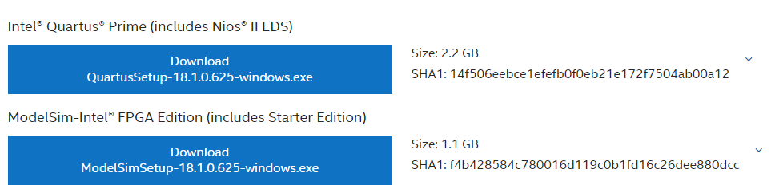

# FPGA: DE10-Standard Board Setup

* DE10-Standard Board [Manuals](https://www.terasic.com.tw/cgi-bin/page/archive.pl?Language=English\&CategoryNo=165\&No=1081\&PartNo=2#contents)
* DE10-Standard Board [Project Builder](https://www.terasic.com.tw/cgi-bin/page/archive.pl?Language=English\&CategoryNo=205\&No=1081\&PartNo=4)

### Quartus Installation Steps in Windows 10&#x20;

Install Quartus Prime Standard[ 18.1.0.625 ](https://www.intel.com/content/www/us/en/software-kit/665987/intel-quartus-prime-standard-edition-design-software-version-18-1-for-windows.html)with ModelSim - upper version does not support Cyclone IV, V family

<figure><figcaption></figcaption></figure>

Go to Individual Files → Install Intel Cyclone V Device Support. Put .qdz file in the same path as installation file.&#x20;

<figure><figcaption></figcaption></figure>

### Setting up Quartus Project&#x20;

1. In the Windows search bar, type "device installer" -> Quartus installer will pop up

<figure><figcaption></figcaption></figure>

<figure><figcaption></figcaption></figure>

<figure><figcaption></figcaption></figure>

2. Select the file directory which you stored .qdz file -> Install Cyclone V Library&#x20;
3. Turn on Quartus&#x20;
4. File -> New Project Wizard -> select directory -> Empty Project -> No need to add files&#x20;
5. In Family Device Board Settings, select Cyclone V with model name 5CSXFC6D6F31C6N

<figure><figcaption></figcaption></figure>

6. Skip EDA Tool Setting. The output should resemble below pic

<figure><figcaption></figcaption></figure>


### Testing Simple Project

1. File -> New -> Verilog HDL File&#x20;
2. Paste following code. (The module name **MUST** match Project name)

```
module test (a,b,out);
input a, b; 
output out;
assign out = a & b; 
endmodule 
```

<figure><figcaption></figcaption></figure>

3. Project -> add/remove files to project -> add current file/remove unncessary file&#x20;
4. Processing -> Start Compilation

<figure><figcaption></figcaption></figure>

5. In project directory, make folder "modelsim". This will be used to store modelsim files&#x20;
6. Turn on Modelsim -> File -> New -> Project

<figure><figcaption></figcaption></figure>

7. Add Existing File -> Add test.v&#x20;


8. Create New File -> Create "test\_HDL".  File Type: Verilog -> Paste Following Code:

```
module testbench;
	reg a;
	reg b;
	wire cout;

initial begin
a = 0;
b = 0;

#20; 

a = 0; b = 0; #20; 
a = 0; b = 1; #20;
a = 1; b = 0; #20;
a = 1; b = 1; #20;

end


test m(
.a( a ),
.b( b ),
.out( cout )
);
endmodule
```

9. Right click the test\_HDL file -> compile -> compile all

<figure><figcaption></figcaption></figure>

```
project open D:/DE0-CV/tutorial_1/modelsim/test_simulation
# Loading project test_simulation
# Compile of test_HDL.v was successful.
# Compile of test.v was successful.
# 2 compiles, 0 failed with no errors.
```

10. Go to Simulate -> Start Simulation -> Select testbench&#x20;

<figure><figcaption></figcaption></figure>

Following screen will pop up.&#x20;

<figure><figcaption></figcaption></figure>

11. View -> Wave
12. Enter following Command to console. (This will add all signals to wave window)&#x20;

```
add wave sim:/testbench/*
```

<figure><figcaption></figcaption></figure>

13. Simulate -> Run 100

<figure><figcaption></figcaption></figure>

After seeing the correct waveform, move to next step&#x20;

### RAM testing by IP-Catalog in Verilog&#x20;

1. Create a new Project&#x20;
2. Go to Tools -> IP Catalog. At right side, following screen will pop up.&#x20;

<figure><figcaption><p>IP Catalog </p></figcaption></figure>

3. Select RAM: 1-PORT and name it **ram32x4.v**

<figure><figcaption></figcaption></figure>

<figure><figcaption></figcaption></figure>

4. Uncheck 'q' output port&#x20;

<figure><figcaption></figcaption></figure>

5. Leave the RAM initialization blank as the testbench will write on it

<figure><figcaption></figcaption></figure>

<figure><figcaption></figcaption></figure>

6. It will generate ram32x4.v and ram32x4\_bb.v \
   **ram32x4.v** -> RTL file which contains actual implementation \
   **ram32x4\_bb.v** -> black box version that needs to be included in top-level design\

7. After creating files, go to Project -> Add/Remove Files.  Following files should be included:&#x20;

* ram32x4.v&#x20;
* ram32x4\_bb.v&#x20;
* ram32x4.qip&#x20;

<figure><figcaption></figcaption></figure>

8. Double click the ram32x4.v file. Change **ram32x4.v** file module name to **project\_3\_ram\_tutorial**. The module name must match the project name. \
   <mark style="color:blue;">module ram32x4 -> module (Your Project Name)</mark>

<figure><figcaption></figcaption></figure>

8. In project directory, create new file with name 'modelsim'. Open Modelsim and create new project in created file. \
   Name the project as **ram32x4\_testbench**&#x20;

<figure><figcaption></figcaption></figure>

9. Add Existing File -> **ram32x4.v**&#x20;
10. Create New File -> **ram32x4\_testbench** with filetype Verilog&#x20;

<figure><figcaption></figcaption></figure>

Following screen will pop up:

<figure><figcaption></figcaption></figure>

11. Go to [Intel FPGAcademy](https://fpgacademy.org/courses.html) and download lab8 file. It contains testbench file for ram32x4
12. Copy and paste file to **ram32x4\_testbench**. Change the module name to ram32x4\_testbench&#x20;
13. Right click ram32x4\_testbench -> Compile -> Compile All&#x20;

<figure><figcaption></figcaption></figure>

14. Simulation -> Start Simulation -> Select **ram32x4\_testbench**&#x20;

<figure><figcaption></figcaption></figure>

