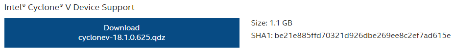
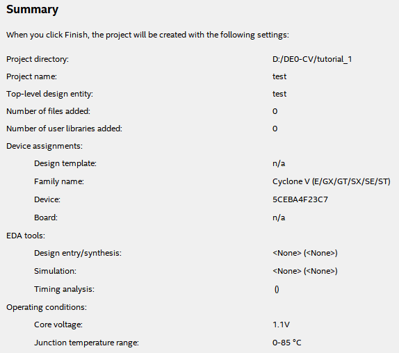

# FPGA: MLP Implementation

### Quartus Installation Steps in Windows 10&#x20;

Install Quartus Prime Standard[ 18.1.0.625 ](https://www.intel.com/content/www/us/en/software-kit/665987/intel-quartus-prime-standard-edition-design-software-version-18-1-for-windows.html)with ModelSim - upper version does not support Cyclone IV, V family

<figure><figcaption></figcaption></figure>

Go to Individual Files → Install Intel Cyclone V Device Support. Put .qdz file in the same path as installation file.&#x20;

<figure><figcaption></figcaption></figure>

### Setting up Quartus Project&#x20;

1. In the Windows search bar, type "device installer" -> Quartus installer will pop up

<figure><figcaption></figcaption></figure>

<figure><figcaption></figcaption></figure>

<figure><figcaption></figcaption></figure>

2. Select the file directory which you stored .qdz file -> Install Cyclone V Library&#x20;
3. Turn on Quartus&#x20;
4. File -> New Project Wizard -> select directory -> Empty Project -> No need to add files&#x20;
5. In Family Device Board Settings, select Cyclone V with model name 5CEBA4F23C7&#x20;

<figure><figcaption></figcaption></figure>

6. Skip EDA Tool Setting. The output should resemble below pic

<figure><figcaption></figcaption></figure>

