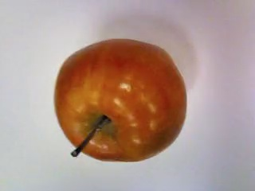

# How to make ML Dataset using Microsoft Vott: Implementation in Google Coral TPU

Whether to make senior design project or to build simple personal projects based on machine learning for resume, the first step of making custom machine learning model is to make custom dataset. Although there are tons of tutorials that teaches how to make such datasets, this page will talk about making custom dataset using Microsoft Vott.&#x20;


### Take Video&#x20;

The first thing to do is to take a video. It is possible to take the video with smartphones and make dataset based on that, but I used OpenMV H7 that uses OmniVision Camera sensors that are widely used in microcontrollers.&#x20;

Omnivision camera sensors are commonly used in&#x20;

* most arduino boards
* Raspberry Pi&#x20;
* ESP32&#x20;
* STM32&#x20;

I though if I make dataset based on OV sensors and recycle the dataset maybe it might increase the accuracy due to shared sensor pixel characteristics, but later I realized it doesn't affect overall performance much.

#### Taking video through OpenMV H7

If video is being taken from phone, this step can be skipped.&#x20;

<figure><figcaption><p>OpenMV IDE Recording Setup</p></figcaption></figure>

Download [OpenMV IDE](https://openmv.io/pages/download) and connect OpenMV H7. There are multiple resolutions to choose to capture image. (The default is QVGA: 320X240)

```python
import sensor, image, time

exposure_ms = 1  # microseconds = 1e-6

sensor.reset()
sensor.set_pixformat(sensor.RGB565)
sensor.set_framesize(sensor.VGA) # Default: sensor.QVGA

# default is turned on. It will automatically lower the brightness if the screen is static
# If you do not turn this off, whenever the object is static, the image will be really dark
# sensor.set_auto_exposure(enable [, exposure_us])
# exposure_us = microseconds in integer

sensor.set_auto_exposure(False, exposure_ms)
sensor.skip_frames(time = 1000)

clock = time.clock()

while(True):
    clock.tick()
    img = sensor.snapshot()
    print(clock.fps())
```

There are multiple options for resolution:&#x20;

<pre class="language-python"><code class="lang-python"><strong>sensor.QQCIF: 88x72
</strong>sensor.QCIF: 176x144
sensor.CIF: 352x288
sensor.QQSIF: 88x60
sensor.QSIF: 176x120
sensor.SIF: 352x240
sensor.QQQQVGA: 40x30
sensor.QQQVGA: 80x60
sensor.QQVGA: 160x120
sensor.QVGA: 320x240
sensor.VGA: 640x480
sensor.HQQQQVGA: 30x20
sensor.HQQQVGA: 60x40
sensor.HQQVGA: 120x80
sensor.HQVGA: 240x160
sensor.HVGA: 480x320
sensor.B64X32: 64x32 (for use with Image.find_displacement())
sensor.B64X64: 64x64 (for use with Image.find_displacement())
sensor.B128X64: 128x64 (for use with Image.find_displacement())
sensor.B128X128: 128x128 (for use with Image.find_displacement())
sensor.B160X160: 160x160 (for the HM01B0)
sensor.B320X320: 320x320 (for the HM01B0)
sensor.LCD: 128x160 (for use with the lcd shield)
sensor.QQVGA2: 128x160 (for use with the lcd shield)
</code></pre>

It is better to have high resolution so that whenever you are using the dataset for other projects you do not have to upscale it.&#x20;

For autoexposure, setting it to FALSE will force OpenMV H7 to not become dark whenever the camera or object is static.&#x20;

<figure><figcaption><p>apple when camera is not moving</p></figcaption></figure>

<figure><figcaption><p>apple when camera is moving</p></figcaption></figure>

While it is possible to make dataset through Tools--> Dataset Editor-->New Dataset, it only takes one image which is inconvenient.

<figure><figcaption></figcaption></figure>

Instead, simply record the whole video by Pressing **Record** in the Frame Buffer windows. At the end of recording, it will prompt user to save video&#x20;

<figure><figcaption></figcaption></figure>


### Convert Video to image frames

Use below code to split videos to frames. The program will prompt user to enter how many image per frame to convert to image. For example, if video is recorded for 10 fps for 10 seconds, it will have 100 frames. If 1 image per 5 frame is being converted, there will be total of 20 images.&#x20;

If the vieo is comparatively static, choose high frame per image. If the video is comparatively dynamic and the objects move fast, then choose low frame per image.

```python
import cv2
import os
filename = input("Input file name: ")
frame_per_image = int(input("frame per image: "))
cap = cv2.VideoCapture(filename)
success, image = cap.read()
# Create a directory to store the frames
if not os.path.exists("frames"):
    os.makedirs("frames")

# Iterate over each frame of the video
frame_count = 0
while True:
    # Read the frame
    ret, frame = cap.read()
    # If there are no more frames, break the loop
    if not ret:
        break
    # Save the frame as an image
    if (frame_count % frame_per_image == 0):
        frame_path = os.path.join("frames", f"frame_{frame_count}.jpg")
        cv2.imwrite(frame_path, frame)
    # Increment the frame count
    frame_count += 1
# Release the VideoCapture object
cap.release()

```

<figure><figcaption></figcaption></figure>

It will output frames in same path. Inside of dataset, there should be multiple images.

<figure><figcaption></figcaption></figure>

### Installing Microsoft VoTT

Go to [Microsoft VoTT github release](https://github.com/Microsoft/VoTT/releases) and install. Although it is no longer continued, it have .dmg files and .exe files in github release which makes it really easy to install. (The files are under Assets)

<figure><figcaption><p>install microsoft vott</p></figcaption></figure>

### Setup Microsoft VoTT

Open Microsoft VoTT, and click new projects

<figure><figcaption></figcaption></figure>

* Display name --> type your dataset name
* SEcurity Token --> Generate New Security Token
* Source Connection --> Select the frames folder that you just made
* Target Connection --> output folder&#x20;

<figure><figcaption></figcaption></figure>

Press "Save Project". Now the VoTT Project will pop up.&#x20;

<figure><figcaption></figcaption></figure>

Press the "+" button next to TAGS and add the name of the object in the "Add new tag". In my case, it will be banana.

<figure><figcaption></figcaption></figure>

Click the Export Setting Button which is shown in the red box above.&#x20;

* Provider --> PASCAL VOC&#x20;
* Asset State --> Only tagged Assets
* Test/Train Split --> 100
* Export Unassigned --> UNCHECKED

If you do not uncheck this, all the images which you did not labeled will be included in dataset also. \


<figure><figcaption><p>Frames which you only viewed will not be exported. In this case, frame_1000 and frame_1004</p></figcaption></figure>

Now, press project button so that you could go back to project.

<figure><figcaption></figcaption></figure>

### Labeling Dataset

Now, select frame\_0.jpg and drag your mouse. The bounding box will pop up. After setting correct bounding box, Press NUMPAD 1.&#x20;

<figure><figcaption><p>labeling banana</p></figcaption></figure>

Whatever saved in TAGS will show up after pressing NUMPAD 1. Press down key, and then keep continuing labeling next image.&#x20;

&#x20;Now you need to keep doing this until the end of image. Use a good gaming mouse, as low quality mouse will cause extensive fatigue.&#x20;

Drag, press 1, press down, drag, press 1, press down, ...&#x20;


#### Do not label it wrong!&#x20;

<figure><figcaption><p>Faulty COCO Dataset</p></figcaption></figure>

Above faulty labels are from official COCO Dataset. Try to label it correctly in order to not confuse the model. (I found this when I made script that draw bounding box on image)

### Exporting the project&#x20;

Once the labeling is done, press **Export Project**.

<figure><figcaption></figcaption></figure>

However, sometimes it will say Export Failed! It does not mean all of your work disappeared.&#x20;

The solution is to hit the **Export Project** several times so that it eventually shows **Export Successful!** message. &#x20;

If it keeps failing, wait for a minute and hit the button for 10 times again.&#x20;

### Checking Output Files

now, next to the frames folder, there should be a vott output folder

<figure><figcaption></figcaption></figure>

Inside the Vott output folder full of .json files, there will be file {Vott\_your\_file\_name}-PasccalVOC. Inside this folder, there should be your JPG image file and Annotations file.&#x20;

<figure><figcaption><p>Vott PascalVOC output</p></figcaption></figure>

Annotation folder is for .xml&#x20;

JPEGImages folder is for .jpg&#x20;

<figure><figcaption><p>JPEGImages</p></figcaption></figure>

<figure><figcaption><p>Annotations</p></figcaption></figure>

The xml files will look like below format:&#x20;

```xml
<annotation verified="yes">
    <folder>Annotation</folder>
    <filename>frame_0.jpg</filename>
    <path>banana_dataset_maker-PascalVOC-export/Annotations/frame_0.jpg</path>
    <source>
        <database>Unknown</database>
    </source>
    <size>
        <width>320</width>
        <height>240</height>
        <depth>3</depth>
    </size>
    <segmented>0</segmented>
    <object>
    <name>banana</name>
    <pose>Unspecified</pose>
    <truncated>0</truncated>
    <difficult>0</difficult>
    <bndbox>
        <xmin>117.51744570974576</xmin>
        <ymin>14.975387314618644</ymin>
        <xmax>203.2808527542373</xmax>
        <ymax>149.3641585010593</ymax>
    </bndbox>
</object>
</annotation>

```

### Ready to use&#x20;

Now, your dataset is ready to use! Copy Annotations folder and JPEGImages folder to whatever place you want. However, if you want this dataset to be used in Pytorch or Tensorflow, you would probably need little bit of polishing, which I will post next time.


## Chapter 2: Google Coral TPU


### Google Coral Dev Board Basic Setup

Initially, I wanted to use Jetson Nano for running my ssdmobilenet .tflite file. However, the outdated JetPack 4.6 and its endless library dependecy error to install tensorflow eventually forced me to try Google Coral Dev Board. (Although Pytorch model that was installed 1 year ago works fine, I want to try .tflite files)  \
\
Finally, I am free of endless h5py wheel configuration error.&#x20;

<figure><figcaption><p>google coral dev board vs jetson nano</p></figcaption></figure>

Below is the official tutorial from google:\
[https://coral.ai/docs/dev-board/get-started](https://coral.ai/docs/dev-board/get-started)

Similar to Jetson Nano setup:&#x20;

1. Download Image
2. Flash through BalenaEtcher

<figure><figcaption></figcaption></figure>

```
(base) jin@cose-zwqin-r13:~/Documents$ ./etcher.AppImage 
Language changed to: en 
packageUpdatable false 
ready -to- show: 1.1095
```

<figure><figcaption><p>switch in Google Coral Dev Board</p></figcaption></figure>

3. Once it is done, it will show following message through HDMI cable

```
=== FLASH START! ===
* Writing partition table
6.4208401 GPT-partition _entry array_crc32 values don't match: 0x4462764 1= 0x97897541
[6.4346771 GPT:] Use GNU Parted to correct GPT errors.
[6.4456501 mncbIkO:] p1 p2 p3 p
Writing bootloader ...
Writing boot filesystem...
[7.3035321 random:] crng init done
* Writing home filesystem..
```

4. When the RED LED turns off, unplug power and remove microSD card, and set switch to on-off-off-off.  After few minutes, below text should appear and then the blue background with terminal should display. &#x20;


```
9.4443951 +HUT
9.4569393 -HWT
9.4928651 HTT: full reorder offload enabled
9.5209031 Pkt log is disabled
9.5285871 target uses HTT version 3.50; host uses 3.28
9.5410181 Host SW:4.5.23.1, FW:2.0.1.1048, HW:QCA6174_REV3_2
9.5525841 o1_pktlog_init: pktlogmod_init successful!
9.5628641 wlan: driver loaded in 1496000
I A start job is running for Scripts that should be run only once (1min 11s no limit)
```


<figure><figcaption></figcaption></figure>

5. If you connect the OTG usb-c cable to desktop, the device should pop up in "mdt device"

<figure><figcaption><p>wifi connect </p></figcaption></figure>

<figure><figcaption></figcaption></figure>

```
(base) jin@cose-zwqin-r13:~$ mdt wait -for -device
Waiting for device.
Found 1 devices.
(base) jin@cose-zwqin-r13:~$ mdt devices purple- jet
(192.168.100. 2)
(base) jin@cose-zwqin-r13:~$
```

6. Connect to WiFi.&#x20;

```
mendel@purple-jet:~$ mcli connection show
NAME
UUID
TYPE
gadgeto
4cd0c09b-3258-4a77-8798-9ab278b997a7 ethernet
gadget1
2ff67458-502-41e0-a831-1a074a485c8d ethernet
MICLab
5fc5a71d-9afb-4d80-873e-b2afce52005e wift
Wired connection 1 0c816d43-024a-3c92-b62f -7090d5e50ado ethernet mendel@purple-jet:~$
```


So, everything is done. The Board will show the terminal at the background with the minimalistic blue background.&#x20;


### Running SSDMobileNet Demo&#x20;

In order to run the ssdmobilenet demo,&#x20;

```
mendel@purple-jet:/$ edgetpu_demo --device
```

<figure><figcaption></figcaption></figure>

<figure><figcaption><p>Google Coral Dev Board Demo</p></figcaption></figure>

It will show the highway video.


### Running Google Tutorial's Parrot Inference Demo

Now, create new folder at home directory with your name and add permission (I did chown root:root /usr/bin/sudo and it messed up my whole system root permission so I had to clean install again)

```
mendel@undefiend-eft:/home$ whoami 
mendel
mendel@undefiend-eft:/home$ sudo chown -R mendel:mendel /home/jin
```

Google tutorial shows how to clone the project and run the sample inference.

Change your directory to home/your-name and clone those projects.

```
remote: Enumerating objects: 315, done.
remote: Counting objects: 1005 (11/13), done.
remote:
Compressing objects: 100% (7/7)
remote:
Total 315 (delta 6),
done.
reused 4 (delta 4). pack-reused 304
objects: 100% (315/315), 6.32 MIB | 5.21 MiB/s, done.
Resolving deltas: 100% (98/98), done. mendel@purple iet:/corals cd pycoral
mendel@purple- jet:/coral/pycorals bash examples/instali requirements.sh classif)
```

```
mendel@purple-jet:/coral/pycoral$ sudo python3 examples/classify image-py. - - mode test _data/mobilenet_v2_1.0_224_inat_bird_quant_edgetpu.tflite=-labelstestda ta/inat bird labels.txt
.. - - INFERENCE TIME-.. -
= input test_data/parrot. jpg
Note: The first inference on Edge TPU is slow because it includes loading the mo del into Edge TPU memory.
13.9ms
4. Oms
3.7 ms
3.8ms
3.4ms
- -RESULTS-. ...
Ara macao (Scarlet Macaw): 0.75781 mendel@purple- jet:/coral/pycorals
```

The parrot inference should run.&#x20;


### Running Custom tflite model based on Google's Efficientdet tutorial

Tutorial Link: [https://colab.research.google.com/github/google-coral/tutorials/blob/master/retrain\_efficientdet\_model\_maker\_tf2.ipynb](https://colab.research.google.com/github/google-coral/tutorials/blob/master/retrain_efficientdet_model_maker_tf2.ipynb)

If you follow the google tutorial, you can make your own Efficientdet.tflite file compiled for google coral dev board. I put them in separate github repository with some inference photos.&#x20;

<figure><figcaption></figcaption></figure>

<figure><figcaption></figcaption></figure>


You need to manually copy .tflite file and label file to specific folders.

<figure><figcaption></figcaption></figure>

```
mendel@purple-jet:/home/coral/pycoral$ python3 examples/classify image.py - -mode
1 test data/demo vi.tflite --labels test data/demo label vi.txt --input test dat
a/images/apple 11. jpg
---- INFERENCE TIME ---- 
Note: The first inference on Edge TPU is slow because it includes loading the del into Edge TPU memory.
mo
80.2ms
66.9ms
68.9ms
70.2ms
69.4ms
RESULTS hand: 0.96484
```

However, as you can see, it is not working out well. My model is saying that apple is hand.  I will post later whenever I have time to fix this


## Chapter 3: Testing Coral Dev Board Camera&#x20;


```shellscript

# Copy selected files to the specified destination directory
echo "Copying selected files to $DESTINATION_DIR:"
for file in "${selected_files[@]}"; do
    cp "$file" "$DESTINATION_DIR"
    echo "Copied: $file"
done

echo "Selected files copied from USB to $DESTINATION_DIR"

# Unmount the USB drive
sudo umount /media/usb

# Print a message indicating that the USB drive has been unmounted
echo "\n==USB drive has been unmounted.==\n"

```

### Copy to USB&#x20;

put those files inside the USB.

&#x20; (1) (1) (1) (1) (1).png>)

Now, connect to Coral Dev Board&#x20;

```
sudo fdisk -l 
```

It will print multiple disks. USB devices are not necessarily sdb or sdc.&#x20;

My USB disk looked like below:&#x20;

```
Device    Boot Start End      Sectors  Size  Id Type
/dev/sda1 *    50944 60604415 60553472 28.90 C  W95 FAT32 (LBA)
```

Now, create new folder in media and mount USB in there&#x20;

```
mkdir /media/usb
sudo mount /dev/sda1 /media/usb
```

Change directory to usb and run usb\_transfer scripts

```
cd /media/usb 
sudo chmod +x usb_transfer.sh
./usb_transfer.sh
```

The script ask user to enter the destination path and which scripts to copy&#x20;

```
mendel@undefined-eft:/media/usb/coral script$ /usb transfer.sh
Files in the USB drive:
run_face_detection_inference.sh run_usb_camera_inference.sh usb_transfer.sh
Enter the destination directory on the Coral Dev Board: /home/jin/demo_files
Enter a file name to copy (or 0 to exit): run_face_detection_inference.sh
Enter a file name to copy (or 0 to exit): run_usb_camera_inference.sh
Enter a file name to copy (or 0 to exit): usb_transfer.sh
Enter a file name to copy
Tor 0 to exit: 0
Coping selected files to /home/jin/demo files:
Copied: run_face_detection_inference.sh
Copied: run_usb_camera_inference.sh
Copied: usb_transfer.sh
Selected files copied from USB to /home/jin/demo_files
```

Now, unmount the USB and plug in USB Camera

```
sudo umount /media/usb
```

### Running script&#x20;

Now, change directory to the /home/jin/demo\_files&#x20;

```
cd /home/jin/demo_files
sudo chmod +x run_usb_camera_inference.sh
./run_usb_camera_inference.sh 
```

The SSDMobileNet V2 1000 object detection demo will look like below:&#x20;

<figure><figcaption></figcaption></figure>

You can also run face detection model. (However, you must run above script first so that it downloads all the models)&#x20;

```
./run_face_detection_inference.sh 
```

In order to shut down, Press Window Key + Tab so that terminal pop up.&#x20;

Ctrl+C to terminate the streaming.&#x20;


## Chapter 4: Train EfficientDet&#x20;


[Google tutorial](https://colab.research.google.com/github/google-coral/tutorials/blob/master/retrain_efficientdet_model_maker_tf2.ipynb) shows how to train your own model for Coral Dev Board.

However, trying to follow this official Google tutorial has inflicted 3 hours of agony and pain on me, as it caused incessant amounts of numpy, tensorflow, and many other library configuration errors. If Google's tutorial code worked for you, you have no need to read this post.&#x20;


After several attempts to fix the problem through google colab, I eventually created jupyter notebook and modified the code a bit.&#x20;


Below is my method of training and deploying the model.&#x20;

It will only detect two objects for testing purposes:&#x20;

* Apple
* The exoglove model that I am trying to detect&#x20;

### Dataset if you need&#x20;

If you need a simple dataset that you want to test, use the below dataset [https://drive.google.com/file/d/1Ji2fiGojwNSJEInsZf1sLoGN2WA3f8ql/view?usp=sharing](https://drive.google.com/file/d/1Ji2fiGojwNSJEInsZf1sLoGN2WA3f8ql/view?usp=sharing) which I have been labeling with Microsoft VoTT.&#x20;

However, this code will require you to make separate folders for images and XML file. Use the below script to separate the image and annotation folder if needed

```
import os
import shutil

def copy_files(source_dir, dest_images_dir, dest_annotations_dir):
    for filename in os.listdir(source_dir):
        if filename.endswith('.jpg'):
            shutil.copy(os.path.join(source_dir, filename), os.path.join(dest_images_dir, filename))
        elif filename.endswith('.xml'):
            shutil.copy(os.path.join(source_dir, filename), os.path.join(dest_annotations_dir, filename))

def main():
    images_folder = "images"
    annotations_folder = "annotations"
    os.makedirs(images_folder, exist_ok=True)
    os.makedirs(annotations_folder, exist_ok=True)

    while True:
        folder_name = input("Enter folder name (Enter '0' to mark the end): ")
        if folder_name == '0':
            break
        if not os.path.isdir(folder_name):
            print(f"Folder '{folder_name}' does not exist. Skipping...")
            continue

        copy_files(folder_name, images_folder, annotations_folder)
    
    print("Copying complete.")

if __name__ == "__main__":
    main()
```

### Create a separate conda environment for efficientDet. Below is the environment.yml for my env.&#x20;

```
name: coral
channels:
  - conda-forge
  - defaults
dependencies:
  - _libgcc_mutex=0.1=main
  - _openmp_mutex=5.1=1_gnu
  - ca-certificates=2023.7.22=hbcca054_0
  - cudatoolkit=11.8.0=h6a678d5_0
  - ld_impl_linux-64=2.38=h1181459_1
  - libffi=3.4.4=h6a678d5_0
  - libgcc-ng=11.2.0=h1234567_1
  - libgomp=11.2.0=h1234567_1
  - libstdcxx-ng=11.2.0=h1234567_1
  - ncurses=6.4=h6a678d5_0
  - openssl=3.0.9=h7f8727e_0
  - pip=23.2.1=py39h06a4308_0
  - python=3.9.17=h955ad1f_0
  - readline=8.2=h5eee18b_0
  - setuptools=68.0.0=py39h06a4308_0
  - sqlite=3.41.2=h5eee18b_0
  - tk=8.6.12=h1ccaba5_0
  - wheel=0.38.4=py39h06a4308_0
  - xz=5.4.2=h5eee18b_0
  - zlib=1.2.13=h5eee18b_0
  - pip:
      - absl-py==1.4.0
      - anyio==3.7.1
      - argon2-cffi==21.3.0
      - argon2-cffi-bindings==21.2.0
      - array-record==0.4.0
      - arrow==1.2.3
      - asttokens==2.2.1
      - astunparse==1.6.3
      - async-lru==2.0.3
      - attrs==23.1.0
      - audioread==3.0.0
      - babel==2.12.1
      - backcall==0.2.0
      - bcrypt==4.0.1
      - beautifulsoup4==4.12.2
      - bleach==6.0.0
      - cachetools==5.3.1
      - certifi==2023.7.22
      - cffi==1.15.1
      - charset-normalizer==3.2.0
      - click==8.1.6
      - comm==0.1.3
      - cryptography==41.0.2
      - cycler==0.11.0
      - cython==3.0.0
      - dataclasses==0.6
      - debugpy==1.6.7
      - decorator==5.1.1
      - defusedxml==0.7.1
      - dm-tree==0.1.8
      - etils==1.4.0
      - exceptiongroup==1.1.2
      - executing==1.2.0
      - fastjsonschema==2.18.0
      - fire==0.5.0
      - flatbuffers==23.5.26
      - fqdn==1.5.1
      - gast==0.4.0
      - gin-config==0.5.0
      - google-api-core==2.11.1
      - google-api-python-client==2.95.0
      - google-auth==2.22.0
      - google-auth-httplib2==0.1.0
      - google-auth-oauthlib==0.4.6
      - google-cloud-bigquery==3.11.4
      - google-cloud-core==2.3.3
      - google-crc32c==1.5.0
      - google-pasta==0.2.0
      - google-resumable-media==2.5.0
      - googleapis-common-protos==1.59.1
      - grpcio==1.56.2
      - grpcio-status==1.48.2
      - h5py==3.9.0
      - httplib2==0.22.0
      - idna==3.4
      - importlib-metadata==6.8.0
      - importlib-resources==6.0.0
      - ipykernel==6.25.0
      - ipython==8.14.0
      - isoduration==20.11.0
      - jax==0.4.13
      - jedi==0.18.2
      - jinja2==3.1.2
      - joblib==1.3.1
      - json5==0.9.14
      - jsonpointer==2.4
      - jsonschema==4.18.4
      - jsonschema-specifications==2023.7.1
      - jupyter-client==8.3.0
      - jupyter-core==5.3.1
      - jupyter-events==0.6.3
      - jupyter-lsp==2.2.0
      - jupyter-server==2.7.0
      - jupyter-server-terminals==0.4.4
      - jupyterlab==4.0.3
      - jupyterlab-pygments==0.2.2
      - jupyterlab-server==2.24.0
      - kaggle==1.5.16
      - keras==2.8.0
      - keras-preprocessing==1.1.2
      - kiwisolver==1.4.4
      - libclang==16.0.6
      - librosa==0.8.1
      - llvmlite==0.36.0
      - lxml==4.9.3
      - markdown==3.4.4
      - markupsafe==2.1.3
      - matplotlib==3.4.3
      - matplotlib-inline==0.1.6
      - mistune==3.0.1
      - ml-dtypes==0.2.0
      - nbclient==0.8.0
      - nbconvert==7.7.3
      - nbformat==5.9.1
      - nest-asyncio==1.5.6
      - neural-structured-learning==1.4.0
      - notebook==7.0.0
      - notebook-shim==0.2.3
      - numba==0.53.0
      - numpy==1.23.4
      - nvidia-cublas-cu11==2022.4.8
      - nvidia-cublas-cu117==11.10.1.25
      - nvidia-cudnn-cu11==8.6.0.163
      - oauthlib==3.2.2
      - opencv-python-headless==4.8.0.74
      - opt-einsum==3.3.0
      - overrides==7.3.1
      - packaging==20.9
      - pandas==2.0.3
      - pandocfilters==1.5.0
      - parso==0.8.3
      - pexpect==4.8.0
      - pickleshare==0.7.5
      - pillow==10.0.0
      - platformdirs==3.9.1
      - pooch==1.7.0
      - prometheus-client==0.17.1
      - promise==2.3
      - prompt-toolkit==3.0.39
      - proto-plus==1.22.3
      - protobuf==3.19.6
      - psutil==5.9.5
      - ptyprocess==0.7.0
      - pure-eval==0.2.2
      - py-cpuinfo==9.0.0
      - pyasn1==0.5.0
      - pyasn1-modules==0.3.0
      - pybind11==2.11.1
      - pycocotools==2.0.6
      - pycoral==2.0.0
      - pycparser==2.21
      - pygments==2.15.1
      - pyparsing==3.1.0
      - python-dateutil==2.8.2
      - python-json-logger==2.0.7
      - python-slugify==8.0.1
      - pytz==2023.3
      - pyyaml==6.0.1
      - pyzmq==25.1.0
      - referencing==0.30.0
      - requests==2.31.0
      - requests-oauthlib==1.3.1
      - resampy==0.4.2
      - rfc3339-validator==0.1.4
      - rfc3986-validator==0.1.1
      - rpds-py==0.9.2
      - rsa==4.9
      - scann==1.2.6
      - scikit-learn==1.3.0
      - scipy==1.11.1
      - send2trash==1.8.2
      - sentencepiece==0.1.99
      - six==1.16.0
      - sniffio==1.3.0
      - sounddevice==0.4.6
      - soundfile==0.12.1
      - soupsieve==2.4.1
      - stack-data==0.6.2
      - tensorboard==2.8.0
      - tensorboard-data-server==0.6.1
      - tensorboard-plugin-wit==1.8.1
      - tensorflow==2.8.4
      - tensorflow-addons==0.21.0
      - tensorflow-datasets==4.9.0
      - tensorflow-estimator==2.8.0
      - tensorflow-hub==0.12.0
      - tensorflow-io-gcs-filesystem==0.32.0
      - tensorflow-metadata==1.13.0
      - tensorflow-model-optimization==0.7.5
      - tensorflowjs==3.18.0
      - termcolor==2.3.0
      - terminado==0.17.1
      - text-unidecode==1.3
      - tf-models-official==2.3.0
      - tf-slim==1.1.0
      - tflite-model-maker==0.4.2
      - tflite-runtime==2.5.0.post1
      - tflite-support==0.4.4
      - threadpoolctl==3.2.0
      - tinycss2==1.2.1
      - toml==0.10.2
      - tomli==2.0.1
      - tornado==6.3.2
      - tqdm==4.65.0
      - traitlets==5.9.0
      - typeguard==2.13.3
      - typing-extensions==4.5.0
      - tzdata==2023.3
      - uri-template==1.3.0
      - uritemplate==4.1.1
      - urllib3==1.25.11
      - wcwidth==0.2.6
      - webcolors==1.13
      - webencodings==0.5.1
      - websocket-client==1.6.1
      - werkzeug==2.3.6
      - wrapt==1.14.1
      - zipp==3.16.2
prefix: /home/jin/anaconda3/envs/coral
```

This is the environment setting that did not cause the numpy or tensorflow library dependency error&#x20;

### Create Jupyter Notebook&#x20;

```
conda install jupyter
jupyter notebook 
```

### Create a new file and paste the following code:&#x20;

```
import numpy as np
import os
import random
import shutil


from tflite_model_maker.config import ExportFormat
from tflite_model_maker import model_spec
from tflite_model_maker import object_detector

import tensorflow as tf
assert tf.__version__.startswith('2')

print(f"TensorFlow version: {tf.__version__}")
print(f"NumPy version: {np.__version__}")

tf.get_logger().setLevel('ERROR')
from absl import logging
logging.set_verbosity(logging.ERROR)

# Images folder input 
images_in = 'Dataset_apple_hand/images'
# XML folder input 
annotations_in = 'Dataset_apple_hand/annotations'


label_map = {1: 'hand', 2: 'apple'}
```

<pre><code>UserWarning: Tensorflow Addons supports using Python ops for all Tensorflow versions above or equal to 2.11.0 and strictly below 2.14.0 (nightly versions are not supported). 
<strong>
</strong><strong>TensorFlow version: 2.8.4
</strong>NumPy version: 1.23.4
</code></pre>

Modify the image and annotation path based on where your dataset is.&#x20;

Although it gave me an outdated tensorflow version warning, it worked well&#x20;

### Paste code for dataset generation

```
def split_dataset(images_path, annotations_path, val_split, test_split, out_path):
    # Remove preexisting folder
    current_dir = os.getcwd() 
    folder_name = os.path.join(current_dir, 'dataset')
    if os.path.exists(folder_name) and os.path.isdir(folder_name):
        shutil.rmtree(folder_name)
        print(f"Prexisting Folder '{folder_name}' deleted.")
    else:
        print(f"Folder '{folder_name}' does not exist. Create new dataset folder")

    
    """Splits a directory of sorted images/annotations into training, validation, and test sets.

    Args:
        images_path: Path to the directory with your images (JPGs).
        annotations_path: Path to a directory with your VOC XML annotation files,
            with filenames corresponding to image filenames. This may be the same path
            used for images_path.
        val_split: Fraction of data to reserve for validation (float between 0 and 1).
        test_split: Fraction of data to reserve for test (float between 0 and 1).
    Returns:
        The paths for the split images/annotations (train_dir, val_dir, test_dir)
    """
    _, dirs, _ = next(os.walk(images_path))

    train_dir = os.path.join(out_path, 'train')
    val_dir = os.path.join(out_path, 'validation')
    test_dir = os.path.join(out_path, 'test')

    IMAGES_TRAIN_DIR = os.path.join(train_dir, 'images')
    IMAGES_VAL_DIR = os.path.join(val_dir, 'images')
    IMAGES_TEST_DIR = os.path.join(test_dir, 'images')
    os.makedirs(IMAGES_TRAIN_DIR, exist_ok=True)
    os.makedirs(IMAGES_VAL_DIR, exist_ok=True)
    os.makedirs(IMAGES_TEST_DIR, exist_ok=True)

    ANNOT_TRAIN_DIR = os.path.join(train_dir, 'annotations')
    ANNOT_VAL_DIR = os.path.join(val_dir, 'annotations')
    ANNOT_TEST_DIR = os.path.join(test_dir, 'annotations')
    os.makedirs(ANNOT_TRAIN_DIR, exist_ok=True)
    os.makedirs(ANNOT_VAL_DIR, exist_ok=True)
    os.makedirs(ANNOT_TEST_DIR, exist_ok=True)

    print(f"Created directories for train, validation, and test data.")
    print(f"Train directory: {train_dir}")
    print(f"Validation directory: {val_dir}")
    print(f"Test directory: {test_dir}")

    # Get all filenames for this dir, filtered by filetype
    filenames = os.listdir(os.path.join(images_path))
    filenames = [os.path.join(images_path, f) for f in filenames if f.endswith('.jpg')]
    # Shuffle the files, deterministically
    filenames.sort()
    random.seed(42)
    random.shuffle(filenames)
    # Get the exact number of images for validation and test; the rest is for training
    val_count = int(len(filenames) * val_split)
    test_count = int(len(filenames) * test_split)
    for i, file in enumerate(filenames):
        source_dir, filename = os.path.split(file)
        annot_file = os.path.join(annotations_path, filename.replace("jpg", "xml"))
        if i < val_count:
            shutil.copy(file, IMAGES_VAL_DIR)
            shutil.copy(annot_file, ANNOT_VAL_DIR)
            print(f"Copied {filename} and its annotation to {IMAGES_VAL_DIR} and {ANNOT_VAL_DIR}")
        elif i < val_count + test_count:
            shutil.copy(file, IMAGES_TEST_DIR)
            shutil.copy(annot_file, ANNOT_TEST_DIR)
            print(f"Copied {filename} and its annotation to {IMAGES_TEST_DIR} and {ANNOT_TEST_DIR}")
        else:
            shutil.copy(file, IMAGES_TRAIN_DIR)
            shutil.copy(annot_file, ANNOT_TRAIN_DIR)
            print(f"Copied {filename} and its annotation to {IMAGES_TRAIN_DIR} and {ANNOT_TRAIN_DIR}")
    return (train_dir, val_dir, test_dir)
```

Above code is function for generating dataset. The code will generate train, validation, test folder

```
train_dir, val_dir, test_dir = split_dataset(images_in, annotations_in,val_split=0.2, test_split=0.2,out_path='dataset')
train_data = object_detector.DataLoader.from_pascal_voc(os.path.join(train_dir, 'images'),os.path.join(train_dir, 'annotations'), label_map=label_map)
validation_data = object_detector.DataLoader.from_pascal_voc(os.path.join(val_dir, 'images'),os.path.join(val_dir, 'annotations'), label_map=label_map)
test_data = object_detector.DataLoader.from_pascal_voc(os.path.join(test_dir, 'images'),os.path.join(test_dir, 'annotations'), label_map=label_map)

print(f'train count: {len(train_data)}')
print(f'validation count: {len(validation_data)}')
print(f'test count: {len(test_data)}')
```

At the end, it will print&#x20;

```
Copied apple_37.jpg and its annotation to dataset/train/images and dataset/train/annotations
Copied hand_787.jpg and its annotation to dataset/train/images and dataset/train/annotations
train count: 832
validation count: 277
test count: 277
```

### Train model

```
spec = object_detector.EfficientDetLite0Spec()

model = object_detector.create(train_data=train_data,
                               model_spec=spec,
                               validation_data=validation_data,
                               epochs=1000,
                               batch_size=32,
                               train_whole_model=True)
```

<figure><figcaption></figcaption></figure>

### Evaluate model

```
model.evaluate(test_data)
```

### Export trained model

Change the filename to whatever you want&#x20;

```
# Now export trained model 

TFLITE_FILENAME = 'efficientdet_coral_v2.tflite' 
LABELS_FILENAME = 'coral_labels_v2.txt'
print("Done!")

model.export(export_dir='.', tflite_filename=TFLITE_FILENAME, label_filename=LABELS_FILENAME,
             export_format=[ExportFormat.TFLITE, ExportFormat.LABEL])
print("Done!")
```

### Convert exported mode using EdgeTPU compiler

Now, your folder should have&#x20;

<figure><figcaption></figcaption></figure>

In the same directory, go to the terminal and type&#x20;

```
edgetpu_compiler efficientdet_coral_v2.tflite --num_segments=1
```

It will print&#x20;

```
Edge TPU Compiler version 16.0.384591198
Started a compilation timeout timer of 180 seconds.

Model compiled successfully in 1524 ms.

Input model: efficientdet_coral_v2.tflite
Input size: 4.24MiB
Output model: efficientdet_coral_v2_edgetpu.tflite
Output size: 5.57MiB
On-chip memory used for caching model parameters: 4.21MiB
On-chip memory remaining for caching model parameters: 3.29MiB
Off-chip memory used for streaming uncached model parameters: 0.00B
Number of Edge TPU subgraphs: 1
Total number of operations: 267
Operation log: efficientdet_coral_v2_edgetpu.log

Model successfully compiled but not all operations are supported by the Edge TPU. A percentage of the model will instead run on the CPU, which is slower. If possible, consider updating your model to use only operations supported by the Edge TPU. For details, visit g.co/coral/model-reqs.
Number of operations that will run on Edge TPU: 264
Number of operations that will run on CPU: 3
See the operation log file for individual operation details.
Compilation child process completed within timeout period.
Compilation succeeded! 

```

Now, the folder should have&#x20;

<figure><figcaption></figcaption></figure>

The log file shows that most of the operations are supported.

```
Edge TPU Compiler version 16.0.384591198
Input: efficientdet_coral_v2.tflite
Output: efficientdet_coral_v2_edgetpu.tflite

Operator                       Count      Status

ADD                            42         Mapped to Edge TPU
CUSTOM                         1          Operation is working on an unsupported data type
RESHAPE                        10         Mapped to Edge TPU
CONCATENATION                  2          Mapped to Edge TPU
RESIZE_NEAREST_NEIGHBOR        12         Mapped to Edge TPU
DEPTHWISE_CONV_2D              80         Mapped to Edge TPU
DEQUANTIZE                     2          Operation is working on an unsupported data type
CONV_2D                        102        Mapped to Edge TPU
QUANTIZE                       1          Mapped to Edge TPU
LOGISTIC                       1          Mapped to Edge TPU
MAX_POOL_2D                    14         Mapped to Edge TPU
```

### Transfer file&#x20;

It is possible to transfer files through SSH communication from the desktop to the Coral Dev Board, but I used a more conventional way: USB

Copy 3 files to USB:&#x20;

* Your exported model.tflite&#x20;
* Your exported label.txt
* usb\_transfer.sh (You can manually cp everything, so skip if you want)

usb\_transfer.sh scripts are in the previous post&#x20;


[Broken link](broken-reference)


Now, turn on the Google Coral Dev Board and mount the USB. (you need to create /media/usb directory) The USB path might differ

```
sudo mount /dev/sda1 /media/usb 
cd /media/usb 
sudo chmod +x usb_transfer.sh
./usb_transfer.sh
```

Transfer those file to one of the directories that belong to /home

I created new folder called "demo\_v2"

```
mendel@undefined-eft:/media/usb$ ./usb transfer.sh
Files in the USB drive:
run_face_detection_inference.sh run_usb_camera_inference.sh usb_transfer.sh
Enter the destination directory on the Coral Dev Board: /home/jin/demo_v2
Enter a file name to copy (or 0 to exit): efficientDet_coral_v2_edgetpu.tflite
Enter a file name to copy (or 0 to exit): coral_labels_v2.txt
Enter a file name to copy (or 0 to exit): 0
Coping selected files to /home/jin/demo files:
Copied: run_face_detection_inference.sh
Copied: run_usb_camera_inference.sh
Copied: usb_transfer.sh
Selected files copied from USB to /home/jin/demo_v2
```


### Run the code&#x20;

Now, go to the directory where your files and models are moved. In my case, it is /home/jin/demo\_v2

<pre><code>mendel@undefined-eft: cd /home/jin/demo_v2
<strong>mendel@undefined-eft: ls
</strong><strong>efficientDet_coral_v2_edgetpu.tflite
</strong><strong>coral_labels_v2.txt 
</strong></code></pre>

There should be your transferred files. Create a script for running the code.&#x20;

```
vim run_effi_v2.sh
```

```
#!/bin/bash

echo "==== EfficientDet Demo ===="

echo "To exit, press win + tab to show terminal"

edgetpu_detect \
--source /dev/video1:YUY2:640x480:10/1 \
--model /home/jin/demo_v2/efficientDet_coral_v2_edgetpu.tflite \
--labels /home/jin/demo_v2/coral_labels.txt
```

ESC + :wq to save

If it causes E212: no permission to write then you should add permission to the home directory&#x20;

<pre><code><strong>sudo chmod +x run_effi_v2.sh
</strong>./run_effi_v2
</code></pre>

If the streaming stops after a few seconds showing gstream render\_overlay\_gen.send(tensor, layout, command)&#x20;

Check whether the script is running **edgetpu\_classify** instead of **edgetpu\_detect**

<figure><figcaption><p>my setting: apple and hand </p></figcaption></figure>

<figure><figcaption></figcaption></figure>

Do not forget to&#x20;

```
sudo shutdown now 
```

Instead of unplugging


## Chapter 5: Calculating Distance between Hand and Apple&#x20;


&#x20;Running Google's github example&#x20;

Thankfully, Google gives [another tutorial ](https://coral.ai/docs/dev-board/camera/#try-other-example-code)about how to modify and run your own model.&#x20;


Turn on your google coral dev board and conenct USB camera. Change to home directory and clone [Google's github](https://github.com/google-coral/examples-camera.git) tutorial.

You can skip install\_requirements if you are using Coral Dev Board.

```
$ cd /home/jin 
$ git clone https://github.com/google-coral/examples-camera.git
$ cd examples-camera
$ sh download_models.sh
$ cd gstreamer
```

However, if you are using USB camera instead of Coral Camera, you need to modify one line of code. I used vim.

```
$ vim detect.py
```

Press \[i] to edit the detect.py file. Go to the parser.add\_argument and change to /dev/video0 to /dev/video1

```
# IF you are using USB Camera, do not forget to change from /dev/video0 to /dev/video1
parser.add_argument('--videosrc', help='Which video source to use. ', default='/dev/video1')
```

Then press **:wq** to exit the vim. Again, if you are getting E212 error, change the permission of home directory.&#x20;

Run the detect.py which will load SSDMobileNet with COCO label map

```
mendel@undefined-eft:/home/jin/examples-camera/gstreamer$ python3 detect.py 
```

It should give you something like this:

<figure><figcaption></figcaption></figure>

## Load your model&#x20;

After checking that the model is correctly working, go to github again and download 3 files:

* common.py&#x20;
* detect.py
* gstreamer.py

Put them inside the USB with your previously trained Efficienddet.tflite file and label map. &#x20;

<figure><figcaption></figcaption></figure>

### Modify code&#x20;

open detect.py and change code&#x20;

For import,&#x20;

```
import numpy as np 
```

Go to generate\_svg()&#x20;

```
def generate_svg(src_size, inference_box, objs, labels, text_lines):
    svg = SVG(src_size)
    src_w, src_h = src_size
    box_x, box_y, box_w, box_h = inference_box
    scale_x, scale_y = src_w / box_w, src_h / box_h
    for y, line in enumerate(text_lines, start=1):
        svg.add_text(10, y * 20, line, 20)
      
    # this is looping through the objects 
    apple_obj = None
    hand_obj = None
    apple_center = (0,0)
    hand_center = (0,0)
    for obj in objs:
        bbox = obj.bbox
        if not bbox.valid:
            continue
        # Absolute coordinates, input tensor space.
        x, y = bbox.xmin, bbox.ymin
        w, h = bbox.width, bbox.height
        # Subtract boxing offset.
        x, y = x - box_x, y - box_y
        # Scale to source coordinate space.
        x, y, w, h = x * scale_x, y * scale_y, w * scale_x, h * scale_y
        percent = int(100 * obj.score)
        label_id = labels.get(obj.id, obj.id)
        label_str = '{}% {}'.format(percent, label_id)
        svg.add_text(x, y - 5, label_str, 20)
        svg.add_rect(x, y, w, h, 'green', 2)

        if label_id == 'apple':
          apple_center = x + w/2, y+ h/2; 
        elif label_id == 'hand':
          hand_center = x + w/2, y + h/2;

    # Draw lines and calculate distance if both centers are found
    if apple_center != (0, 0) and hand_center != (0, 0):
        svg.add_rect(apple_center[0], apple_center[1], 5,5,'red', 8)
        svg.add_rect(hand_center[0], hand_center[1], 5, 5, 'blue', 8)

        # Calculate Euclidean distance between centers
        distance = np.linalg.norm(np.array(apple_center) - np.array(hand_center))
        distance_text = 'Distance: {:.2f} pixels'.format(distance)
        svg.add_text(10, src_h - 40, distance_text, 30)

    return svg.finish()
```

Because I am only detecting apple and hand, I only added code for this.&#x20;

(The code I added is probably really inefficient so you should modify a lot)

What this code basically do is to add the dots at the center of apple and hand and calculate the distance with numpy.&#x20;


Now, go to the man() and change model name and label map.&#x20;

In my case, it will be

```
default_model_dir = ''
default_model = 'efficientdet_v2.tflite'
default_labels = 'efficientdet_v2_label.txt'
```

Also, I will be putting files in same directory so model\_dir = ''

Save it and unplug USB.&#x20;


### Connect to Coral Dev board&#x20;

Connect USB to coral dev board.&#x20;

To make it easy, I used usb\_transfer.sh script that I used in previous posts&#x20;

If it is first time using usb, then&#x20;

```
sudo mkdir /media/usb
sudo mount /dev/sda1 /meda/usb 
cd /media/usb 
```

Your USB name might differ.&#x20;

Copy all the contents to the /home directory. I put everything inside demo\_v3 folder&#x20;

```
$ pwd 
/home/jin/demo_v3
$ ls 
common.py 
detect.py 
efficientdet_v2_label.txt
efficientdet_v2.tflite
gstreamer.py 
```

Run the detect model.

<figure><figcaption></figcaption></figure>

```
$ python3 detect.py
```

<figure><figcaption></figcaption></figure>

<figure><figcaption><p>google coral dev board: distance</p></figcaption></figure>

Unfortunately, I could not find the way to draw a line in svg. The distance is based on the pixel. Camera input is 640X480


## Chapter 5: Testing UART

Unfortunately, Google Coral Dev Board does not support BLE.&#x20;


In order to communicate with other microcontroller, it is possible to use MQTT communication, as I used it for sending distance from OpenMV H7 to ESP32.&#x20;


However, the school WIFI sometimes block the WIFI communication and the broker is sometimes not ablue to receive any information. It means I can only demo my project in my Professor's Lab.&#x20;


To fix this problem, I am going to output distance through UART communication and make Bluetooth HM-10 to send the distance information.&#x20;


To install the GPIO library,&#x20;

```
sudo python3 -m pip install python-periphery 
```

[Google documentation](https://coral.ai/docs/dev-board/gpio/#header-pinout) shows the pinout.&#x20;

* 5V pin = Lower row rightmost pin
* GND pin = Lower row right to the 3rd pin
* UART3 TX pin = Upper row right to the 4th pin&#x20;

UART3 TX (output) pin is the /dev/ttymxc2.&#x20;

### Connect Arduino to see output

<figure><figcaption></figcaption></figure>

I already have a arduino debugging tool that I made to test UART communication specific with little i2c display. This will display the UART output through the I2C display so I do not have to look at Serial Monitor.&#x20;

<figure><figcaption></figcaption></figure>

### Writing simple script to test whether UART works or not&#x20;

lets make a simple script

```
# UART_tester.py
# just check whether the uart outputs the number

from periphery import Serial
import time

# Configure UART3, 9600 baud
# PIN 7 
# Lower row 4th pin 

uart3 = Serial("/dev/ttymxc2", 9600)

def send_number(num):
    uart3.write(f"{num}".encode())
    print(num)

try:
    while True:
        for num in range(1, 101):
            send_number(num)
            time.sleep(0.5)  # lets make port rest
        # Loop back to 1 once 100 is reached
except KeyboardInterrupt:
    print("Exiting...")
finally:
    uart3.close()
```

This code will simply print out the number 1 to 100 through the UART port3 tx. &#x20;

I am settting baud rate to 9600 because I will use it for the bluetooth modules that uses 9600 as default baud rate.&#x20;

You can either write this on vim or write it on desktop and transfer it.&#x20;

Now, run the code

```
sudo python3 uart_tester.py 
```

Do not forget the 'sudo' as it will give you warning that you do not have permission for port&#x20;

If it keep causing permission error

```
sudo chmod a+rw /dev/ttymxc2
```

To get permission.&#x20;

<figure><figcaption></figcaption></figure>

It should print out number from 1 to 100.&#x20;


However, if you do not have logic analyzer or simple UART debugger, you can use below super simple code to test whether UART is working or not.&#x20;

<pre><code><strong>//ESP32 receives UART serial 2 (Port 16, 17) 
</strong>//ESP32 then reflects back to UART cable serial 0. (USB cable)

void setup() {
  // put your setup code here, to run once:
  Serial2.begin(9600);
  Serial.begin(115200);
}

void loop() {
  if (Serial2.available()) {
    Serial.write(Serial2.read());
  }
}
</code></pre>


## Output Object distance through UART &#x20;

now, lets go to the Coral Dev board and output distance through UART communication.&#x20;

Let's edit the detect.py&#x20;

```
vim detect.py 
```

In the import,&#x20;

```python
# import numpy for distance calculation
import numpy as np 
# import uart 
from periphery import Serial 

# now put UART communication in here 
uart3 = Serial("/dev/ttymxc2", 9600)
```

And in the generate\_svg,&#x20;

```python
    # Draw lines and calculate distance if both centers are found
    if apple_center != (0, 0) and hand_center != (0, 0):
        svg.add_rect(apple_center[0], apple_center[1], 3,3,'red', 3)
        svg.add_rect(hand_center[0], hand_center[1], 3, 3, 'blue', 3)

        # Calculate Euclidean distance between centers
        distance = np.linalg.norm(np.array(apple_center) - np.array(hand_center))
        distance_text = 'Distance: {:.2f} pixels'.format(distance)
        svg.add_text(10, src_h - 40, distance_text, 30)
        #output uart
        uart3.write(f"{distance} ".encode()); 
```

If you just do&#x20;

```
uart3.write(distance) 
```

It will cause error since the int is directly passed (bytes is required)

Run the code&#x20;

```
python3 detect.py 
```

<figure><figcaption></figcaption></figure>

It will output the distance correctly! However, the numbers are float and there is no space between each distance.&#x20;

## Polishing UART output&#x20;

Lets make it more clean. Go to vim and edit the UART output line

```python
uart3.write(f"{int(distance)} ".encode()); 
```

<figure><figcaption><p>editing through vim....</p></figcaption></figure>

Now the distance is converted to int and have space. (I do not need that much accuracy)&#x20;

So, if you run this code

<figure><figcaption><p>distance output</p></figcaption></figure>

<figure><figcaption></figcaption></figure>

The UART correctly receives the distance and prints them in integer format and with space


However, the GPIO usage probably cause delays in both Google Coral Dev board and ESP32.&#x20;

I probably need to fix code so that It sends distance every 3 inferences.

<figure><figcaption></figcaption></figure>

As one inference is around 80ms, 3 inference would be \~250ms. Updating distance 4 times per second is probably unnoticeable.&#x20;


## # ====Updated Code ==== #&#x20;

so, whenever the UART Communication tries to send integer information, the UART TX will send&#x20;

```
123\n443\n503\n412\n123...
```

I used delimiter as the **'\n'** so that ESP8266 (which is the receiver) can receive and parse easily.&#x20;

The sample python3 code to send UART information will be&#x20;

```
import serial
import time
import random 

uart3= serial.Serial("/dev/ttymxc2", 115200)

while true: 
    distance = random.randint(0, 300)
    uart3.write(f"{distance}".encode())
    uart3.write(b'\n')
    print(distance)
    time.sleep(3)
```

Above code will send a random distance from 0 to 300 through UART in a Baud rate of 115200 and also send a delimiter as '\n'.&#x20;

To add timer instead of delay, the prev\_dist and prev\_time must be initialized inside of main() function

```
import serial
import time
import random 

def main():
    uart3 = serial.Serial("/dev/ttymxc2", 115200)

    previous_distance = None  # Initialize the previous_distance variable
    previous_time = time.time()  # Initialize the previous_time variable

    interval = 0.3  # Set the desired interval in seconds (e.g., 300ms)

    while True:
        current_time = time.time()

        # Check if the desired interval has passed
        if current_time - previous_time >= interval:
            previous_time = current_time  # Update the previous time

            # Generate a random distance value
            distance = random.randint(0, 300)

            # Check if the generated distance is the same as the previous one
            while distance == previous_distance:
                distance = random.randint(0, 300)

            # Update the previous_distance variable
            previous_distance = distance

            # Send the distance over UART
            uart3.write(f"{distance}".encode())
            uart3.write(b'\n')
            print(distance)

        # You can run other programs or tasks here without blocking the loop

if __name__ == "__main__":
    main()

```


For Testing UART&#x20;
