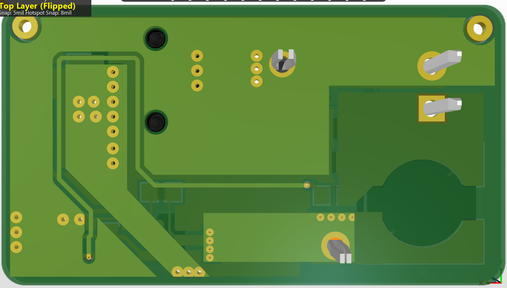

# HSPICE

## Creating Inverter

<figure><figcaption>
create inverter - Cell name:inverter View Name: schematic
</figcaption></figure>

##

## Running Testbench&#x20;

After designing the testbench, Click Tools --> PrimeWave&#x20;

<figure><figcaption></figcaption></figure>

In the Primewave, go to the Simulation --> Options&#x20;

Select PrimeSim HSPICE.&#x20;

Save

<figure><figcaption></figcaption></figure>

Now with the changed setting in the Primewave, Go to Setup --> Model Files&#x20;

<figure><figcaption></figcaption></figure>

For the Testbench file,&#x20;

* /packages/process\_kit/generic/generic\_90nm/updated\_oct2010/SAED\_PDK90nm/hspice/SAED90nm.lib&#x20;

For Section,&#x20;

* TT\_12

Save&#x20;

<figure><figcaption></figcaption></figure>

Now, go to Setup --> Analysis&#x20;

<figure><figcaption></figcaption></figure>

In the testbench, select Tran

<figure><figcaption></figcaption></figure>

* Start Time: 0&#x20;
* Time Step: 10p
* Stop Time: 100m&#x20;
* Set "Enable"

In the testbench, select DC&#x20;

<figure><figcaption></figcaption></figure>

* Select Power source from the Testbench&#x20;

<figure><figcaption>
the red one - /V2
</figcaption></figure>

Now, the PrimeWave Simulator should have the following table in 'value'

<figure><figcaption>
testbench following value 
</figcaption></figure>

Set the input/output variables&#x20;

<figure><figcaption></figcaption></figure>

&#x20;Save the PrimeWave Script

<figure><figcaption></figcaption></figure>

Now, go to simulation --> Netlist/Run

<figure><figcaption></figcaption></figure>
