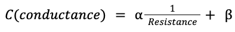

# Coral TPU: Connect USB Camera

<figure><figcaption></figcaption></figure>

[Google Tutorial: how to connect camera](https://coral.ai/docs/dev-board/camera/#connect-a-usb-camera)

### Detect USB Camera

```
v4l2-ctl --list-formats-ext --device /dev/video1
```

Because OpenCV is already installed in google coral, you do not have to install any module. However, it is important to check what resolution and what fps the usb camera supports.&#x20;

For example, my camera only supports 20fps or 30fps unlike google tutorial which uses 24fps 800X600


### Making Scripts

In order to follow tutorial I had to type multiple github links which was easy to mistake. To make it simpler lets use script so that everything could be copy pasted

### Create 3 Scripts&#x20;

2 scripts are for demo and 1 scripts and for transferring scripts easily to destination file

```
touch run_usb_camera_inference.sh
touch run_face_detection_inference.sh 
touch usb_transfer.sh 
```

run\_usb\_camera\_inference.sh _(Do not forget to change fps and resolution and directory)_

```shellscript
#!/bin/bash

echo "\n==== SSDMobileNet V2 1000 Object detection Demo ====\n"

export DEMO_FILES="/home/jin/demo_files"
mkdir -p ${DEMO_FILES}

# The image classification model and labels file
wget -nc -P ${DEMO_FILES}/ https://github.com/google-coral/test_data/raw/master/mobilenet_v2_1.0_224_quant_edgetpu.tflite
wget -nc -P ${DEMO_FILES}/ https://raw.githubusercontent.com/google-coral/test_data/release-frogfish/imagenet_labels.txt

# The face detection model (does not require a labels file)
wget -nc -P ${DEMO_FILES}/ https://github.com/google-coral/test_data/raw/master/ssd_mobilenet_v2_face_quant_postprocess_edgetpu.tflite

echo "this will classify 1000 different objects: "

edgetpu_classify \
--source /dev/video1:YUY2:640x480:10/1 \
--model ${DEMO_FILES}/mobilenet_v2_1.0_224_quant_edgetpu.tflite \
--labels ${DEMO_FILES}/imagenet_labels.txt

```

run face\_detection\_inference.sh _(Do not forget to change fps and resolution and directory)_

```shellscript
#!/bin/bash

# Set the path to the demo files directory
echo "\n=========Face Detection Demo==============\n"

DEMO_FILES="/home/jin/demo_files"

# Set the path to the model file
MODEL_FILE="${DEMO_FILES}/ssd_mobilenet_v2_face_quant_postprocess_edgetpu.tflite"

# Check if the model file exists
if [ ! -f "$MODEL_FILE" ]; then
    echo "Model file '$MODEL_FILE' is missing! Check the folder path: '$DEMO_FILES'"
else
    # Run the edgetpu_detect command
    edgetpu_detect \
    --source /dev/video1:YUY2:640x480:10/1  \
    --model "$MODEL_FILE"
fi

```

This is for easy file transfer. You can skip this

```shellscript
#!/bin/bash

# Display files in the USB drive
echo "Files in the USB drive:"
ls -1

# Ask the user to enter the destination directory
read -p "Enter the destination directory on the Coral Dev Board: " DESTINATION_DIR

# Initialize an array to store selected files
selected_files=()

# Prompt the user to enter file names to copy
while true; do
    read -p "Enter a file name to copy (or 0 to exit): " filename
    if [ "$filename" = "0" ]; then
        break
    fi
    if [ -f "$filename" ]; then
        selected_files+=("$filename")
    else
        echo "File not found."
    fi
done

# Copy selected files to the specified destination directory
echo "Copying selected files to $DESTINATION_DIR:"
for file in "${selected_files[@]}"; do
    cp "$file" "$DESTINATION_DIR"
    echo "Copied: $file"
done

echo "Selected files copied from USB to $DESTINATION_DIR"

# Unmount the USB drive
sudo umount /media/usb

# Print a message indicating that the USB drive has been unmounted
echo "\n==USB drive has been unmounted.==\n"

```

### Copy to USB&#x20;

put those files inside the USB.

&#x20;

Now, connect to Coral Dev Board&#x20;

```
sudo fdisk -l 
```

It will print multiple disks. USB devices are not necessarily sdb or sdc.&#x20;

My USB disk looked like below:&#x20;

```
Device    Boot Start End      Sectors  Size  Id Type
/dev/sda1 *    50944 60604415 60553472 28.90 C  W95 FAT32 (LBA)
```

Now, create new folder in media and mount USB in there&#x20;

```
mkdir /media/usb
sudo mount /dev/sda1 /media/usb
```

Change directory to usb and run usb\_transfer scripts

```
cd /media/usb 
sudo chmod +x usb_transfer.sh
./usb_transfer.sh
```

The script ask user to enter the destination path and which scripts to copy&#x20;

```
mendel@undefined-eft:/media/usb/coral script$ /usb transfer.sh
Files in the USB drive:
run_face_detection_inference.sh run_usb_camera_inference.sh usb_transfer.sh
Enter the destination directory on the Coral Dev Board: /home/jin/demo_files
Enter a file name to copy (or 0 to exit): run_face_detection_inference.sh
Enter a file name to copy (or 0 to exit): run_usb_camera_inference.sh
Enter a file name to copy (or 0 to exit): usb_transfer.sh
Enter a file name to copy
Tor 0 to exit: 0
Coping selected files to /home/jin/demo files:
Copied: run_face_detection_inference.sh
Copied: run_usb_camera_inference.sh
Copied: usb_transfer.sh
Selected files copied from USB to /home/jin/demo_files
```

Now, unmount the USB and plug in USB Camera

```
sudo umount /media/usb
```

### Running script&#x20;

Now, change directory to the /home/jin/demo\_files&#x20;

```
cd /home/jin/demo_files
sudo chmod +x run_usb_camera_inference.sh
./run_usb_camera_inference.sh 
```

The SSDMobileNet V2 1000 object detection demo will look like below:&#x20;

<figure><figcaption></figcaption></figure>

You can also run face detection model. (However, you must run above script first so that it downloads all the models)&#x20;

```
./run_face_detection_inference.sh 
```

In order to shut down, Press Window Key + Tab so that terminal pop up.&#x20;

Ctrl+C to terminate the streaming.&#x20;

