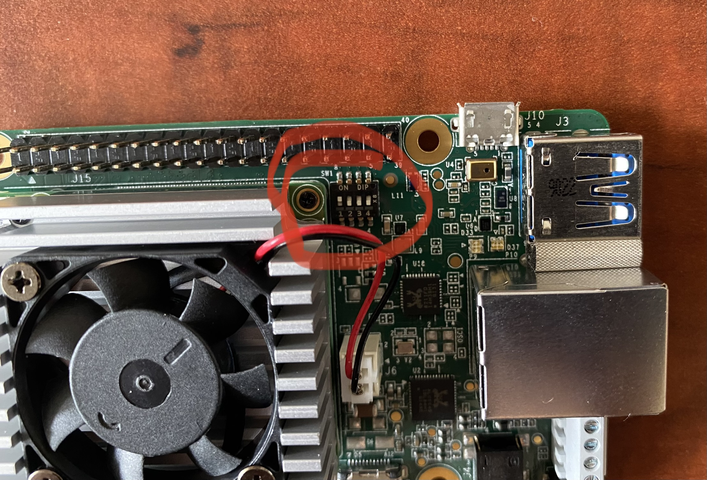

# Google Coral TPU

Initially, I wanted to use Jetson Nano for running my ssdmobilenet .tflite file. However, the outdated JetPack 4.6 and its endless library dependecy error to install tensorflow eventually forced me to try Google Coral Dev Board. (Although Pytorch model that was installed 1 year ago works fine, I want to try .tflite files)  \
\
Finally, I am free of endless h5py wheel configuration error.&#x20;

<figure><figcaption><p>google coral dev board vs jetson nano</p></figcaption></figure>

Below is the official tutorial from google:\
[https://coral.ai/docs/dev-board/get-started](https://coral.ai/docs/dev-board/get-started)

Similar to Jetson Nano setup, you should download image, run balenaetcher, and then flip the switch again

<figure><figcaption><p>switch in Google Coral Dev Board</p></figcaption></figure>

<figure><figcaption></figcaption></figure>

Once it is done, it will show following message through HDMI cable

```
=== FLASH START! ===
* Writing partition table
6.4208401 GPT-partition _entry array_crc32 values don't match: 0x4462764 1= 0x97897541
[
6.4346771 GPT: Use GNU Parted to correct GPT errors.
[
6.4456501 mncbIkO: p1 p2 p3 p
Writing bootloader ...
Writing boot filesystem...
[
7.3035321 randon: crng init done
* Writing hone filesystem..

```


When the RED LED turns off, unplug power and remove microSD card, and set switch to on-off-off-off.&#x20;

Connect to computer with USB C cable.&#x20;

<figure><figcaption></figcaption></figure>

<figure><figcaption><p>wifi connect </p></figcaption></figure>

<figure><figcaption></figcaption></figure>

```
(base) jin@cose-zwqin-r13:~$ mdt wait -for -device
Waiting for device.
Found 1 devices.
(base) jin@cose-zwqin-r13:~$ mdt devices purple- jet
(192.168.100. 2)
(base) jin@cose-zwqin-r13:~$
```

If you successfully connect to wifi,&#x20;

```
mendel@purple-jet:~$ mcli connection show
NAME
UUID
TYPE
gadgeto
4cd0c09b-3258-4a77-8798-9ab278b997a7 ethernet
gadget1
2ff67458-502-41e0-a831-1a074a485c8d ethernet
MICLab
5fc5a71d-9afb-4d80-873e-b2afce52005e wift
Wired connection 1 0c816d43-024a-3c92-b62f -7090d5e50ado ethernet mendel@purple-jet:~$
```


So, everything is done. The Board will show the terminal at the background with the minimalistic blue background.&#x20;


In order to run the ssdmobilenet demo,&#x20;

```
mendel@purple-jet:/$ edgetpu demo - -device
```

<figure><figcaption></figcaption></figure>

<figure><figcaption><p>Google Coral Dev Board Demo</p></figcaption></figure>

It will show the highway video.


Google tutorial shows how to clone the project and run the sample inference.


Change your directory to home and clone those projects.

```
remote: Enumerating objects: 315, done.
remote: Counting objects: 1005 (11/13), done.
remote:
Compressing objects: 100% (7/7)
remote:
Total 315 (delta 6),
done.
reused 4 (delta 4). pack-reused 304
objects: 100% (315/315), 6.32 MIB | 5.21 MiB/s, done.
Resolving deltas: 100% (98/98), done. mendel@purple iet:/corals cd pycoral
mendel@purple- jet:/coral/pycorals bash examples/instali requirements.sh classif)
```

```
mendel@purple-jet:/coral/pycoral$ sudo python3 examples/classify image-py. - - mode test _data/mobilenet_v2_1.0_224_inat_bird_quant_edgetpu.tflite=-labelstestda ta/inat bird labels.txt
.. - - INFERENCE TIME-.. -
= input test_data/parrot. jpg
Note: The first inference on Edge TPU is slow because it includes loading the mo del into Edge TPU memory.
13.9ms
4. Oms
3.7 ms
3.8ms
3.4ms
- -RESULTS-. ...
Ara macao (Scarlet Macaw): 0.75781 mendel@purple- jet:/coral/pycorals
```

The parrot inference should run.&#x20;


If you follow the google tutorial, you can make your own Efficientdet .tflite file compiled for google coral dev board. I put them in separate github repository with some inference photos.&#x20;

<figure><figcaption></figcaption></figure>

<figure><figcaption></figcaption></figure>


However, as you can see, it is not working well

<figure><figcaption></figcaption></figure>

```
mendel@purple-jet:/home/coral/pycoral$ python3 examples/classify image.py - -mode
1 test data/demo vi.tflite
- -labels test data/demo label vi.txt - input test dat
a/images/apple 11. jpg
- . . - INFERENCE TIME • - ..
Note: The first inference on Edge TPU is slow because it includes loading the del into Edge TPU memory.
mo
80.2ms
66.9ms
68.9ms
70.2ms
69.4ms
RESULTS hand: 0.96484
mendel@purple- jet : /home/coral/pycoral$ python examples/classify_ image.py - -mode
I test data/demo vi. tflite
-labels test_data/demo_label_vI.txt
•- input test dat
a/images/apple 11.jpg
```


