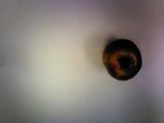
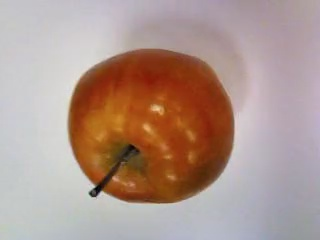

# How to make ML Dataset using Microsoft Vott

Whether to make senior design project or to build simple personal projects based on machine learning for resume, the first step of making custom machine learning model is to make custom dataset. Although there are tons of tutorials that teaches how to make such datasets, this page will talk about making custom dataset using Microsoft Vott.&#x20;


### Take Video&#x20;

The first thing to do is to take a video. It is possible to take the video with smartphones and make dataset based on that, but I used OpenMV H7 that uses OmniVision Camera sensors that are widely used in microcontrollers.&#x20;

Omnivision camera sensors are commonly used in&#x20;

* most arduino boards
* Raspberry Pi&#x20;
* ESP32&#x20;
* STM32&#x20;

I though if I make dataset based on OV sensors and recycle the dataset maybe it might increase the accuracy due to shared sensor pixel characteristics, but later I realized it doesn't affect overall performance much.

#### Taking video through OpenMV H7

If video is being taken from phone, this step can be skipped.&#x20;

<figure><figcaption><p>OpenMV IDE Recording Setup</p></figcaption></figure>

Download [OpenMV IDE](https://openmv.io/pages/download) and connect OpenMV H7. There are multiple resolutions to choose to capture image. (The default is QVGA: 320X240)

```python
import sensor, image, time

exposure_ms = 1  # microseconds = 1e-6

sensor.reset()
sensor.set_pixformat(sensor.RGB565)
sensor.set_framesize(sensor.VGA) # Default: sensor.QVGA

# default is turned on. It will automatically lower the brightness if the screen is static
# If you do not turn this off, whenever the object is static, the image will be really dark
# sensor.set_auto_exposure(enable [, exposure_us])
# exposure_us = microseconds in integer

sensor.set_auto_exposure(False, exposure_ms)
sensor.skip_frames(time = 1000)

clock = time.clock()

while(True):
    clock.tick()
    img = sensor.snapshot()
    print(clock.fps())
```

There are multiple options for resolution:&#x20;

<pre class="language-python"><code class="lang-python"><strong>sensor.QQCIF: 88x72
</strong>sensor.QCIF: 176x144
sensor.CIF: 352x288
sensor.QQSIF: 88x60
sensor.QSIF: 176x120
sensor.SIF: 352x240
sensor.QQQQVGA: 40x30
sensor.QQQVGA: 80x60
sensor.QQVGA: 160x120
sensor.QVGA: 320x240
sensor.VGA: 640x480
sensor.HQQQQVGA: 30x20
sensor.HQQQVGA: 60x40
sensor.HQQVGA: 120x80
sensor.HQVGA: 240x160
sensor.HVGA: 480x320
sensor.B64X32: 64x32 (for use with Image.find_displacement())
sensor.B64X64: 64x64 (for use with Image.find_displacement())
sensor.B128X64: 128x64 (for use with Image.find_displacement())
sensor.B128X128: 128x128 (for use with Image.find_displacement())
sensor.B160X160: 160x160 (for the HM01B0)
sensor.B320X320: 320x320 (for the HM01B0)
sensor.LCD: 128x160 (for use with the lcd shield)
sensor.QQVGA2: 128x160 (for use with the lcd shield)
</code></pre>

It is better to have high resolution so that whenever you are using the dataset for other projects you do not have to upscale it.&#x20;

For autoexposure, setting it to FALSE will force OpenMV H7 to not become dark whenever the camera or object is static.&#x20;

<figure><figcaption><p>apple when camera is not moving</p></figcaption></figure>

<figure><figcaption><p>apple when camera is moving</p></figcaption></figure>

While it is possible to make dataset through Tools--> Dataset Editor-->New Dataset, it only takes one image which is inconvenient.

<figure><figcaption></figcaption></figure>

Instead, simply record the whole video by Pressing **Record** in the Frame Buffer windows. At the end of recording, it will prompt user to save video&#x20;

<figure><figcaption></figcaption></figure>


### Convert Video to image frames

Use below code to split videos to frames. The program will prompt user to enter how many image per frame to convert to image. For example, if video is recorded for 10 fps for 10 seconds, it will have 100 frames. If 1 image per 5 frame is being converted, there will be total of 20 images.&#x20;

If the vieo is comparatively static, choose high frame per image. If the video is comparatively dynamic and the objects move fast, then choose low frame per image.

```python
import cv2
import os
filename = input("Input file name: ")
frame_per_image = int(input("frame per image: "))
cap = cv2.VideoCapture(filename)
success, image = cap.read()
# Create a directory to store the frames
if not os.path.exists("frames"):
    os.makedirs("frames")

# Iterate over each frame of the video
frame_count = 0
while True:
    # Read the frame
    ret, frame = cap.read()
    # If there are no more frames, break the loop
    if not ret:
        break
    # Save the frame as an image
    if (frame_count % frame_per_image == 0):
        frame_path = os.path.join("frames", f"frame_{frame_count}.jpg")
        cv2.imwrite(frame_path, frame)
    # Increment the frame count
    frame_count += 1
# Release the VideoCapture object
cap.release()

```

<figure><figcaption></figcaption></figure>

It will output frames in same path. Inside of dataset, there should be multiple images.

<figure><figcaption></figcaption></figure>

### Installing Microsoft VoTT

Go to [Microsoft VoTT github release](https://github.com/Microsoft/VoTT/releases) and install. Although it is no longer continued, it have .dmg files and .exe files in github release which makes it really easy to install. (The files are under Assets)

<figure><figcaption><p>install microsoft vott</p></figcaption></figure>

### Setup Microsoft VoTT

Open Microsoft VoTT, and click new projects

<figure><figcaption></figcaption></figure>

* Display name --> type your dataset name
* SEcurity Token --> Generate New Security Token
* Source Connection --> Select the frames folder that you just made
* Target Connection --> output folder&#x20;

<figure><figcaption></figcaption></figure>

Press "Save Project". Now the VoTT Project will pop up.&#x20;

<figure><figcaption></figcaption></figure>

Press the "+" button next to TAGS and add the name of the object in the "Add new tag". In my case, it will be banana.

<figure><figcaption></figcaption></figure>

Click the Export Setting Button which is shown in the red box above.&#x20;

* Provider --> PASCAL VOC&#x20;
* Asset State --> Only tagged Assets
* Test/Train Split --> 100
* Export Unassigned --> UNCHECKED

If you do not uncheck this, all the images which you did not labeled will be included in dataset also. \


<figure><figcaption><p>Frames which you only viewed will not be exported. In this case, frame_1000 and frame_1004</p></figcaption></figure>

Now, press project button so that you could go back to project.

<figure><figcaption></figcaption></figure>

### Labeling Dataset

Now, select frame\_0.jpg and drag your mouse. The bounding box will pop up. After setting correct bounding box, Press NUMPAD 1.&#x20;

<figure><figcaption><p>labeling banana</p></figcaption></figure>

Whatever saved in TAGS will show up after pressing NUMPAD 1. Press down key, and then keep continuing labeling next image.&#x20;

&#x20;Now you need to keep doing this until the end of image. Use a good gaming mouse, as low quality mouse will cause extensive fatigue.&#x20;

Drag, press 1, press down, drag, press 1, press down, ...&#x20;


### Exporting the project&#x20;

Once the labeling is done, press **Export Project**.

<figure><figcaption></figcaption></figure>

However, sometimes it will say Export Failed! It does not mean all of your work disappeared.&#x20;

The solution is to hit the **Export Project** several times so that it eventually shows **Export Successful!** message. &#x20;

If it keeps failing, wait for a minute and hit the button for 10 times again.&#x20;

### Checking Output Files

now, next to the frames folder, there should be a vott output folder

<figure><figcaption></figcaption></figure>

Inside the Vott output folder full of .json files, there will be file {Vott\_your\_file\_name}-PasccalVOC. Inside this folder, there should be your JPG image file and Annotations file.&#x20;

<figure><figcaption><p>Vott PascalVOC output</p></figcaption></figure>

Annotation folder is for .xml&#x20;

JPEGImages folder is for .jpg&#x20;

<figure><figcaption><p>JPEGImages</p></figcaption></figure>

<figure><figcaption><p>Annotations</p></figcaption></figure>

The xml files will look like below format:&#x20;

```xml
<annotation verified="yes">
    <folder>Annotation</folder>
    <filename>frame_0.jpg</filename>
    <path>banana_dataset_maker-PascalVOC-export/Annotations/frame_0.jpg</path>
    <source>
        <database>Unknown</database>
    </source>
    <size>
        <width>320</width>
        <height>240</height>
        <depth>3</depth>
    </size>
    <segmented>0</segmented>
    <object>
    <name>banana</name>
    <pose>Unspecified</pose>
    <truncated>0</truncated>
    <difficult>0</difficult>
    <bndbox>
        <xmin>117.51744570974576</xmin>
        <ymin>14.975387314618644</ymin>
        <xmax>203.2808527542373</xmax>
        <ymax>149.3641585010593</ymax>
    </bndbox>
</object>
</annotation>

```

### Ready to use&#x20;

Now, your dataset is ready to use! Copy Annotations folder and JPEGImages folder to whatever place you want. However, if you want this dataset to be used in Pytorch or Tensorflow, you would probably need little bit of polishing, which I will post next time.
