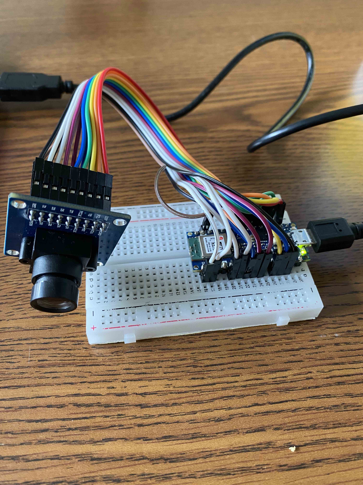
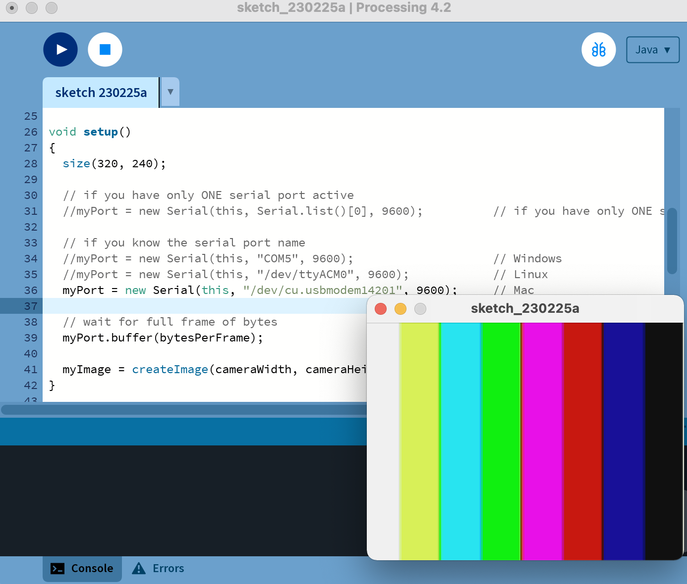

# JPG to JPEG

<figure><figcaption>
Arduino BLE 33 with OV7670
</figcaption></figure>

At first, I was surprised at how many GPIO pins are required to connect camera and whether it is possible for Cortex M4 microcontroller to manage all the GPIO input/output at such high frequency while outputting all the pixels values through UART port with 256 kB memory.

The BLE 33 sends all of the uncompressed, raw pixel value through the uart usb cable. Thankfully, there is RGB 565/888 processing [program](https://processing.org/download) that can visualize hex value in UART communication in real-time video streaming, made by MIT graduate student.

<figure><figcaption></figcaption></figure>

Every time BLE33 captures image, it needs to send 320X240X1 pixels of information through the UART communication.&#x20;

Each pixels contain RGB565.&#x20;

* Red - 5 bit&#x20;
* Green - 6 bit&#x20;
* Blue - 5 bit&#x20;

0b.RRRR.RGGG.GGGB.BBBB;&#x20;

which is total of 16 bit = 2 bytes.

So, if the video is 1 fps, the UART needs to send 320X240X16X1 = 1,228,800 bits. If the baud rate is set to 115,200 it would take around 11 seconds to send a single image.

Standard uart communication sticks to 8 bits in one line for single frame, the microcontroller have to send two frame per pixel, meaning that it needs to send 320X240X2 frame.&#x20;

<figure><figcaption>
apple dataset digital color meter
</figcaption></figure>

For example, if the BLE33 is capturing red apple and sending information through Serial Port, R value should be higher than G and B&#x20;

<figure><figcaption></figcaption></figure>

In order to send this single pixel value of 0b1111.1010.1000.1000 --> 0xfa88&#x20;

start bit - 0 - 1111.1010 - 1 - end bit&#x20;

start bit - 0 - 1000.1000 - 1 - end bit

If you turn on the Serial monitor, it will constantly lag then crash due to sheer number of bytes being sent from BLE33.\
\
Higher the baud rate, more work microcontroller have to do while processing all the Camera GPIOs.&#x20;

<figure><figcaption></figcaption></figure>

<figure><figcaption>
crashing serial monitor
</figcaption></figure>

<figure><figcaption></figcaption></figure>

The easiest attempt to alleviate such bottleneck is to lower the resolution. Ov7760 Camera driver shows different resolution options

<figure><figcaption>
OV7760 Camera driver
</figcaption></figure>

<figure><figcaption>
OV7760 output different resolution
</figcaption></figure>

