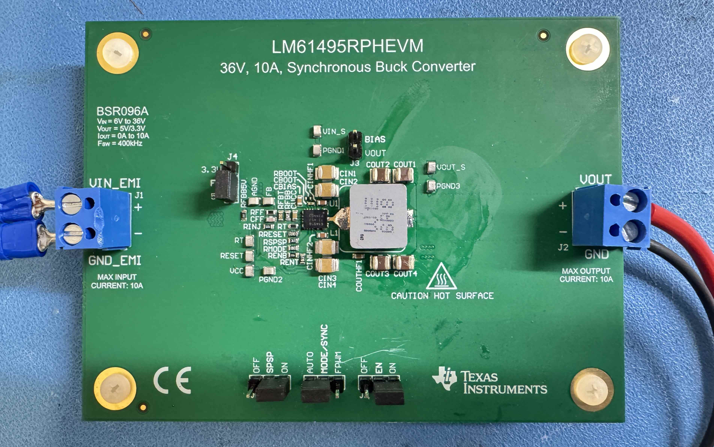

# LM61495 Test Board

<figure><figcaption></figcaption></figure>

* LM61495 is buck converter that can output max 10A output current without having an external FET and comparatively small footprint.
* This is great for the motherboard, which serves the purpose of power distribution in hot environment
* I thought about using LM5148 Buck controller + LMG2100 GaNFET for 5V \~15A option, but the GaNFET is out of stock

<figure><figcaption></figcaption></figure>

For above configuration, the maximum stack will be 5, so 5V 2A output barely meets the requirements. Transient surge will be suppressed by extra additional capacitors

## LM61495 EVM Testing&#x20;

After testing the default LM61495 board, the IC chip and inductor got considerable amount of\
heat.

I want:

* Lowest switching frequency
* Lowest possible heat
* Footprint size does not matter&#x20;

At 5V, 400kHz output, the recommended inductor is\
L: _2.4 uH_ (744325240)\
COUT: _4 x 47 uF + 100 uF electrolytic + 2 x 2.2 uF_\
CIN: _4 x 10 uF + 2 x 470 nF + 100 uF electrolytic_


## Inductor Selection:&#x20;

```markdown
### Inductor Comparison Matrix

| Parameter | 744325240 | 744393665068 (New) | Delta / Assessment |
| :--- | :--- | :--- | :--- |
| **Inductance** | *Not Specified* | 6.8 µH | Reference baseline needed for 744325240 |
| **Saturation Current ($I_{sat}$)** | 17 A | 20 A | **+17.6% increase** (Higher headroom for transient motor loads) |
| **Direct Current Resistance (DCR)**| 4.75 mΩ | 9.00 mΩ | **+89.5% increase** (Higher conduction/copper losses) |
| **Dimensions (L × W × H)** | 10.50 × 10.20 × 5.00 mm | 11.30 × 10.00 × 6.00 mm | Slightly larger footprint (+0.8mm L, +1.0mm H, -0.2mm W) |
| **Footprint Area** | 107.10 mm² | 113.00 mm² | **+5.5% larger** layout real estate required |
| **Status / Application** | Existing Baseline | Brand New Product | Requires layout modification validation |

```


