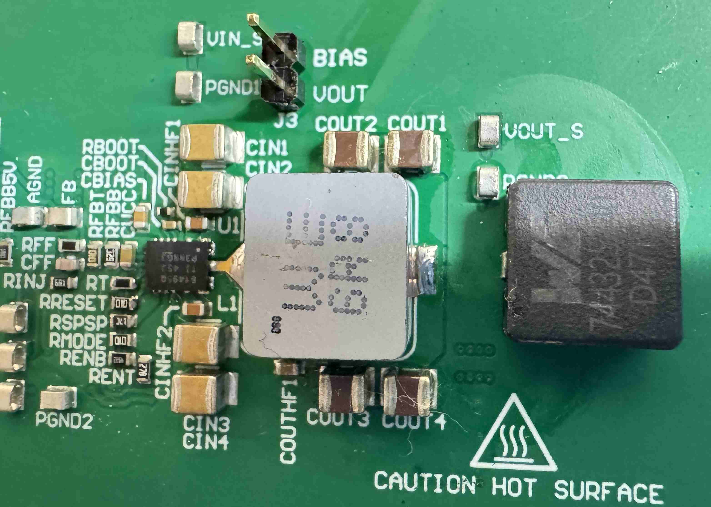
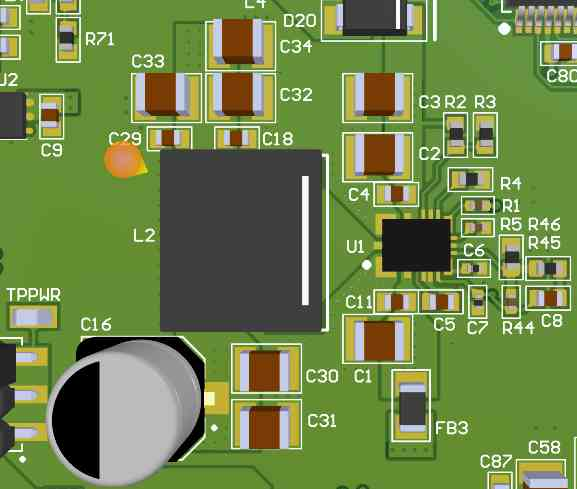
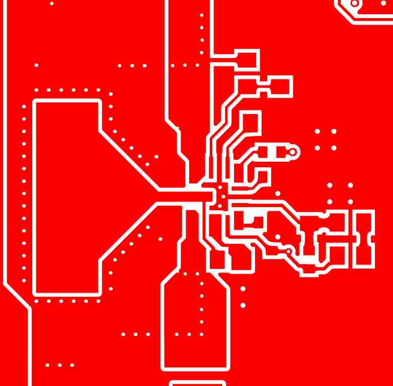

# LM61495 Test Board

<figure><figcaption></figcaption></figure>

* LM61495 is buck converter that can output max 10A output current without having an external FET + comparatively small footprint.
* This is great for the motherboard, which serves the purpose of power distribution in hot environment
* I thought about using LM5148 Buck controller + LMG2100 GaNFET/MOSFET for 5V \~15A option, but the entire footprints are too big&#x20;

<figure><figcaption></figcaption></figure>

For above configuration, the maximum slave stack will be 5, so 5V 2A output barely meets the requirements. Transient surge will be suppressed by extra additional capacitors

## LM61495 EVM Testing&#x20;

After testing the default LM61495 board, the IC chip and inductor got considerable amount of\
heat.

I want:

* Lowest possible switching frequency
* Lowest possible heat
* Intermediate Footprint size

At 5V, 400kHz output, the recommended inductor is\
L: _2.4 uH_ (744325240)\
COUT: _4 x 47 uF + 100 uF electrolytic + 2 x 2.2 uF_\
CIN: _4 x 10 uF + 2 x 470 nF + 100 uF electrolytic_

## Inductor Selection:&#x20;

| Inductor                            | 744325240            | 744393665068         |
| ----------------------------------- | -------------------- | -------------------- |
| **Inductance**                      | 2.4 µH               | 6.8 µH               |
| **Saturation Current ($I\_{sat}$)** | 17 A                 | 20 A                 |
| **DCR**                             | 4.75 mΩ              | 9.00 mΩ              |
| **Dimensions**                      | 10.5 × 10.2 × 5.0 mm | 11.3 × 10.0 × 6.0 mm |

<figure><figcaption></figcaption></figure>

Compared to original inductor in EVM, it have higher DCR but at almost triple inductance.&#x20;

Fortunately, the footprint was compatible.&#x20;

* RT = 53.6kohm for 300khz switching frequency&#x20;

<figure><figcaption></figcaption></figure>

## Output Ripple with Load Tester&#x20;

### 24V Input -> 5V&#x20;

Input: 24.06V, 2.26A&#x20;

Output: 4.84V, 10A (18 AWG wire loss to the power load)

Efficiency - 89.01%&#x20;

Considering that the long 18AWG wires were heating up under the FLIR camera, I think it is having great efficiency&#x20;

* Blue is Inductor Switch Input&#x20;
* Yellow is the voltage measured at the output screw terminal&#x20;

<figure><figcaption></figcaption></figure>

<figure><figcaption></figcaption></figure>

Output 5V ripple measured at the Screw Terminal: **73.8mV@10A** out

### 36V Input -> 5V&#x20;

Input: 35.95V, 1.52A&#x20;

Output: 4.93V, 10A&#x20;

Efficiency - 90.22%&#x20;

The inductor is still under CCM, not showing DCM shortness of breath DCM

<figure><figcaption></figcaption></figure>

<figure><figcaption></figcaption></figure>

Output 5V ripple measured at the Screw Terminal: 113**mV@10A** out

Still a totally acceptable voltage ripple&#x20;

## Temperature - Thermal Cam&#x20;

<figure><figcaption></figcaption></figure>

From left to right:&#x20;

* 30 second after turn on&#x20;
* 1 minute after turn on&#x20;
* 5 minute after turn on&#x20;

## Layout&#x20;

<figure><figcaption></figcaption></figure>

Above is default EVM Schematic

<figure><figcaption></figcaption></figure>

* 24V power supply input
* Ferrite bead pi filtering
* Low switching frequency (300khz)
* Output 5.1V instead of 5V for stacking connector resistance (and slightly better efficiency)
* 5 X Murata 47uF 1210 Capacitors + 330nF/470nF HF filtering capacitor
* At 5.1V, the derating is at 28uF&#x20;
* &#x20;Additional D=8.0mm Aluminium Electrolytic Bulk Capacitor
* UVLO resistor divider - the +24V might come from cascading a flyback PoE Buck Converter with a slow start&#x20;

## PCB Layout&#x20;

* Multiple 8 Mill Via + 12 Mill Via&#x20;
* Three 8-mil via under the center pad of LM61495 (Maybe I should've selected plugged via)
* &#x20; extended pin for soldering inspection&#x20;

<figure><figcaption></figcaption></figure>

<figure><figcaption></figcaption></figure>
