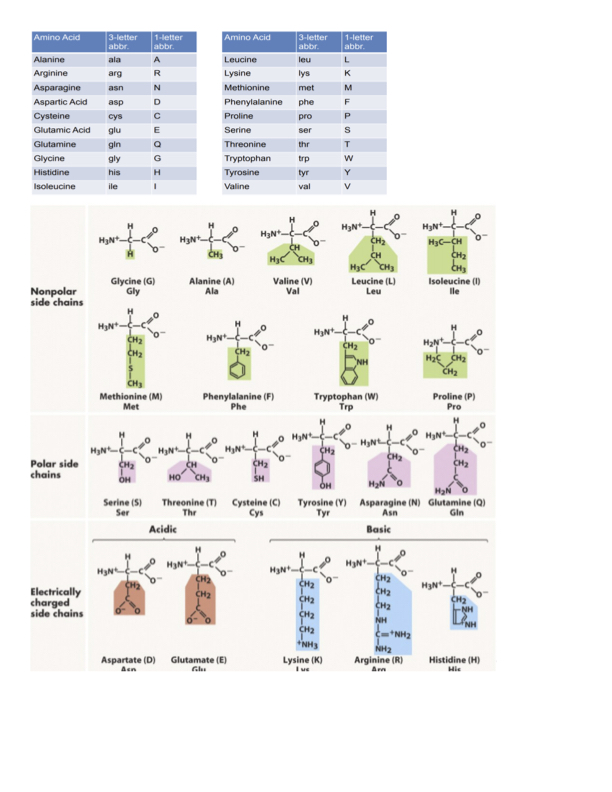

# Intro Biochem

1. Which of the following statements best explains the hydrophobic effect? _D_\_\_\_ (a) Water becomes less ordered, thereby increasing entropy (b) Water becomes more ordered, thereby increasing entropy (c) Water becomes less ordered, thereby decreasing entropy (d) Water becomes more ordered, thereby decreasing entropy (e) Hydrophobic molecules form hydrogen bonds with water, decreasing entropy
2. Which of the following functional groups is hydrophobic? **C**\_ (a) -OH (b) -C=O (c) -CH3 (d) -NH2

(e) -NH- 3. Which of the following functional groups can act as a hydrogen bond acceptor but not a donor? **B**\_

(a) -OH (b) -C=O (c) -CH3 (d) -NH2

(e) -NH- 4. What amino acid is shown below? **B**\_

(a) histidine (b) tryptophan (c) tyrosine (d) phenylalanine (e) threonine 5. What amino acid is shown below? **A**\_ (a) histidine (b) tryptophan (c) tyrosine (d) phenylalanine (e) threonine 6. Which of the following amino acids have basic sidechains? **A**\_ (a) arginine and lysine (b) methionine and cysteine (c) aspartate and glutamate (d) phenylalanine and tyrosine (e) serine and threonine

7. Which of the following amino acids contain sulfur in their sidechains? **B**\_ (a) arginine and lysine (b) methionine and cysteine (c) aspartate and glutamate (d) phenylalanine and tyrosine (e) serine and threonine
8. Which of the following pairs of amino acids is capable of forming a salt bridge with one another? **C**\_ (a) Lysine and Arginine (b) Lysine and Asparagine (c) Lysine and Aspartic Acid (d) Aspartic Acid and Glutamic Acid (e) Serine and Threonine
9. Which of the following amino acids will be found more often in the interior of a protein? **C**\_ (a) arginine (b) glutamine (c) leucine (d) lysine (e) asparagine
10. The amino acid sequence Met-Glu-Arg-Ala-Asp-Lys can also be written as which of the following? **D**\_ (a) MERAEK (b) MEAADK (c) MGAAAL (d) MERADK (e) MGRAQL
11. The His imidazole ring has a pKa = 6.5; what percentage of a protein's His side chains **C**\_ will be protonated at pH = 6.5? (a) 10 % (b) 25 % (c) 50 % (d) 75 % (e) 100 %
12. Amino acids are joined to form proteins by what kind of reaction, to form what bond? **D**\_ (a) hydrolysis reaction, peptide bond (b) condensation reaction, hydrogen bond (c) hydrolysis reaction, hydrogen bond (d) condensation reaction, peptide bond (e) condensation reaction, ionic bond
13. Ramachandran plots show which of the following? **D**\_ (a) allowable rotation of amino acid side chains (b) allowable rotation about the peptide bond (c) allowable movement of protein domains (d) allowable and favored φ and ψ torsion angles (e) allowable protein-protein interactions
14. The α-helix is stabilized primarily by which of the following? **A**\_ (a) hydrogen bonding between backbone C=O and backbone N-H (b) hydrophobic interactions between backbone C=O and backbone N-H (c) hydrogen bonding between amino acid side chains (d) hydrophobic interactions between amino acid side chains (e) salt bridges between amino acid side chains
15. The β-sheet is stabilized primarily by which of the following? **A**\_ (a) hydrogen bonding between backbone C=O and backbone N-H (b) hydrophobic interactions between backbone C=O and backbone N-H (c) hydrogen bonding between amino acid side chains (d) hydrophobic interactions between amino acid side chains (e) salt bridges between amino acid side chains
16. Which of the following describes the conformation of an α-helix **D**\_ (a) a left-handed helix with 3.6 residues per turn (b) a left-handed helix with 5.4 residues per turn (c) a right-handed helix with 5.4 residues per turn (d) a right-handed helix with 3.6 residues per turn (e) a right-handed helix with 10 residues per turn
17. Protein tertiary structure is stabilized by what type(s) of interaction? **E**\_ (a) ionic only (b) salt bridges only (c) hydrogen bonding only (d) hydrophobic only (e) all of the above
18. The primary driving force behind protein folding is which of the following? **D**\_ (a) ionic interactions (b) salt bridges (c) hydrogen bonding (d) hydrophobic interactions (e) none of the above
19. Anfinsen's experiment with denaturation and renaturation of ribonuclease A showed what? **A**\_ (a) The native fold of a protein is dictated by its amino acid sequence. (b) Protein folding is a non-cooperative process. (c) Protein folding always requires help from other proteins. (d) The native fold of a protein is its highest energy conformation. (e) Proteins all have multiple native functional conformations.
20. The Myoglobin (Mb) and Hemoglobin (Hb) O2 binding curves are hyperbolic and sigmoidal, respectively, indicating what? **B**\_ (a) Mb binding is cooperative and Hb binding is non-cooperative (b) Mb binding is non-cooperative and Hb binding is cooperative (c) Both Mb and Hb binding are cooperative (d) Both Mb and Hb binding are non-cooperative (e) The binding curves indicate nothing about cooperativity of binding
21. What is the meaning of the following expression? θ = \[L] **E**\_ (a) It indicates that ligand binding is cooperative \[L] + Kd (b) It indicates that ligand binding is weak at high concentrations (c) It indicates that ligand binding is very tight at low concentrations (d) It indicates that ligand binding is weak at all concentrations (e) It defines the Kd as the ligand concentration at which half the ligand binding sites are filled.
22. Which of the following peptides will be produced by cleavage of a protein with Chymotrypsin? **A**\_ (a) VALLSALEW (b) EYDGLASR (c) FEGRELWES (d) ESTEQPCSL (e) PCNRTEVES
23. Which of the following peptides will be produced by cleavage of a protein with CNBr? **C**\_ (a) GLERQETR (b) FRMESTML (c) YRGKLEMRM (d) EVILLIES (e) KRLMENAA
24. Which protein purification method best takes advantage of specific protein-ligand interactions? **E**\_ (a) ultracentrifugation (b) gel electrophoresis (c) gel filtration chromatography (d) ion exchange chromatography (e) affinity chromatography
25. Which protein purification method separates proteins based on size? **C**\_ (a) salting out (b) ultracentrifugation (c) gel filtration chromatography (d) affinity chromatography (e) ion exchange chromatography
26. X-ray crystallography uses high-energy X-rays for what purpose? **B**\_ (a) determine the amino acid sequence of a protein (b) determine the three-dimensional structure of a protein at atomic resolution (c) determine the molecular mass of a protein (d) hydrolyze proteins to individual amino acids for sequencing (e) give a sense of purpose to obsolete synchrotron facilities
27. A reaction will tend to go in the forward direction when which of the following conditions is met? **A**\_ (a) the ΔG of the forward reaction is less than 0 (b) the ΔG of the forward reaction is greater than 0 (c) the ΔG of the forward reaction is equal to 0 (d) the ΔG of the reverse reaction is less than 0 (e) the ΔG of the reverse reaction is equal to 0
28. Which one of the following statements about enzymes is true? **E**\_ (a) Enzymes lower the ΔG of a reaction. (b) Enzymes raise the ΔG°' of a reaction. (c) Enzymes raise the ΔG‡ of a reaction. (d) Enzymes accelerate only the forward reaction and not the back reaction. (e) Enzymes stabilize the transition state rather than the substrate.
29. For an uncatalyzed chemical reaction, S ⇌ P , with rate constants k1 = 50 s-1 and k-1 = 5 s-1 ,

what will be the ratio of \[P] to \[S] after the reaction has reached equilibrium? **D**\_ (a) 1:5 (b) 1:1 (c) 5:1 (d) 10:1 (e) 50:1 30. How might an enzyme catalyzing the reaction in the previous question affect its k1 and k-1? **A**\_ (a) It will increase both k1 and k-1 (b) It will increase k1 and have no effect on k-1 (c) It will increase k1 and decrease k-1 (d) It will decrease both k1 and k-1 (e) It will affect neither k1 nor k-1 31. How are values for the initial velocity V0 of an enzyme reaction determined? **B**\_ (a) plotting \[P] vs t for a series of enzyme reactions at a single \[S] (b) plotting \[P] vs t for a series of enzyme reactions at varying \[S] (c) plotting \[P] vs \[S] for a series of enzyme reactions at a constant \[E] (d) plotting \[E] vs \[S] for a series of enzyme reactions at varying \[ES] (e) plotting \[ES] vs t for a series of enzyme reactions at varying \[E] 32. The KM of an enzyme reaction is equivalent to which of the following? **B**\_ (a) \[S] at Vmax (b) \[S] at ! ! Vmax (c) \[ES] at Vmax (d) \[E] + \[S] at ! ! Vmax (e) \[Et] at Vmax 33. Which of the following terms is given by the slope of the line in a Lineweaver-Burk plot? **B**\_ (a) KM (b) KM / Vmax (c) -1 / KM (d) Vmax (e) 1/ Vmax 34. Which of the following expressions defines KM? **A**\_ (a) (k-1 + k2)/k1 (b) (k1 + k2 + k3) / (k-1 + k-2 + k-3) (c) kcat / V0 (d) k1 / (k1 + k-1) (e) (k-1 + k2) k1

35. Which of the following statements about competitive inhibitors of an enzyme reaction is true? **A**\_ (a) They increase the apparent KM (b) They decrease Vmax (c) They decrease KM / Vmax (d) Inhibition cannot be overcome by adding more \[S] (e) They bind to a different site from the substrate
36. Based on the Michaelis-Menten equation, which of the following statements is true? **A**\_ (a) The smaller the KM the less \[S] is needed for V0 to approach Vmax. (b) The smaller the KM the more \[S] is needed for V0 to approach Vmax. (c) The larger the KM the less \[S] is needed for V0 to approach Vmax. (d) The magnitude of KM has no relation to V0. (e) None of these statements is true.
37. Ribonuclease A catalyzes the hydrolysis of RNA using which catalytic mechanism? **B**\_ (a) metal ion catalysis (b) acid-base catalysis (c) covalent catalysis (d) proximity (e) none of the above
38. His12 of Ribonuclease A plays what role in catalysis? **A**\_ (a) It acts as a general base and removes a proton from RNA. (b) It acts as a general acid and removes a proton from RNA. (c) It acts as a general base and removes a proton from water. (d) It removes a proton from a neighboring Ser residue. (e) It forms a covalent intermediate with the RNA substrate.
39. Chymotrypsin catalyzes hydrolysis of proteins by what catalytic mechanism(s)? **E**\_ (a) covalent catalysis only (b) general acid-base catalysis only (c) metal ion catalysis and covalent catalysis (d) redox and general acid-base catalysis (e) covalent catalysis and general acid-base catalysis
40. Which of the following does not occur during polypeptide hydrolysis by chymotrypsin? **D**\_ (a) transfer of a proton from Ser195 to His57 (b) transfer of a proton from His57 to the substrate (c) transfer of a proton from a water molecule to His57 (d) formation of a covalent bond between His57 and the substrate (e) formation of a covalent bond between Ser195 and the substrate

<figure><figcaption></figcaption></figure>

<figure><figcaption></figcaption></figure>

<figure><figcaption></figcaption></figure>

<figure><figcaption></figcaption></figure>

<figure><figcaption></figcaption></figure>

<figure><figcaption></figcaption></figure>

<figure><figcaption></figcaption></figure>
