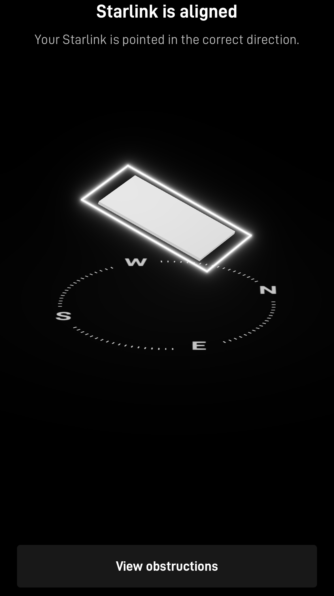
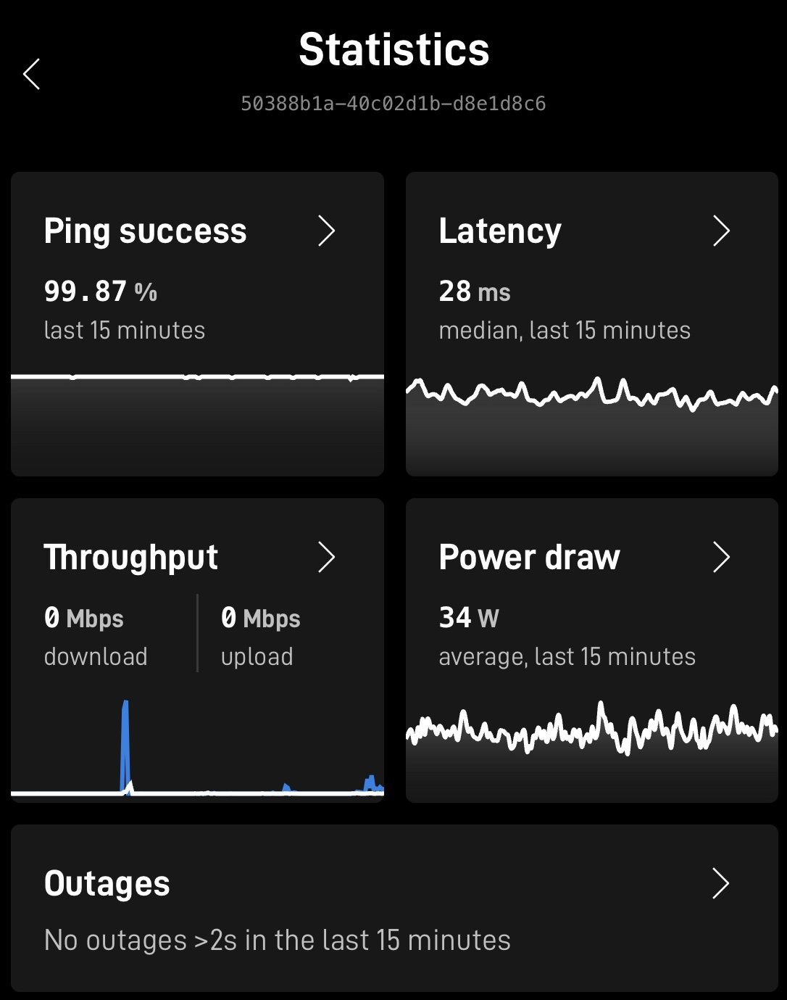
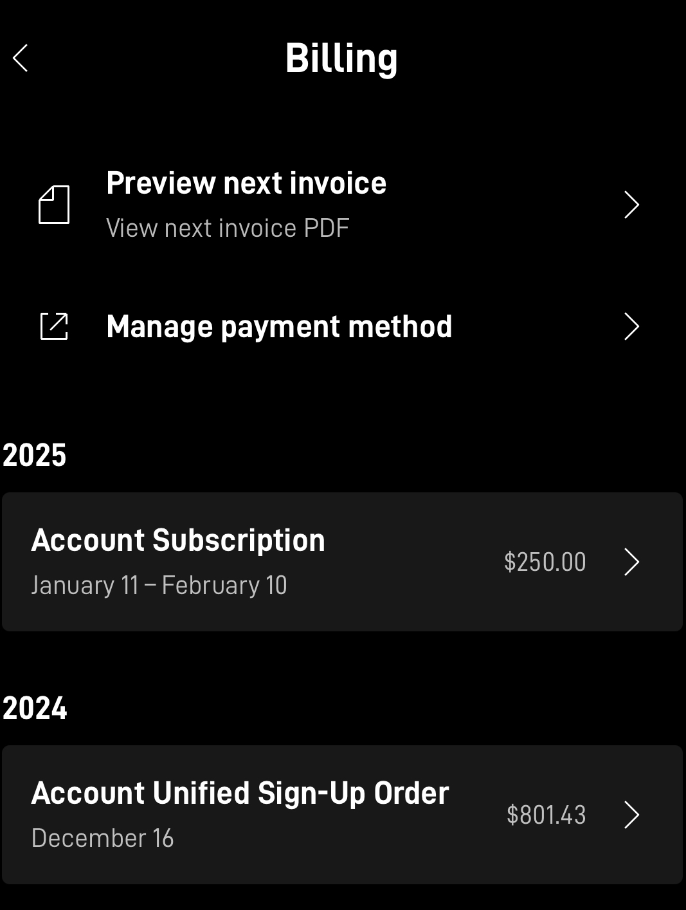
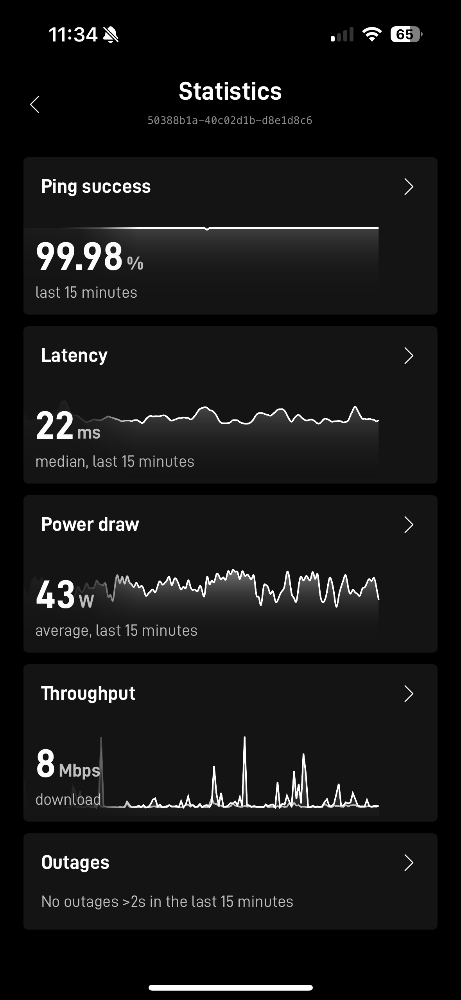

# Power Generator/Starlink Enterprise for Trailer

Our company rented a container trailer with a portable generator in Savannah, Georgia where the massive mega factories are being built. Every morning, from Monday to Saturday, My boss and I come here at 7 AM and turn on the 100kW diesel generator. Usually, my work usually ends at 4 PM but my boss does not leave until 6 PM. As an Electrical Engineer, I was curious of how the generator and the trailer office's circuit breaker diagram worked.&#x20;

<figure><figcaption></figcaption></figure>

## Cummins C100D6R Generator&#x20;

Unlike the compact, newer generators that convert alternator AC voltages to DC voltage and then back to AC voltage using an inverter, this 100kW C100D6R generator is straightforward - a big diesel engine spins the alternator, and this 3-phase voltage is directly connected to the portable office trailer circuit box

<figure><figcaption>
conventional generator versus compact, newer generation generator with inverter
</figcaption></figure>

In the first case, the diesel engine drives the alternator, which directly generates an AC voltage.&#x20;

* Voltage and frequency depend on the engine's speed and load conditions
* Need to spin at constant speed for exact 60Hz AC generation. Can be wasteful when low load&#x20;
* Natural sine wave from alternator
* Can easily have higher capacity&#x20;

For later case, a smaller diesel engine drives the alternator, and the generatred AC voltage is converted to DC then converted back to AC voltage by inverter

* Can easily make a smaller size generator. In case of increased load, the generator can simply increase RPM for higher power&#x20;
* Due to diode rectifier and inverter, the cost goes up. Especially, higher capacity inverters are hard to make. (usually below <10kW) However, nowadays inverter components are becoming drastically cheaper to make better sine waves with filters and accurate feedback systems.&#x20;
* An old, cheap-quality inverter with few MOSFETs that generates a square wave or sine wave with 2-3 steps can ruin sensitive electronics, but nowadays, all applications that need DC voltage use SPDT, which is insensitive to those kinds of variations.&#x20;

## 4-Pole Alternator RPM&#x20;

According to the datasheet, the Stamford alternator (UCI274D) have 4 poles.&#x20;

* 2 pole alternator, for 1 full rotation where N-S rotates 360 degree, one complete AC cycle is done.&#x20;
* 4-pole alternator, for 1 full rotation, each phase of the stator encounters two N poles and two S poles in one rotation, making two complete AC cycle --> Engine can spin half-time slower&#x20;

<figure><figcaption></figcaption></figure>

Where \[frequency] = \[RPM]\*\[Pole Number]/120. To make a 60Hz AC signal, the Cummins diesel engine needs to rotate at 1800 RPM. 1800 RPM X 4/2 = 3600 AC cycle/min. 3600 divided by 60 seconds equals 60 AC cycle --> 60Hz signal.&#x20;

## Wiring to the Trailer Office&#x20;

How does wiring to the trailer work? You can see the trailer office and generator are interconnected with the L5-50 Power Cable.&#x20;

* The generator make L1(V\_a), L2(V\_b), L3(V\_c), neutral, and ground pins&#x20;
* However, in the L6-50 socket, there are only 3 pins - the 3 cables are likely L1, neutral, ground or L1, L2, neutral.&#x20;

<figure><figcaption></figcaption></figure>

### Typical Output Voltage Setup for Generator

| **Configuration** | **Voltage** | **Description**                                                               |
| ----------------- | ----------- | ----------------------------------------------------------------------------- |
| 1 Phase           | 240V        | Standard single-phase output for homes, welder or grinder                     |
| 3 Phase           | 208V        | Three-phase Wye configuration, common for commercial/industrial applications. |
| 3 Phase           | 480V        | High-voltage three-phase output for heavy industrial machinery like motors    |

<figure><figcaption>
Portable Generator L1,L2,L3,N, generator
</figcaption></figure>

<figure><figcaption></figcaption></figure>

<figure><figcaption></figcaption></figure>

The reason why there are only 3 wires connected to the trailer office is that it is running in **240/120 VAC/1 phase** mode. In this case, we only need 3 cables - L1, L2, neutral for return.&#x20;

* L1 to L2 is exactly 180 degrees apart (not 120 degrees apart as 3-phase) - L1 to L2 can generate 240V&#x20;
* L1 to Ground = 120V&#x20;
* L2 to Ground = 120V&#x20;

<figure><figcaption>
L6 Power Socket Configuration
</figcaption></figure>

<figure><figcaption></figcaption></figure>

### Efficiency of Generator&#x20;

<figure><figcaption></figcaption></figure>

<figure><figcaption></figcaption></figure>

Currently, The generator is hooked up to the two-trailer office. During the snowstorm where we turned on the maximum AC, the current usage was around 168A and I was afraid that we might have to order larger generator as the blackout start current required was 3 times higher than the nominal current consumption.&#x20;

Right now, it is using around 41.6A, and sometimes it drops to as low as 2.6A when the weather is good. Despite the low current consumption, the giant generator has to keep spinning, which is where low efficiency comes in. According to the datasheet, it consumes

* 2.8 gallons (10.6L)/hour at 50% load&#x20;

Compared to a small, compact generator which sips the fuel, the inefficiency difference is drastic. However, those small generators cannot handle a sudden, max load during the freezing morning when we turn on the max heater.&#x20;

## Starlink Enterprise Setup

Because our company ATT 4G Modem Hotspot was sluggish and even sending emails took more than 5 minutes, my boss bought StarLink Enterprise with 4TB of data. The issue was that no one knew how to set it up so the boss gave me an assignment to set it up.&#x20;

One thing I had trouble with was that in order to use Starlink, WIFI needs to be connected to the output of Starlink device. I rushed to Walmart and bought a TP-Link AC1550 for maximum coverage and bandwidth.&#x20;

First thing to do is to figure out the place to put the Startlink plate. I put it right above our rented UnitedRental trailer office with a ladder&#x20;

<figure><figcaption></figcaption></figure>

The most complicated part of installing Starlink is to set the connecting cables from outside Starlink Plate to the Power Supply. Fortunately, we were able to shove the cable into the circuit breaker box where the hot wires are being connected to the Generator.

<figure><figcaption></figcaption></figure>

<figure><figcaption>
starlink enterprise setup with TP-Link WIFI
</figcaption></figure>

After connecting power cable from the Starlink Power supply to the Starlink Plate, you need to check the signal alignment. The default Starlink Enterprise Package did not come with the Mount!&#x20;

I just put a bunch of bricks/Lugs from construction field to make the Starlink aligned to the Signal.

<figure><figcaption></figcaption></figure>

Once aligned, you can check the status through the app. After several slight readjustment of tiltedness/rotation, the starlink finally showed that it was aligned.

<figure><figcaption></figcaption></figure>

After Alignment, you need to login to the StarLink account to start using it. If you do not log-in, which I tried to figure out the problem for 1 hour, it won't connect to internet although you are able to connect to starlink.&#x20;

<figure><figcaption></figcaption></figure>

<figure><figcaption></figcaption></figure>

So far, it is working really great, reliable, and way faster than AT\&T 4G Modem. After the setup, I did not face any issues, and during lunchtime when everyone (at least 12 people) watches youtube videos with heavy traffic, it did not have any kind of issues. No occasional disconnection or sluggish video loading.&#x20;

Whenever we shut down the generator and turned it back on everyday, Starlink did not have a problem and worked just fine.&#x20;

<figure><figcaption></figcaption></figure>

