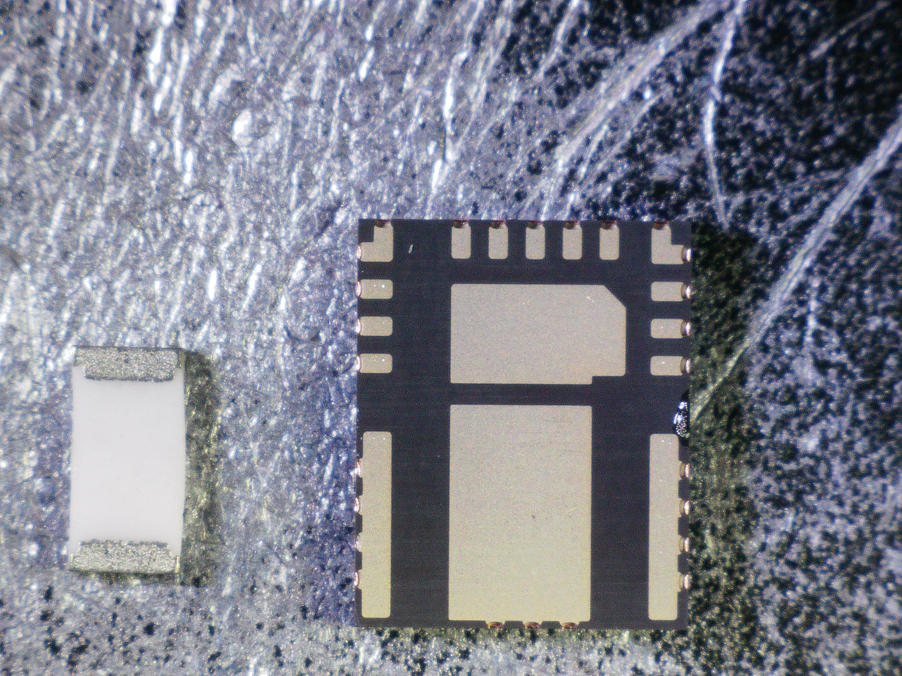
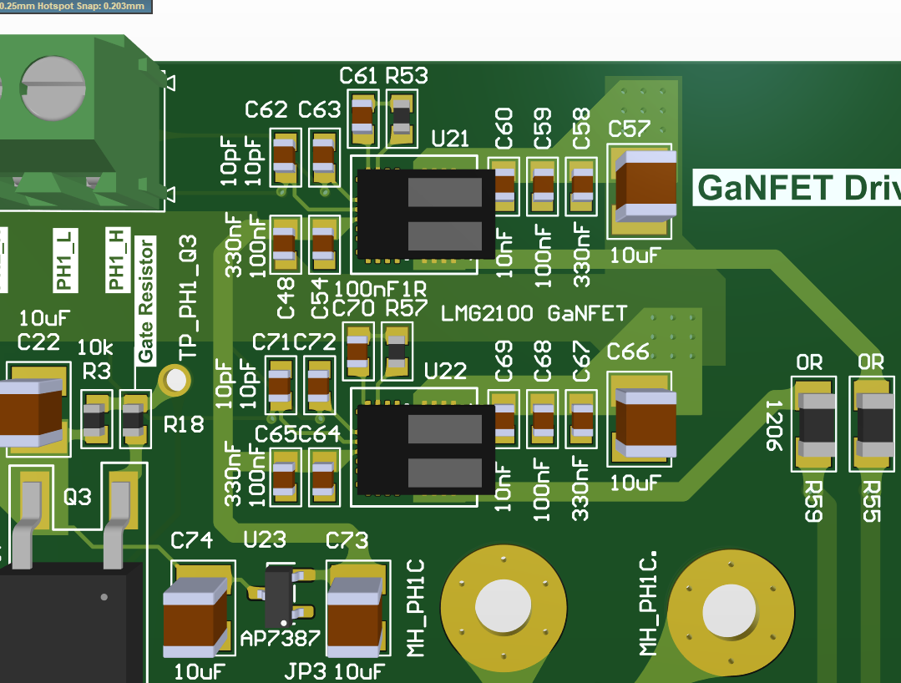
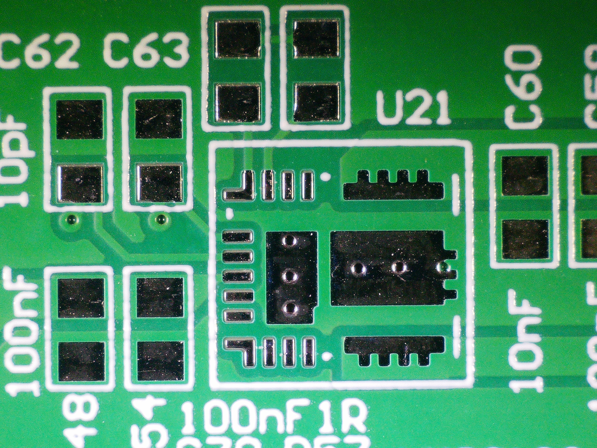
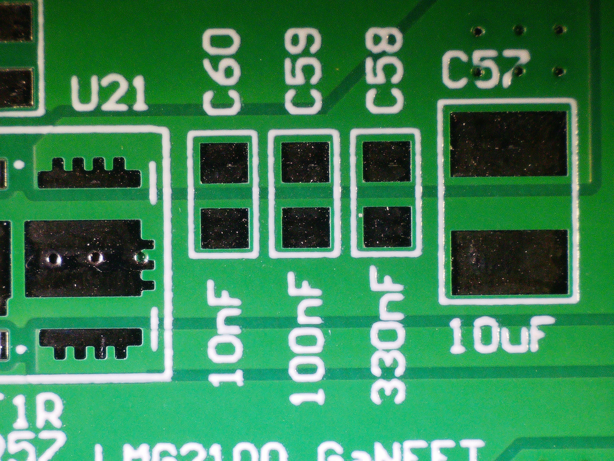

# LMR2100R044 Test

Now we can buy a 60W GaN Charger with the size of smartphone charger for $15. Feels like every switching devices nowadays are pushing GaNFET.&#x20;

I had a opportunity to test GaNFET while designing other Evaluation board. Because there was some empty space, I had a chance to shove in the LMR2100R044 footprint for testing - two half bridge for simple testing.&#x20;

LMG2100R044 = GaN Driver + GaNFET Half Bridge.&#x20;

It only needs input 3.3V PWM, and no other things, greatly decreasing footprint size.&#x20;

<figure><figcaption></figcaption></figure>

Usually all the new GaNFETS from TI are **out of stock**, but I was lucky enought to get few of them. (DRV7167 is still out of stock)

### Size Comparison with 1210 Resistor&#x20;

<figure><figcaption></figcaption></figure>

### PCB Design&#x20;

In order to make cheapest possible board - I only used 12mil Via which Fab charges for free with 0603 Resistors with 200mm X 100mm PCB empty space

Although It does not need multiple components, I followed recommeded TI schematic&#x20;

* 3.3V Logic PWM RC Filter - 10 ohm resistor + 10pF Capacitor&#x20;
* Input Filtering Capacitors&#x20;
* Charge Pump Slew Rate Control  - for ringing, 100nF Boost Capacitor + 1 Ohm Series Resistor&#x20;
* Linear voltage Regulator - 48V to 5V&#x20;

<figure><figcaption></figcaption></figure>

<figure><figcaption></figcaption></figure>

<figure><figcaption></figcaption></figure>

<figure><figcaption></figcaption></figure>

### Comparison with TO-252 MOSFET (DMN10H400SK3-13)

In footprint you can see footprint Q3 for TO-252 Package&#x20;

| Parameter | DMP10H400SK3-13 | LMG2100R044 |
| --------- | --------------- | ----------- |
| **Vds**   | 100 V           | 90 V        |
| **Rds**   | 240 mΩ          | 4.4 mΩ      |
| **Id**    | 9 A             | 35 A        |

### Testing a simple Half Bridge&#x20;

*
