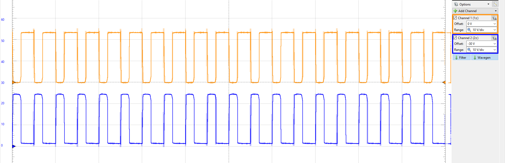
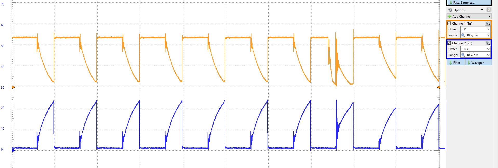
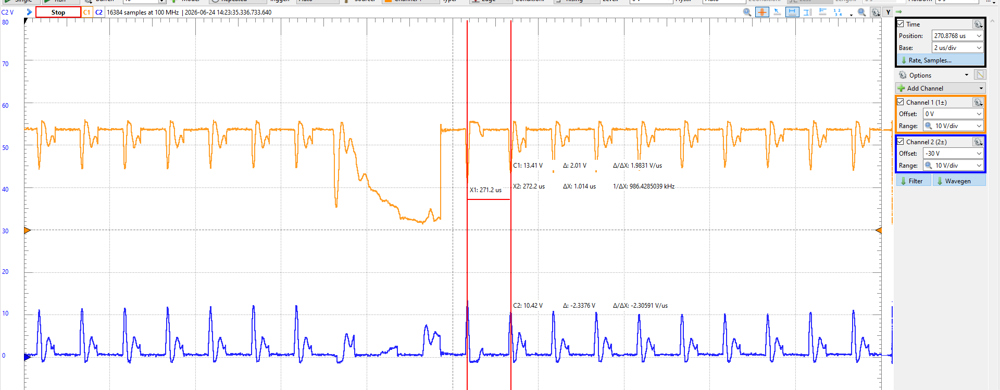
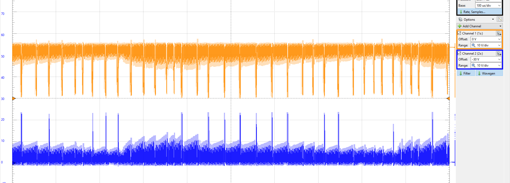

# LMR2100R044 Test

Now we can buy a 60W GaN Charger with the size of smartphone charger for $15. Feels like every switching devices nowadays are pushing GaNFET.&#x20;

I had a opportunity to test GaNFET while designing other Evaluation board. Because there was some empty space, I had a chance to shove in the LMR2100R044 footprint for testing - two half bridge for simple testing.&#x20;

LMG2100R044 = GaN Driver + GaNFET Half Bridge.&#x20;

It only needs input 3.3V PWM, and no other things, greatly decreasing footprint size.&#x20;

<figure><figcaption></figcaption></figure>

Usually all the new GaNFETS from TI are **out of stock**, but I was lucky enought to get few of them. (DRV7167 is still out of stock)

### Size Comparison with 1210 Resistor&#x20;

<figure><figcaption></figcaption></figure>

### PCB Design&#x20;

In order to make cheapest possible board - I only used 12mil Via which Fab charges for free with 0603 Resistors with 200mm X 100mm PCB empty space

Although It does not need multiple components, I followed recommeded TI schematic&#x20;

* 3.3V Logic PWM RC Filter - 10 ohm resistor + 10pF Capacitor&#x20;
* Input Filtering Capacitors&#x20;
* Charge Pump Slew Rate Control  - for ringing, 100nF Boost Capacitor + 1 Ohm Series Resistor&#x20;
* Linear voltage Regulator - 48V to 5V&#x20;

<figure><figcaption></figcaption></figure>

<figure><figcaption></figcaption></figure>

You can see 12 mil Via in the PGND Pad. Original footprint had 8 mil X 6 Vias

<figure><figcaption></figcaption></figure>

<figure><figcaption></figcaption></figure>

### Comparison with TO-252 MOSFET (DMN10H400SK3-13)

In footprint you can see footprint Q3 for TO-252 Package&#x20;

| Parameter | DMP10H400SK3-13 | LMG2100R044 |
| --------- | --------------- | ----------- |
| **Vds**   | 100 V           | 90 V        |
| **Rds**   | 240 mΩ          | 4.4 mΩ      |
| **Id**    | 9 A             | 35 A        |

### Testing with Brushed DC Motor&#x20;

* Full H-Bridge Test with 24V Brushed DC Motor&#x20;

<figure><figcaption></figcaption></figure>

<figure><figcaption></figcaption></figure>

### Motor characteristics&#x20;

* No-Load: 5279 RPM @ 286 mA
* With Load: 4360 RPM @ 1.926 A
* Starting Current: 9.7 A
* R -  12.9 Ω
* L - 1289 µ

For Optimal PMW width to not fully trigger RC time constant in motor controllers,&#x20;

$$\tau_e = \frac{L}{R}$$

$$L = 1289\ \mu\text{H} = 1.289\ \text{mH}$$

$$R = 12.9\ \Omega$$

$$\tau_e = \frac{1.289 \times 10^{-3}\ \text{H}}{12.9\ \Omega} \approx 99.9\ \mu\text{s} \approx 100\ \mu\text{s}$$

$$T_{\text{pwm}} \le \frac{\tau_e}{2}$$

$$\frac{100\ \mu\text{s}}{5} = 20\ \mu\text{s}$$

Converting this period to frequency (f = 1/T):

$$f_{\text{pwm}} \ge \frac{1}{20\ \mu\text{s}} = 50\ \text{kHz}$$

Based on RC time constant, at least PWM should be above 10kHz, but above 20khz should be better to not hear any noise&#x20;

### PWM Testing: 20khz, 100khz, 6.25Mhhz, 10MHz

Compared to conventional motor controller that supports up to 100khz inner current loop pwm switching, the GaFET supports up to 10MHz switching according to the datasheet.&#x20;

At 24V, the 20khz PWM with 50% duty cycle was too weak to turn on the motor, and started spinning at 60% duty cycle. \
\
Below is with 60% duty cycle&#x20;

#### 20khz

<figure><figcaption></figcaption></figure>

#### 100khz&#x20;

<figure><figcaption></figcaption></figure>

1Mhz&#x20;

<figure><figcaption></figcaption></figure>

<figure><figcaption></figcaption></figure>

## Heating at high switching frequency&#x20;

