# Motor Control in Simulink

<figure><figcaption></figcaption></figure>

<figure>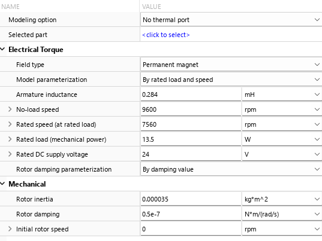<figcaption></figcaption></figure>

### Simplist Control: Brsuhed DC Motor Control

Belos is probably the simplest motor control system that I could imagine: Brushed DC motor speed control. Input is PWM duty cycle and output is the speed. For R, L, no load speed and etc I copied from random motor that I could find in Digikey

<figure><figcaption></figcaption></figure>

Following is the variable I put in

```
% Nominal Voltage - 24V 
% No load speed - 9600 
% No load current - 21 
% Nominal Speed - 7560 
% continous torque 11.89 
% R - 9.7 
% L - 0.284 mH 
% Torque Constant - 24.49 
% Rotor Inertia - 3.50 gcm^2 
% Mechanical Time Constant - 5.66 

% Gs = 1/(Ls+R)

% Technosoft Var 
Reference = 600; 
kp = 500; 
ki = 30;
f = 1e4; % 10000hz  
ts = 1/f;
L = 0.284e-3; 
R = 9.7


% Open the model
open_system('DC_Motor_PI_Speed');

% Run the simulation
simOut = sim('DC_Motor_PI_Speed');


% Extract Current and RPM data
current = simOut.RPM;   % this is actually current
rpm = simOut.RPM1;      % this is actual RPM
```

<figure>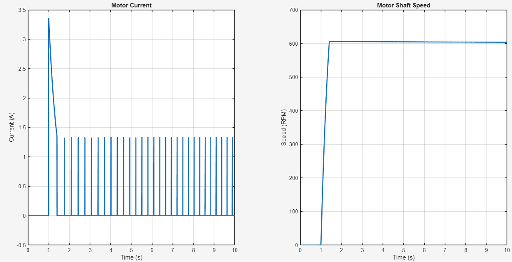<figcaption></figcaption></figure>

<figure>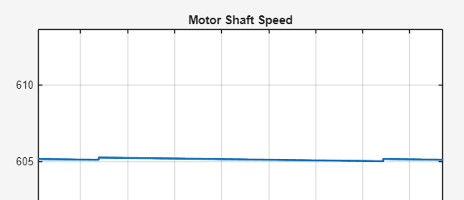<figcaption></figcaption></figure>

## BLDC Motor Current Control

Sample BLDC Motor current inner loop PI Control

* For BLDC Motor, it requires inner current loop, then speed loop and then position loop.
* Inner Current PI loop have highest current control frequency (higher bandwidth)

In the Current control mode, there is a need for position as reverse Park Clarke Transform need to calculate the vector based on the Magnet N-S. (I always though there is no need for incremental/absolute encoder as current need to only flow from phase A to phase B or C without knowing the precise angle).

If there was no encoder, then there would be no torque as motor will either stick to the closest magnet, without constanly pulling and pushing.

<figure>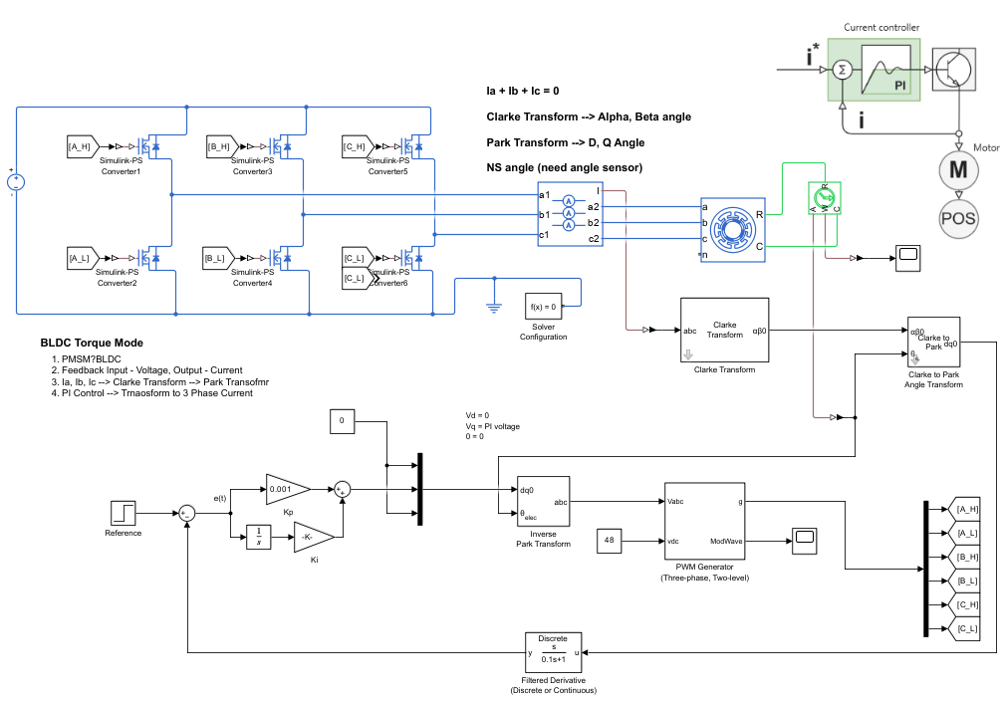<figcaption></figcaption></figure>

### BLDC Speed Control

Speed control is more complicated than only the current control. (I think current mode is only used in torque mode).

Fortunatley, MATLAB gives us the BLDC speed control sample with many building blocks that encompasses multiple different functions.

<figure>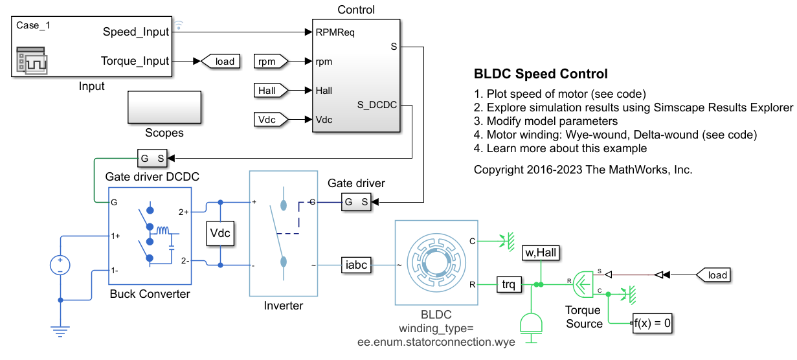<figcaption></figcaption></figure>

Following is the result of poorly tuned PID

<figure>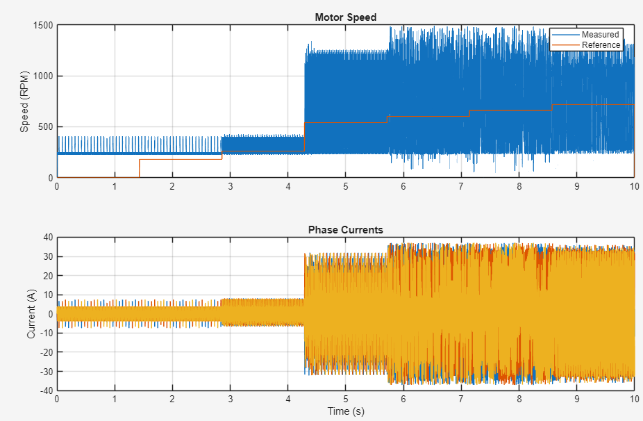<figcaption></figcaption></figure>


### BLDC Position Control

Probably the most hardest part is the position control that merges above all Thankfully, Simulink gives us a nice building block samples that we need to put in following var:

<div><figure>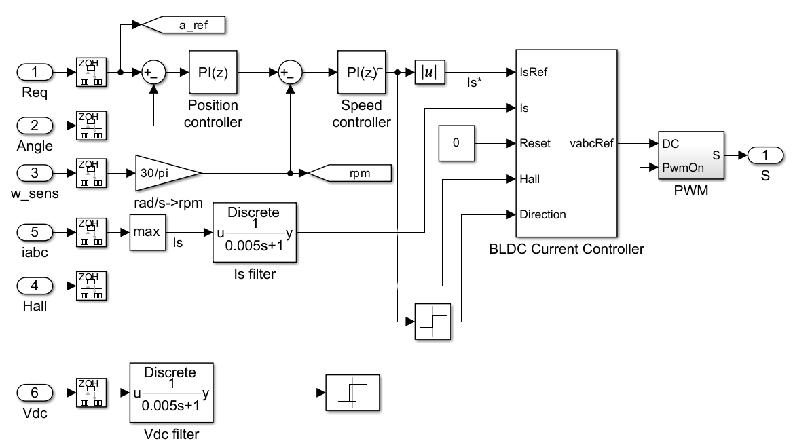<figcaption></figcaption></figure> <figure>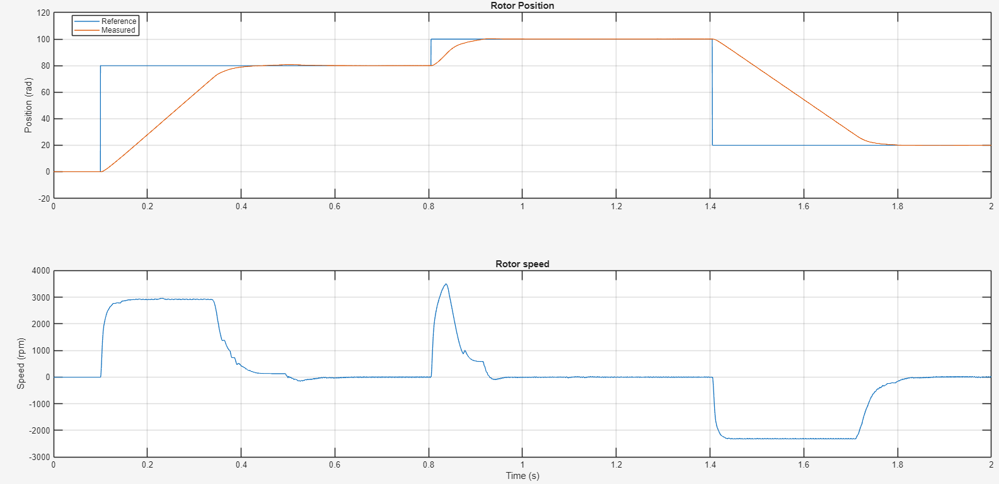<figcaption></figcaption></figure></div>

## Current Control in actual BLDC Motor

Following is the photo of current response


4-Pole BLDC Motor with L = 0.515mH and R = 4.2

In order to make a motor to react to the dynamic current more faster, I could set high passband rate so that inner current loop reacts more faster. It comes at the cost of overshooting current.

<figure>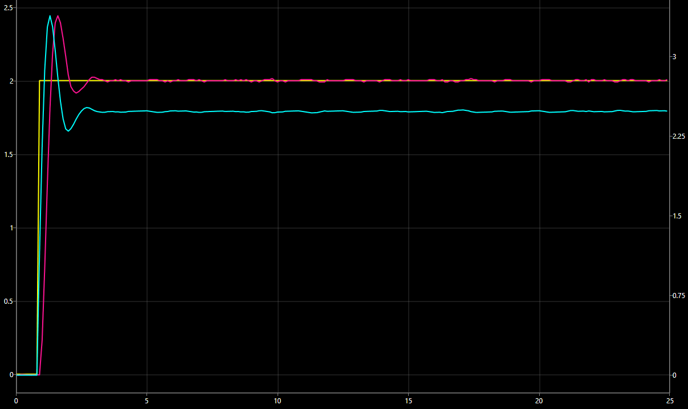<figcaption></figcaption></figure>

* Passband: 637 hz (4000 rad/s)

<figure>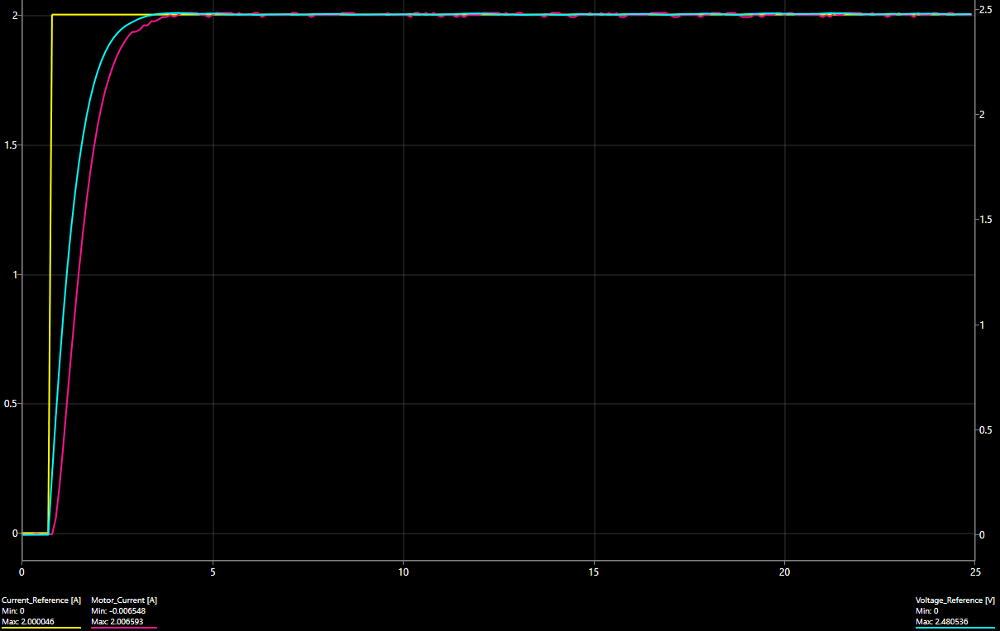<figcaption></figcaption></figure>

* Passband: 159.17 hz (1000 rad/s)

## Speed Control

Following is the PI tuning for speed control without any load on it. Rotational Inertia is around 0.00005 kg\*m^2 for all the rotating parts

* P = 1.71
* I = 0.113

<figure>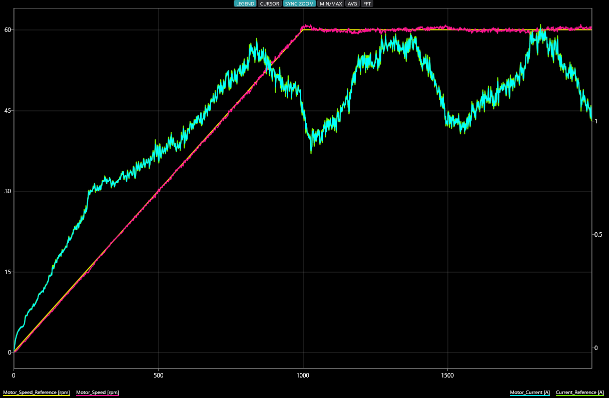<figcaption></figcaption></figure>

However, If I want to rotate a 4kg Cylinder, the auaotuner will tune PI values to higher.

<figure><figcaption></figcaption></figure>

So, if I plug in 0.00125 + 0.00005kg = 0.00130 kgm^2

* P = 29.35
* I = 3.12

However, the cylindrical load always does not perfectly align with center of the motor, which greatly increases rotational inertia and acceleration current. To compensate that, I slightly increase PI value.

<figure>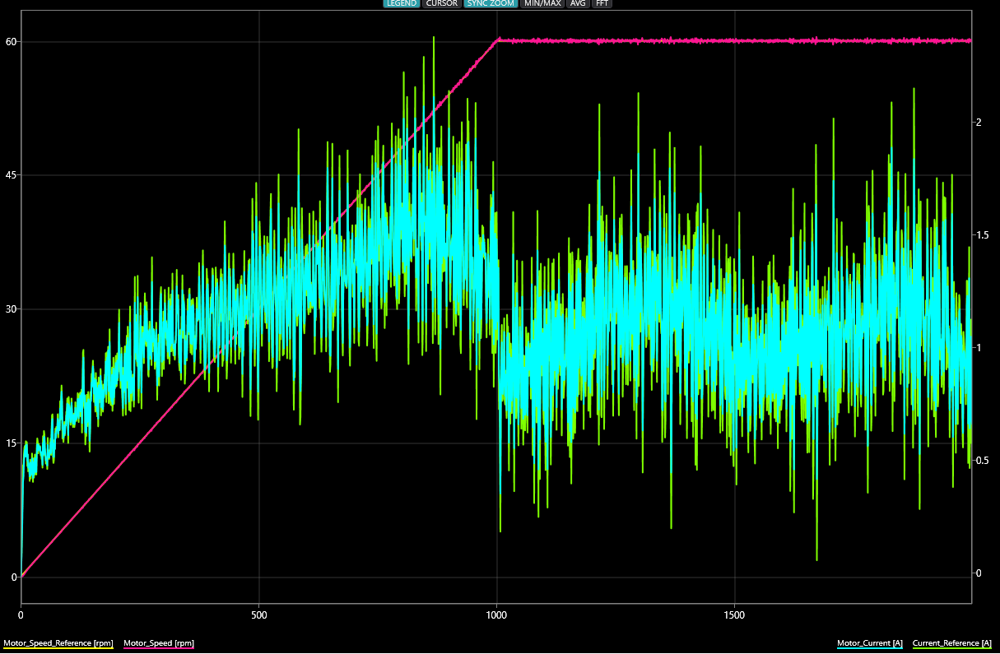<figcaption></figcaption></figure>

<figure>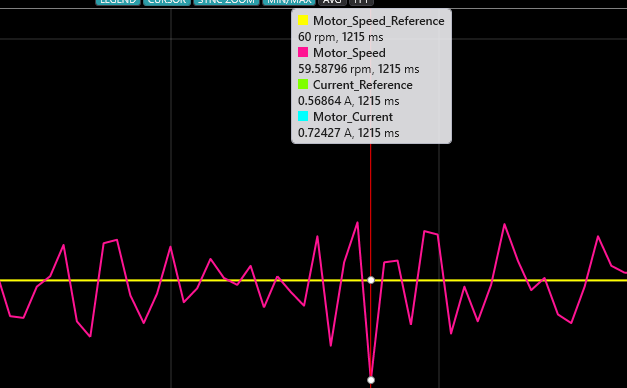<figcaption></figcaption></figure>

\
The motor constantly tries to set speed at 60 RPM, and there is low amount of stead state error.

However, with exact same PI tuning if I change the laod from 4kg to 1kg, the motor will violently oscillate with high stead state error at cruising speed

<figure>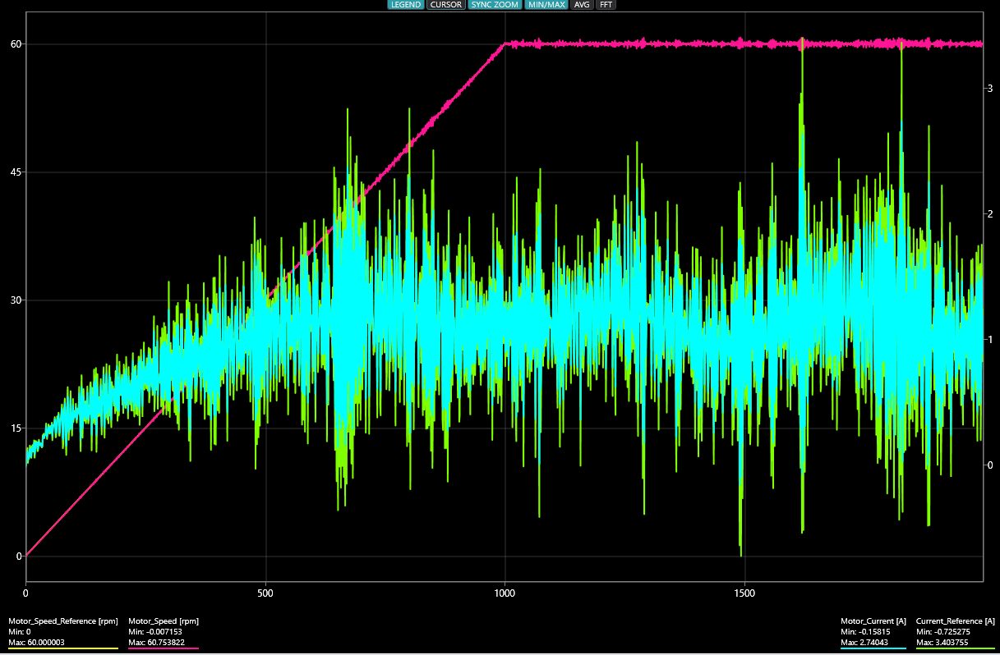<figcaption></figcaption></figure>

<figure>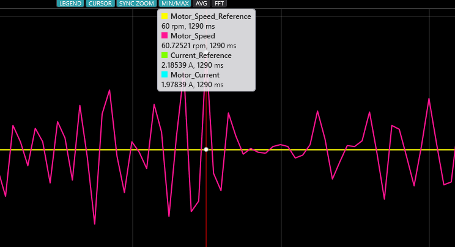<figcaption></figcaption></figure>

