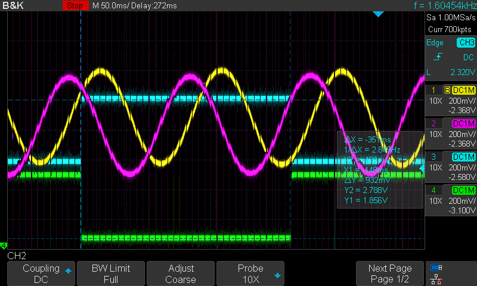

# Motor Encoders

There are a lot of different types of encoders used in industrial application. Although I did not experienced much of them, there are three major ones that I have experience with.&#x20;

* Incremental Encoder&#x20;
  * Analog 1Vpp Encoder&#x20;
  * Digital Encoder&#x20;
* Absolute Encoder&#x20;
  * Biss-C&#x20;

## Incremental Encoder

Usually, Incremental encoders have 4 signals&#x20;

* COS+
* COS-&#x20;
* SIN+
* SIN-&#x20;

Some encoders have extra index signals for homing&#x20;

* Index+&#x20;
* Index-&#x20;

### Incremental Analog Encoder&#x20;

* 1Vpp sine and cosine signal. Direct output from optical/magnetic encoder sensor &#x20;

Your motor controller should have internal interpolator ic. (1Vpp Analog signal -> 3.3V/5V logic)&#x20;

Because those are analog signal with \~500mVpp, they are extremely susceptible to noise. With long wires, the signal ca go down to \~400mV range. \
Also with Motor Phase Cable passing nearby, those encoder signals are easily distorted.&#x20;

Especially with high interpolation, which it divides one cosine/sine period into multiple small segments, the encoder will likely to skip some bits.

<figure><figcaption>
Purple: COS+(500mV) Yellow: COS- (500mV)  White: COS+ - COS- Differential (1Vpp)
</figcaption></figure>

<figure><figcaption>
Purple: COS+ Yellow: SIN+ Cyan, Green: INDEX Differential
</figcaption></figure>

