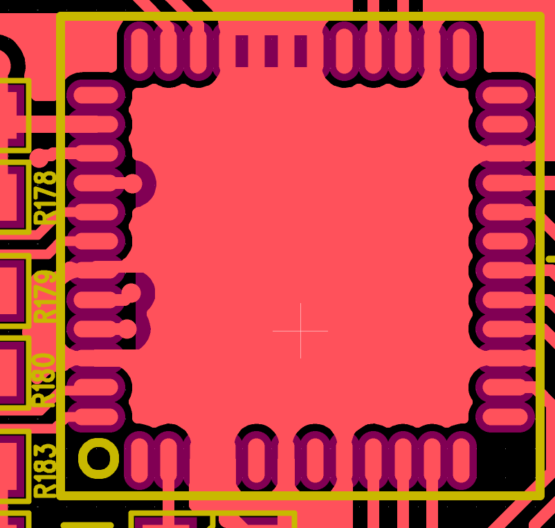
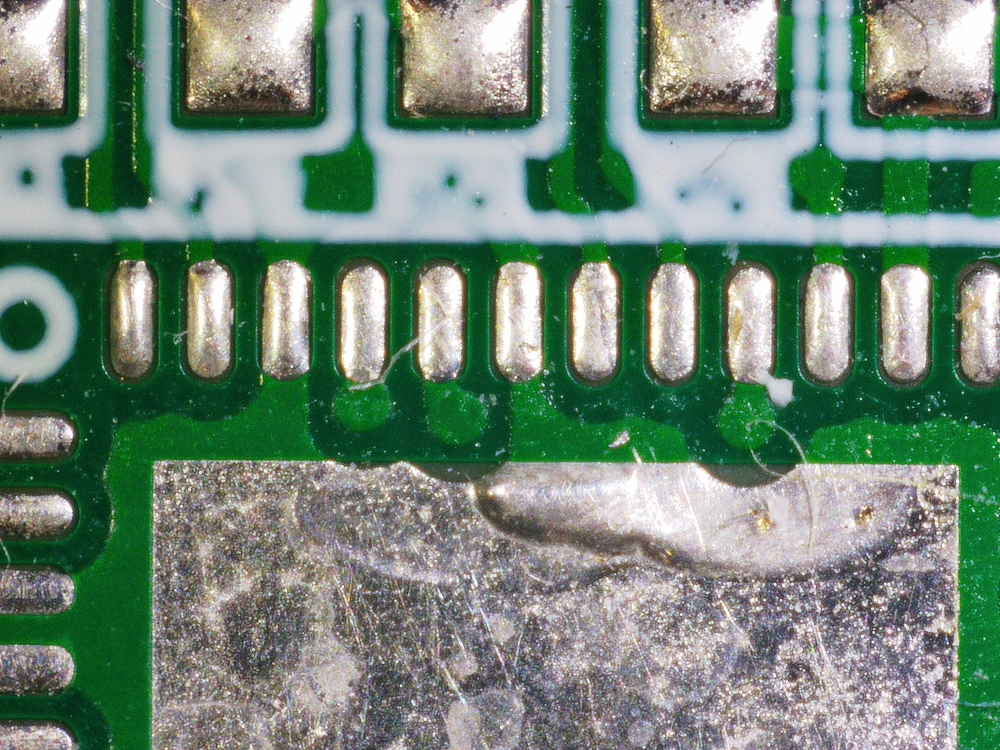
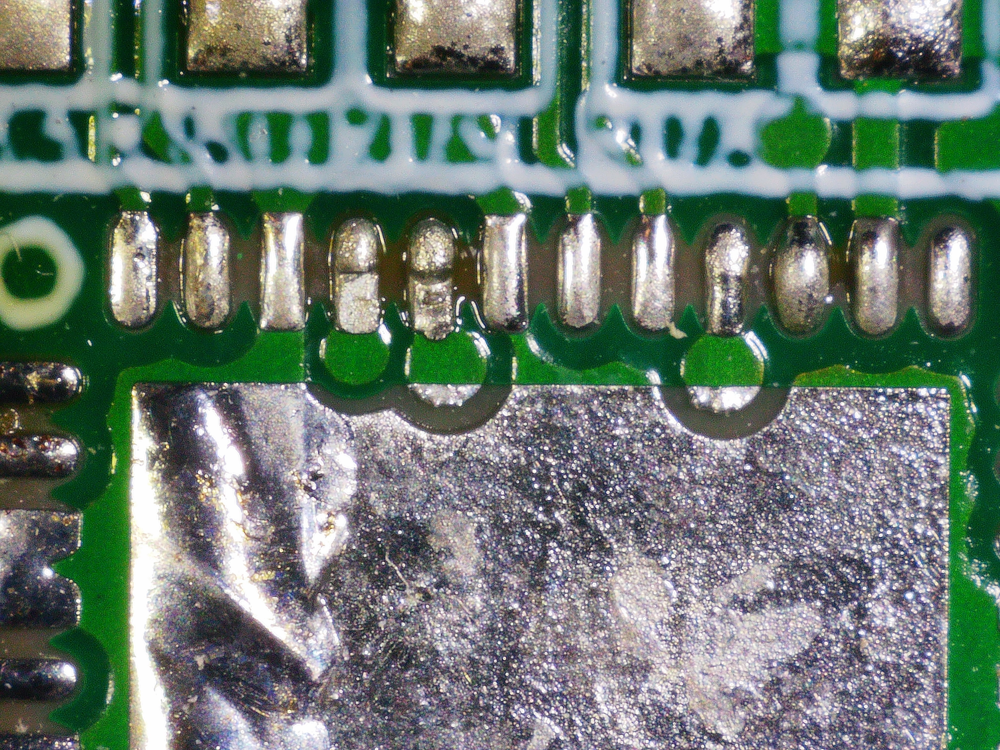

# Design Mistake

## PCB Design Mistake&#x20;

7 years ago,  an 6-layer, high density Motor controller PCB design was submitted to the Fab. Unknowingly, there was an 8 mil via between EPAD and pin pad.&#x20;

The top copper layer between plugged via and EPAD was not directly connected, but the solder mask expansion was enough to expose both copper to the QFN IC Chip.&#x20;

<figure><figcaption></figcaption></figure>

Red - Top Copper Layer&#x20;

Purple - Top Soldermask Layer&#x20;

## Fab Number 1.&#x20;

The fab that we ordered this PCB in 2019 "fixed" this issue without notifying us.&#x20;

The Fab engineers shrunk the EPAD and Via size so that the IC chip does not short GND and SIGNAL&#x20;

<figure><figcaption></figcaption></figure>

## Fab Number 2. &#x20;

We ordered the second batch of PCB to the different fab.  

However, Fab #2 proceeded with our faulty design. Once we got 250 new boards, most of them had an differential signal shorted to the GND, burning the encoder differential driver.&#x20;

<figure><figcaption></figcaption></figure>

## Conclusion&#x20;

It was 2026 that we found out that there was a via between EPAD and signal pad. 250 PCBs were salvaged (worth $75k)
