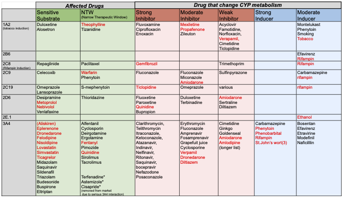

# CYP Interaction Chart

<figure><figcaption></figcaption></figure>

| 
 
                           | Sensitive sub                                                                                                                                                                                                                                                   | NTW                                                                                                                                                                                                                                                                                 | 
Strong Inhibitor
 | 
Strong 

Inhibitor
                                                                  | Moderate Inducer                                 | 
 
 |
| ------------------------------------- | --------------------------------------------------------------------------------------------------------------------------------------------------------------------------------------------------------------------------------------------------------------- | ----------------------------------------------------------------------------------------------------------------------------------------------------------------------------------------------------------------------------------------------------------------------------------- | -------------------------- | ----------------------------------------------------------------------------------------------- | ------------------------------------------------ | ----------- |
| 
1A2 

(tobacco induction)
 | 
Duloxetine

Alosetron
                                                                                                                                                                                                                               | 
Theophylline

Tizanidine
                                                                                                                                                                                                                                                | 
 
                | 
 
                                                                                     | 
Montelukast

Phenytoin

smoking
 | 
 
 |
| 
2C8

(Rifampin Induction)
 | Repaglinide                                                                                                                                                                                                                                                     | Paclitaxel                                                                                                                                                                                                                                                                          | 
 
                | 
 
                                                                                     | 
Efavirenz

Rifampin
                  | 
 
 |
| 2C9                                   | Celecoxib                                                                                                                                                                                                                                                       | 
Warfarin

Phenytoin
                                                                                                                                                                                                                                                     | 
 
                | 
 
                                                                                     | 
Carbamazepine

rifampin
              | 
 
 |
| 2C19                                  | 
Omeprazole

Lansoprazole
                                                                                                                                                                                                                            | S-mephenytoin                                                                                                                                                                                                                                                                       | 
 
                | 
 
                                                                                     | rifampin                                         | 
 
 |
| 2D6                                   | 
Desipramine

Metoprolol

Nebivolol

Venlafaxine
                                                                                                                                                                                           | Thioridazine                                                                                                                                                                                                                                                                        | 
 
                | 
 
                                                                                     | 
 
                                      | 
 
 |
| 3A4                                   | 
(Aliskiren)

Eplerenone

Dronedarone

Felodipine

Nisoldipine

Lovastatin

Simvastatin

Ticagrelor

Midazolam

Saquinavir

Sildenafil

Triazolam

Budesonide

Buspirone

Eltriptan
 | 
Alfentanil

Cyclosporin

Deirgotamine

Ergotamine

Fentanyl

Pimozide

Quinidine

Sirolimus

Tacrolimus

  

Terfenadine*

Astemizole*

Cisapride* (removed from market due to serious 3A4 interaction)
 | 
 
                | 
Carbamazepine

Phenytoin

Phenobarbital

Rifampin

St.John’s wort(3)
 | 
 
                                      | 
 
 |
| 2B6                                   | 
 
                                                                                                                                                                                                                                                     | 
 
                                                                                                                                                                                                                                                                         | 
 
                | 
Efavirenz

Rifampin
                                                                 | 
 
                                      | 
 
 |
| 
 
                           | 
 
                                                                                                                                                                                                                                                     | 
 
                                                                                                                                                                                                                                                                         | 
 
                | 
 
                                                                                     | 
 
                                      | 
 
 |

