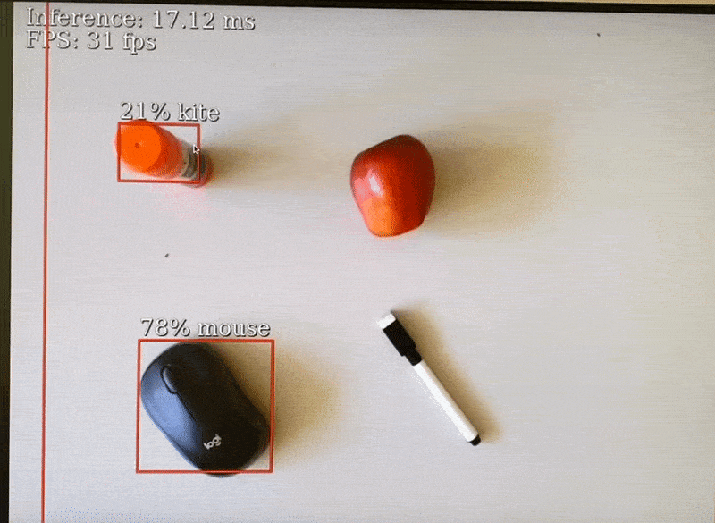

# Coral TPU: calculate Distance between object

## I need to calculate the distance between exoglove model and apple. How?&#x20;


## Running Google's github example&#x20;

Thankfully, Google gives [another tutorial ](https://coral.ai/docs/dev-board/camera/#try-other-example-code)about how to modify and run your own model.&#x20;


Turn on your google coral dev board and conenct USB camera. Change to home directory and clone [Google's github](https://github.com/google-coral/examples-camera.git) tutorial.

If you are using coral dev board, no need to install requirements&#x20;

```
$ cd /home/jin 
$ git clone https://github.com/google-coral/examples-camera.git
$ cd examples-camera
$ sh download_models.sh
$ cd gstreamer
```

If you are using the Google Coral Camera, no need to change the code. However, if you are using USB camera,&#x20;

```
$ vim detect.py
```

Press \[i] to edit the detect.py file. Go to the parser.add\_argument and change to /dev/video0 to /dev/video1

```
# IF you are using USB Camera, do not forget to change from /dev/video0 to /dev/video1
parser.add_argument('--videosrc', help='Which video source to use. ', default='/dev/video1')
```

Then press **:wq** to exit the vim. Again, if you are getting E212 error, set the permission of home directory.&#x20;

Run the detect.py which will load SSDMobileNet with COCO label map

```
mendel@undefined-eft:/home/jin/examples-camera/gstreamer$ python3 detect.py 
```

It should give you something like this:

<figure><figcaption></figcaption></figure>

## Load your model&#x20;

After checking that the model is correctly working, go to github again and download 3 files:

* common.py&#x20;
* detect.py
* gstreamer.py

Put them inside the USB with your previously trained Efficienddet.tflite file and label map. &#x20;

<figure><figcaption></figcaption></figure>

### Modify code&#x20;

open detect.py and change code&#x20;

For import,&#x20;

```
import numpy as np 
```

Go to generate\_svg()&#x20;

```
def generate_svg(src_size, inference_box, objs, labels, text_lines):
    svg = SVG(src_size)
    src_w, src_h = src_size
    box_x, box_y, box_w, box_h = inference_box
    scale_x, scale_y = src_w / box_w, src_h / box_h
    for y, line in enumerate(text_lines, start=1):
        svg.add_text(10, y * 20, line, 20)
      
    # this is looping through the objects 
    apple_obj = None
    hand_obj = None
    apple_center = (0,0)
    hand_center = (0,0)
    for obj in objs:
        bbox = obj.bbox
        if not bbox.valid:
            continue
        # Absolute coordinates, input tensor space.
        x, y = bbox.xmin, bbox.ymin
        w, h = bbox.width, bbox.height
        # Subtract boxing offset.
        x, y = x - box_x, y - box_y
        # Scale to source coordinate space.
        x, y, w, h = x * scale_x, y * scale_y, w * scale_x, h * scale_y
        percent = int(100 * obj.score)
        label_id = labels.get(obj.id, obj.id)
        label_str = '{}% {}'.format(percent, label_id)
        svg.add_text(x, y - 5, label_str, 20)
        svg.add_rect(x, y, w, h, 'green', 2)

        if label_id == 'apple':
          apple_center = x + w/2, y+ h/2; 
        elif label_id == 'hand':
          hand_center = x + w/2, y + h/2;

    # Draw lines and calculate distance if both centers are found
    if apple_center != (0, 0) and hand_center != (0, 0):
        svg.add_rect(apple_center[0], apple_center[1], 5,5,'red', 8)
        svg.add_rect(hand_center[0], hand_center[1], 5, 5, 'blue', 8)

        # Calculate Euclidean distance between centers
        distance = np.linalg.norm(np.array(apple_center) - np.array(hand_center))
        distance_text = 'Distance: {:.2f} pixels'.format(distance)
        svg.add_text(10, src_h - 40, distance_text, 30)

    return svg.finish()
```

Because I am only detecting apple and hand, I only added code for this.&#x20;

(The code I added is probably really inefficient so you should modify a lot)

What this code basically do is to add the dots at the center of apple and hand and calculate the distance with numpy.&#x20;


Now, go to the man() and change model name and label map.&#x20;

In my case, it will be

```
default_model_dir = ''
default_model = 'efficientdet_v2.tflite'
default_labels = 'efficientdet_v2_label.txt'
```

Also, I will be putting files in same directory so model\_dir = ''

Save it and unplug USB.&#x20;


### Connect to Coral Dev board&#x20;

Connect USB to coral dev board.&#x20;

To make it easy, I used usb\_transfer.sh script that I used in previous posts&#x20;

If it is first time using usb, then&#x20;

```
sudo mkdir /media/usb
sudo mount /dev/sda1 /meda/usb 
cd /media/usb 
```

Your USB name might differ.&#x20;

Copy all the contents to the /home directory. I put everything inside demo\_v3 folder&#x20;

```
$ pwd 
/home/jin/demo_v3
$ ls 
common.py 
detect.py 
efficientdet_v2_label.txt
efficientdet_v2.tflite
gstreamer.py 
```

Run the detect model.

<figure><figcaption></figcaption></figure>

```
$ python3 detect.py
```

<figure><figcaption></figcaption></figure>

<figure><figcaption><p>google coral dev board: distance</p></figcaption></figure>

Unfortunately, I could not find the way to draw a line in svg.
