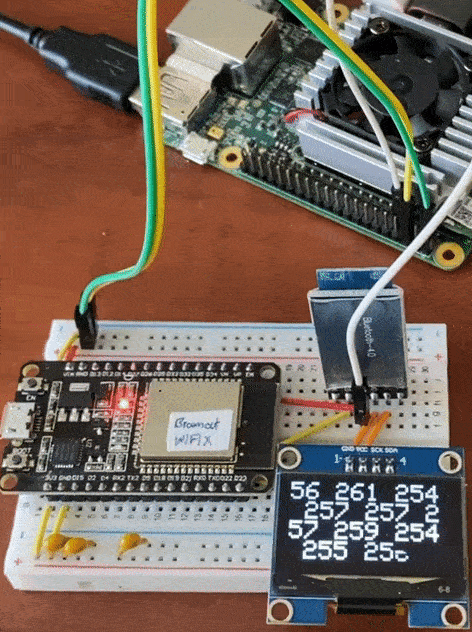

# Coral TPU: Output UART

Unfortunately, Google Coral Dev Board does not support BLE.&#x20;


In order to communicate with other microcontroller, it is possible to use MQTT communication, as I used it for sending distance from OpenMV H7 to ESP32.&#x20;


However, the school WIFI sometimes block the WIFI communication and the broker is sometimes not ablue to receive any information. It means I can only demo my project in my Professor's Lab.&#x20;


To fix this problem, I am going to output distance through UART communication and make Bluetooth HM-10 to send the distance information.&#x20;


To install the GPIO library,&#x20;

```
sudo python3 -m pip install python-periphery 
```

[Google documentation](https://coral.ai/docs/dev-board/gpio/#header-pinout) shows the pinout.&#x20;

* 5V pin = Lower row rightmost pin
* GND pin = Lower row right to the 3rd pin
* UART3 TX pin = Upper row right to the 4th pin&#x20;

UART3 TX (output) pin is the /dev/ttymxc2.&#x20;

### Connect Arduino to see output

<figure><figcaption></figcaption></figure>

I already have a arduino debugging tool that I made to test UART communication specific with little i2c display. This will display the UART output through the I2C display so I do not have to look at Serial Monitor.&#x20;

<figure><figcaption></figcaption></figure>

### Writing simple script to test whether UART works or not&#x20;

lets make a simple script

```
# UART_tester.py
# just check whether the uart outputs the number

from periphery import Serial
import time

# Configure UART3, 9600 baud
# PIN 7 
# Lower row 4th pin 

uart3 = Serial("/dev/ttymxc2", 9600)

def send_number(num):
    uart3.write(f"{num}".encode())
    print(num)

try:
    while True:
        for num in range(1, 101):
            send_number(num)
            time.sleep(0.5)  # lets make port rest
        # Loop back to 1 once 100 is reached
except KeyboardInterrupt:
    print("Exiting...")
finally:
    uart3.close()
```

This code will simply print out the number 1 to 100 through the UART port3 tx. &#x20;

I am settting baud rate to 9600 because I will use it for the bluetooth modules that uses 9600 as default baud rate.&#x20;

You can either write this on vim or write it on desktop and transfer it.&#x20;

Now, run the code

```
sudo python3 uart_tester.py 
```

Do not forget the 'sudo' as it will give you warning that you do not have permission for port&#x20;

If it keep causing permission error

```
sudo chmod a+rw /dev/ttymxc2
```

To get permission.&#x20;

<figure><figcaption></figcaption></figure>

It should print out number from 1 to 100.&#x20;


However, if you do not have logic analyzer or simple UART debugger, you can use below super simple code to test whether UART is working or not.&#x20;

<pre><code><strong>//ESP32 receives UART serial 2 (Port 16, 17) 
</strong>//ESP32 then reflects back to UART cable serial 0. (USB cable)

void setup() {
  // put your setup code here, to run once:
  Serial2.begin(9600);
  Serial.begin(115200);
}

void loop() {
  if (Serial2.available()) {
    Serial.write(Serial2.read());
  }
}
</code></pre>


## Output Object distance through UART &#x20;

now, lets go to the Coral Dev board and output distance through UART communication.&#x20;

Let's edit the detect.py&#x20;

```
vim detect.py 
```

In the import,&#x20;

```python
# import numpy for distance calculation
import numpy as np 
# import uart 
from periphery import Serial 

# now put UART communication in here 
uart3 = Serial("/dev/ttymxc2", 9600)
```

And in the generate\_svg,&#x20;

```python
    # Draw lines and calculate distance if both centers are found
    if apple_center != (0, 0) and hand_center != (0, 0):
        svg.add_rect(apple_center[0], apple_center[1], 3,3,'red', 3)
        svg.add_rect(hand_center[0], hand_center[1], 3, 3, 'blue', 3)

        # Calculate Euclidean distance between centers
        distance = np.linalg.norm(np.array(apple_center) - np.array(hand_center))
        distance_text = 'Distance: {:.2f} pixels'.format(distance)
        svg.add_text(10, src_h - 40, distance_text, 30)
        #output uart
        uart3.write(f"{distance} ".encode()); 
```

If you just do&#x20;

```
uart3.write(distance) 
```

It will cause error since the int is directly passed (bytes is required)

Run the code&#x20;

```
python3 detect.py 
```

<figure><figcaption></figcaption></figure>

It will output the distance correctly! However, the numbers are float and there is no space between each distance.&#x20;

## Polishing UART output&#x20;

Lets make it more clean. Go to vim and edit the UART output line

```python
uart3.write(f"{int(distance)} ".encode()); 
```

<figure><figcaption><p>editing through vim....</p></figcaption></figure>

Now the distance is converted to int and have space. (I do not need that much accuracy)&#x20;

So, if you run this code

<figure><figcaption><p>distance output</p></figcaption></figure>

<figure><figcaption></figcaption></figure>

The UART correctly receives the distance and prints them in integer format and with space


However, the GPIO usage probably cause delays in both Google Coral Dev board and ESP32.&#x20;

I probably need to fix code so that It sends distance every 3 inferences.

<figure><figcaption></figcaption></figure>

As one inference is around 80ms, 3 inference would be \~250ms. Updating distance 4 times per second is probably unnoticeable.&#x20;


## # ====Updated Code ==== #&#x20;

so, whenever the UART Communication tries to send integer information, the UART TX will send&#x20;

```
123\n443\n503\n412\n123...
```

I used delimiter as the **'\n'** so that ESP8266 (which is the receiver) can receive and parse easily.&#x20;

The sample python3 code to send UART information will be&#x20;

```
import serial
import time
import random 

uart3= serial.Serial("/dev/ttymxc2", 115200)

while true: 
    distance = random.randint(0, 300)
    uart3.write(f"{distance}".encode())
    uart3.write(b'\n')
    print(distance)
    time.sleep(3)
```

Above code will send a random distance from 0 to 300 through UART in a Baud rate of 115200 and also send a delimiter as '\n'.&#x20;

To add timer instead of delay, the prev\_dist and prev\_time must be initialized inside of main() function

```
import serial
import time
import random 

def main():
    uart3 = serial.Serial("/dev/ttymxc2", 115200)

    previous_distance = None  # Initialize the previous_distance variable
    previous_time = time.time()  # Initialize the previous_time variable

    interval = 0.3  # Set the desired interval in seconds (e.g., 300ms)

    while True:
        current_time = time.time()

        # Check if the desired interval has passed
        if current_time - previous_time >= interval:
            previous_time = current_time  # Update the previous time

            # Generate a random distance value
            distance = random.randint(0, 300)

            # Check if the generated distance is the same as the previous one
            while distance == previous_distance:
                distance = random.randint(0, 300)

            # Update the previous_distance variable
            previous_distance = distance

            # Send the distance over UART
            uart3.write(f"{distance}".encode())
            uart3.write(b'\n')
            print(distance)

        # You can run other programs or tasks here without blocking the loop

if __name__ == "__main__":
    main()

```


For Testing UART&#x20;


