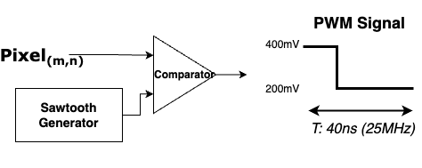

# Memresistor Mapping

Abstract&#x20;

In order to classify the MNIST dataset, the CNN model was trained in Python script and tested in the Cadence circuit simulation. The goal is to transcribe the Python/Cadence model to Synopsys HSPICE.&#x20;

## Dataset input&#x20;

* Input: 28X28 uint8 (0 \~ 255) grayscale Images&#x20;
* Trim the 1st, 2nd, 27th, and 28th row and column (usually those are zero paddings)
* Max pooling 2X2
* Quantize to 4-bit (Range 0 to 15)&#x20;

The resulting MNIST dataset should be a size of 12X12.

<figure><figcaption><p><strong>Origial 28X28 Pixel Image</strong></p></figcaption></figure>

<figure><figcaption><p><strong>Downsampled 12X12 Image</strong></p></figcaption></figure>

```
# Quantized 12X12 4-bit pixel for number 5
# The range is from 0 to 15 instead of 0 to 255
 
 [ 0  0  0  0  0  0  0  0  0  0  0  0]
 [ 0  0  0  0  0  0  1  4  3  6  6  0]
 [ 0  0  1  8 11 14 15 15  8  9  4  0]
 [ 0  0  0 10 13 14  6 10  0  0  0  0]
 [ 0  0  0  0  4 12  0  0  0  0  0  0]
 [ 0  0  0  0  0 11  7  2  0  0  0  0]
 [ 0  0  0  0  0  1 11 13  3  0  0  0]
 [ 0  0  0  0  0  0  0  9 14  1  0  0]
 [ 0  0  0  0  0  3 10 14 13  0  0  0]
 [ 0  0  0  1  9 14 14  8  1  0  0  0]
 [ 0  3 10 14 15  9  1  0  0  0  0  0]
 [ 0  6  7  5  2  0  0  0  0  0  0  0]
```

The resulting Dataset is now fed to the following CNN Model&#x20;

## CNN Model Structure&#x20;

<figure><figcaption></figcaption></figure>

* 144 input Layer&#x20;
* 32 hidden layer&#x20;
* 10 output layer&#x20;

## Conductance to Resistance Conversion

The weights are given by the Excel files which were verified in Cadence.&#x20;

* W1QRun3.csv -> 64 Row, 144 Column&#x20;
* W2QRun3.csv -> 10 Row, 64 Column&#x20;

In the analog circuit, the resistance is represented by the inverse of Excel file weights.&#x20;

The goal is to map the Excel file weight values to resistance.&#x20;

* High Weights -> High Current, Conductance -> Need low resistance
* Low Weights -> Low Current, Conductance -> Need high resistance

The total possible values of Excel weight files are:&#x20;

```
W1: [-0.44 -0.3 -0.16 -0.02 0. 0.02 0.16 0.3 ]
W2: [-0.44 -0.3 -0.16 -0.02 0. 0.02 0.16 0.3 0.44 0.58 0.72 0.86 1. ]
```

However, **negative resistance is not possible**. All the negative weights will form another subtractor circuit so that the negative circuit subtracts the current from the positive circuit.&#x20;

```
# Absolute value of resistance
abs(W1 || W2): [0 0.02 0.16 0.3 0.44 0.58 0.72 0.86 1]
```

As you can see, the conductance is evenly distributed based on 0.14 for 8 different values (excluding 0) so that the resistance can be easily translated to 8-bit values.&#x20;

The goal is the translate those Conductance to Resistance in an inverse relationship.&#x20;

<figure><figcaption></figcaption></figure>

If we set the conversion formula to be&#x20;

<figure><figcaption></figcaption></figure>

We know that the graph must pass through points (5000,1) and (25000, 0.02). Based on the calculation,&#x20;

* Alpha = 6125&#x20;
* Beta = -0.225&#x20;

Based on the formula, those 8 conductance values are translated to&#x20;

```
| Conductance | Resistance |
|-------------|------------|
| 0.02        | 25,000     |
| 0.16        | 15,909.1   |
| 0.30        | 11,666.7   |
| 0.44        | 9,210.53   |
| 0.58        | 7,608.7    |
| 0.72        | 6,481.48   |
| 0.86        | 5,645.16   |
| 1.00        | 5,000      |
```

## Pixel Input to PWM&#x20;

### Conventional Circuit: Pixels to analog Voltage&#x20;

The quantized 4-bit input pixels can be converted to voltage through DAC and then fed to a Memresistor array to do analog computing. The resulting current is converted to a digital signal.&#x20;

<figure><figcaption><p>DAC to memresistor to ADC analog calculation</p></figcaption></figure>

However, this method has several issues:&#x20;

* For each pixel input, DAC is required
* For each output column at the end, ADC is required&#x20;
* ADC drastically increases the die area and power consumption
* ADC resolution and sampling frequency&#x20;

### New Design: Pixels to PWM signal&#x20;

<figure><figcaption></figcaption></figure>

Instead of using DAC, the quantized 4-bit pixel values will be converted to the PWM signal, with D = 400mV and D' = 200mV. The higher the pixel value, the higher the PWM duty cycle as higher the average voltage

The Period will be 40 nanoseconds as the sawtooth generator generates a clock in 25MHz.&#x20;

Following is the 4-bit quantized sample Image:

```
 [ 0  0  0  0  0  0  0  0  0  0  0  0]
 [ 0  0  0  0  0  0  1  4  3  6  6  0]
 [ 0  0  1  8 11 14 15 15  8  9  4  0]
 [ 0  0  0 10 13 14  6 10  0  0  0  0]
 [ 0  0  0  0  4 12  0  0  0  0  0  0]
 [ 0  0  0  0  0 11  7  2  0  0  0  0]
 [ 0  0  0  0  0  1 11 13  3  0  0  0]
 [ 0  0  0  0  0  0  0  9 14  1  0  0]
 [ 0  0  0  0  0  3 10 14 13  0  0  0]
 [ 0  0  0  1  9 14 14  8  1  0  0  0]
 [ 0  3 10 14 15  9  1  0  0  0  0  0]
 [ 0  6  7  5  2  0  0  0  0  0  0  0]
```

The 4-bit pixel range is from 0 to 15. Thus, each bit = 1/15 = 6.66% of each duty cycle&#x20;

* Pixel 0 = 0 Duty. This should be perfectly flat, 200mV signal&#x20;
* Pixel 1 = 6.66% Duty. 400mV\*0.0666 + 200mV\*(1-0.0666) = 213.32mV&#x20;
* Pixel 2= 12.5% Duty. 400mV\*0.125 + 200mV\*(1-0.125) = 226.64mV&#x20;

...

* Pixel 14 = 93.34% Duty. 400mV\*0.9334+200mV\*0.0666 = 386.7mV&#x20;
* Pixel 15 = 100% Duty. 400mV\*1 + 200mV\*0 = 400mV&#x20;

<figure><figcaption></figcaption></figure>

